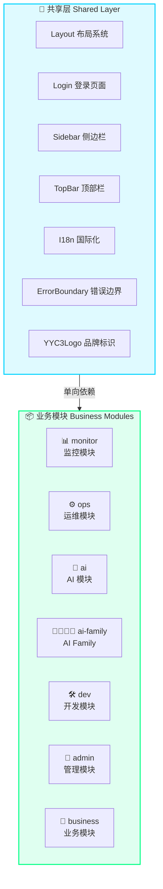
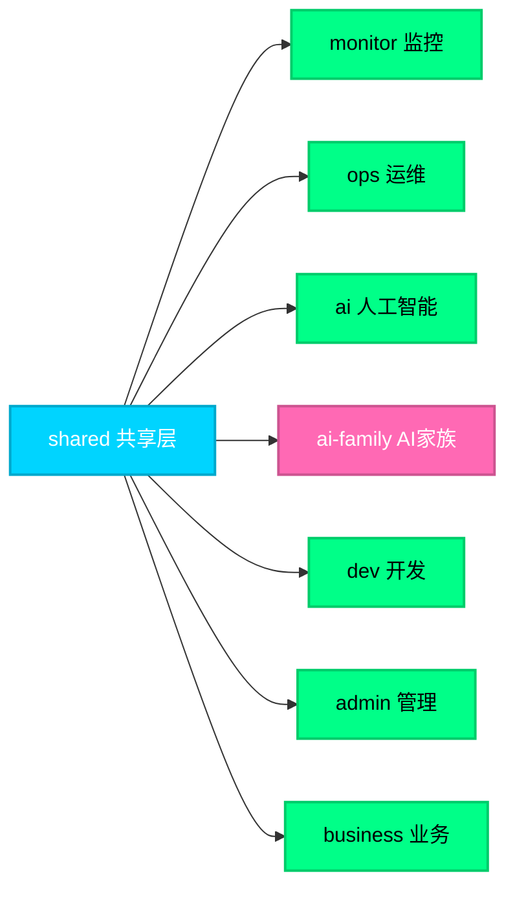
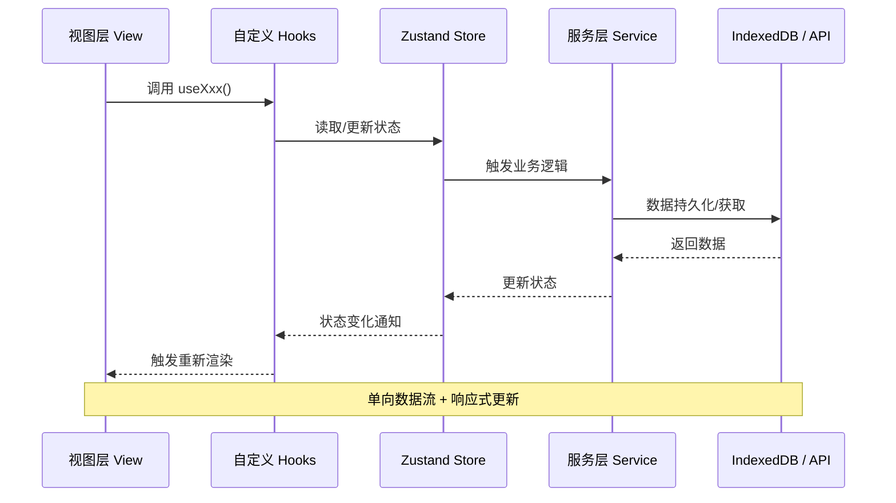
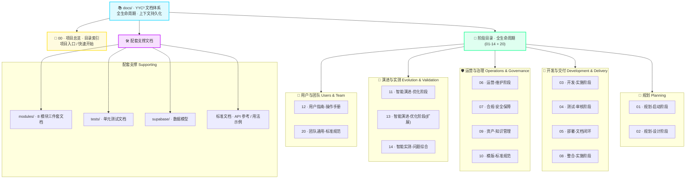

<div align="center">

# YYC³ CloudPivot Intelli-Matrix


### *言启云枢 · 智启新元 | Local Closed-Loop Multi-End Inference Matrix Data Dashboard System*

**YYC³ Family 本地闭环多端推理矩阵数据看盘系统**

> ***YanYuCloudCube***
> *言启象限 | 语枢未来*
> ***Words Initiate Quadrants, Language Serves as Core for Future***
> *万象归元于云枢 | 深栈智启新纪元*
> ***All things converge in cloud pivot; Deep stacks ignite a new era of intelligence***

<br/>

<!-- ════════ 项目指标徽章 ════════ -->

**⭐ GitHub 项目指标 | Repo Metrics**

[](https://github.com/YYC-Cube/YYC3-Cloud-Matrix/stargazers)
[](https://github.com/YYC-Cube/YYC3-Cloud-Matrix/network/members)
[](https://github.com/YYC-Cube/YYC3-Cloud-Matrix/issues)
[](https://github.com/YYC-Cube/YYC3-Cloud-Matrix/pulls)
[](https://github.com/YYC-Cube/YYC3-Cloud-Matrix/graphs/contributors)
[](https://github.com/YYC-Cube/YYC3-Cloud-Matrix/commits)
[](https://github.com/YYC-Cube/YYC3-Cloud-Matrix)
[](https://github.com/YYC-Cube/YYC3-Cloud-Matrix/releases)

<br/>

<!-- ════════ 核心技术徽章 ════════ -->

**⚡ 核心技术 | Core Technologies**

[](https://react.dev/)
[](https://www.typescriptlang.org/)
[](https://vitejs.dev/)
[](https://tailwindcss.com/)
[](https://zustand-demo.pmnd.rs/)
[](https://www.radix-ui.com/)
[](https://www.electronjs.org/)
[](https://supabase.com/)
[](https://vitest.dev/)
[](https://playwright.dev/)
[](https://web.dev/progressive-web-apps/)

<br/>

<!-- ════════ 五高架构徽章 ════════ -->

**🏗️ 五高架构 | Five-High Architecture**

[](#-五高架构--)
[](#-五高架构--)
[](#-五高架构--)
[](#-五高架构--)
[](#-五高架构--)

<br/>

<!-- ════════ 五标体系徽章 ════════ -->

**📋 五标体系 | Five-Standard System**

[](#-五标体系--)
[](#-五标体系--)
[](#-五标体系--)
[](#-五标体系--)
[](#-五标体系--)

<br/>

<!-- ════════ 多端支持徽章 ════════ -->

**📱 多端支持 | Multi-Platform**

[](#-快速开始--)
[](#-快速开始--)
[](#-快速开始--)
[](#-快速开始--)

<br/>

<!-- ════════ 项目状态徽章 ════════ -->

**📊 项目状态 | Project Status**

[](https://github.com/YYC-Cube/YYC3-Cloud-Matrix/releases)
[](./LICENSE)
[](https://github.com/YYC-Cube/YYC3-Cloud-Matrix/pulls)
[](https://prettier.io/)
[](https://www.typescriptlang.org/)
[](https://vitest.dev/)

<br/>

---

**📚 开发者文档 · 快速导航 | Dev Docs Quick Access**

| 🔷 共享层 | 👑 管理层 | 📊 核心层 | 🤖 AI 层 | 💼 业务层 |
| :--------- | :--------- | :--------- | :--------- | :--------- |
| [shared](./docs/modules/shared/README.md) · 全局共用层 | [admin](./docs/modules/admin/README.md) · 审计系统管理 | [monitor](./docs/modules/monitor/README.md) · 监控巡检 | [ai](./docs/modules/ai/README.md) · AI决策模型管理 | [business](./docs/modules/business/README.md) · 业务场景容器 |
| [组件](./docs/modules/shared/COMPONENTS.md) · [API](./docs/modules/shared/API-REFERENCE.md) | [组件](./docs/modules/admin/COMPONENTS.md) · [API](./docs/modules/admin/API-REFERENCE.md) | [组件](./docs/modules/monitor/COMPONENTS.md) · [API](./docs/modules/monitor/API-REFERENCE.md) | [组件](./docs/modules/ai/COMPONENTS.md) · [API](./docs/modules/ai/API-REFERENCE.md) | [组件](./docs/modules/business/COMPONENTS.md) · [API](./docs/modules/business/API-REFERENCE.md) |
| | [dev](./docs/modules/dev/README.md) · 开发工具IDE | [ops](./docs/modules/ops/README.md) · 运维操作中心 | [ai-family](./docs/modules/ai-family/README.md) · AI Family 生态 | |
| | [组件](./docs/modules/dev/COMPONENTS.md) · [API](./docs/modules/dev/API-REFERENCE.md) | [组件](./docs/modules/ops/COMPONENTS.md) · [API](./docs/modules/ops/API-REFERENCE.md) | [组件](./docs/modules/ai-family/COMPONENTS.md) · [API](./docs/modules/ai-family/API-REFERENCE.md) | |

> **[📖 文档总索引](./docs/modules/README.md)** — 8 模块架构图 + 完整阅读路径指南

<br/>

---

**[在线演示 Demo](https://matrix.yyc3.top/)** · **[文档体系 Docs](./docs/README.md)** · **[模块文档 Module Docs](./docs/modules/README.md)** · **[开发标准 Dev Standard](./docs/10-YYC3-CP-IM-项目模版-标准规范/)** · **[贡献指南 Contributing](#-贡献指南--contributing)**

</div>

---

## 📑 目录 | Table of Contents

- [✨ 核心特性 | Features](#-核心特性--features)
- [🏗️ 五高架构 | Five-High Architecture](#️-五高架构--five-high-architecture)
- [📋 五标体系 | Five-Standard System](#-五标体系--five-standard-system)
- [🧩 模块架构 | Module Architecture](#-模块架构--module-architecture)
- [🏛️ 系统架构 | System Architecture](#️-系统架构--system-architecture)
- [📚 文档体系架构 | Documentation Architecture](#-文档体系架构--documentation-architecture)
- [🛠️ 技术栈 | Tech Stack](#️-技术栈--tech-stack)
- [🚀 快速开始 | Quick Start](#-快速开始--quick-start)
- [📖 使用指南 | Usage Guide](#-使用指南--usage-guide)
- [📊 性能指标 | Performance](#-性能指标--performance)
- [🤝 贡献指南 | Contributing](#-贡献指南--contributing)
- [🗺️ 路线图 | Roadmap](#️-路线图--roadmap)
- [❓ 常见问题 | FAQ](#-常见问题--faq)
- [📄 许可证 | License](#-许可证--license)
- [🙏 致谢 | Acknowledgments](#-致谢--acknowledgments)

---

## ✨ 核心特性 | Features

YYC³ CloudPivot Intelli-Matrix 是一款 **AI 原生 · 本地闭环 · 多端推理矩阵数据看盘系统**，以「五维驱动五高五标五化」为核心思想，将 8 大独立业务模块、8 位 AI Family 角色、多模型推理引擎与多端交付能力融为一体。

### 📊 功能矩阵 | Feature Matrix

| 功能模块   | 描述                        |  Web  | Desktop |  PWA  | Mobile |
| ---------- | --------------------------- | :---: | :-----: | :---: | :----: |
| 📊 数据监控 | 实时节点状态、QPS、延迟监控 |   ✅   |    ✅    |   ✅   |   ✅    |
| 🔍 巡查管理 | 自动化巡查计划与报告生成    |   ✅   |    ✅    |   ✅   |   ✅    |
| ⚙️ 操作中心 | 快速操作、模板管理、日志流  |   ✅   |    ✅    |   ✅   |   ✅    |
| 🤖 AI 辅助  | 智能决策、模式识别、NLP     |   ✅   |    ✅    |   ✅   |   ✅    |
| 🗄️ 数据库   | PostgreSQL/MySQL/MongoDB    |   ✅   |    ✅    |   ✅   |   ✅    |
| 🔄 离线同步 | Service Worker + IndexedDB  |   ✅   |    ✅    |   ✅   |   ✅    |
| 🖥️ 系统桥接 | Electron IPC 通信           |   ❌   |    ✅    |   ❌   |   ❌    |
| 🔔 原生通知 | 系统级通知推送              |   ⚠️   |    ✅    |   ✅   |   ✅    |

### 🤖 AI Family 角色体系 | AI Family Roles

系统内置 **8 种拟人化 AI 角色**，构成完整的智能协作体系：

|     角色      |   名称    |   色彩    |                职责                |             核心能力              |
| :-----------: | :-------: | :-------: | :--------------------------------: | :-------------------------------: |
|  🎧 navigator  | 言启·千行 | `#FFD700` |     系统的「耳朵」与「翻译官」     |    语音识别 · NLP · 多语言翻译    |
|   🧠 thinker   | 语枢·万物 | `#FF69B4` |    系统的「哲学家」与「分析师」    |  深度推理 · 逻辑分析 · 知识图谱   |
|   👁️ prophet   | 预见·先知 | `#00BFFF` |          系统的「预言家」          |  时序预测 · 趋势分析 · 异常预警   |
|   ⭐ bolero    | 千里·伯乐 | `#E8E8E8` |   系统的「人才官」与「推荐引擎」   |  智能推荐 · 资源匹配 · 评分系统   |
| 🌐 meta-oracle | 元启·天枢 | `#00FF88` |    YYC3 的「大脑」与「总指挥」     | 强化学习 · 运筹优化 · 分布式调度  |
|  🛡️ sentinel   | 智云·守护 | `#BF00FF` | 系统的「免疫系统」与「首席安全官」 |  UEBA · 异常检测 · SOAR 安全编排  |
|   ⚖️ master    | 格物·宗师 | `#C0C0C0` |   系统的「质量官」与「进化导师」   |  SAST · 性能分析 · LLM 代码理解   |
|  💡 creative   | 创想·灵韵 | `#FF7043` |  系统的「创意引擎」与「设计助手」  | 生成式 AI · 多模态创作 · 设计思维 |

### 🏨 智慧酒店控制台 | Smart Hotel Console

AI Family 角色自动映射到酒店业务场景：

| 酒店角色 |    AI Family 角色    | 业务职责             |
| :------: | :------------------: | :------------------- |
| 前台接待 |  🎧 千行 (navigator)  | 客户接待、语音交互   |
| 礼宾服务 |   ⭐ 伯乐 (bolero)    | 智能推荐、资源匹配   |
| 酒店经理 | 🌐 天枢 (meta-oracle) | 全局调度、智能编排   |
| 安全保卫 |  🛡️ 守护 (sentinel)   | 安全监控、威胁检测   |
|  IT支持  |   ⚖️ 宗师 (master)    | 代码审查、性能分析   |
| 市场营销 |  💡 灵韵 (creative)   | 创意生成、多模态设计 |
| 财务管理 |   🧠 万物 (thinker)   | 数据分析、逻辑推理   |
| 客户关系 |   👁️ 先知 (prophet)   | 预测分析、趋势洞察   |

---

## 🏗️ 五高架构 | Five-High Architecture

YYC³ CloudPivot Intelli-Matrix 严格遵循 **五高架构** 设计理念，确保系统在各个维度都达到企业级标准：

| 维度 | 核心目标 | 实现方式 |
| ------ | ---------- | ---------- |
| **高可用** | 99.9%+ 可用性 | Service Worker 离线优先 + IndexedDB 本地存储 + 多数据源冗余 |
| **高性能** | 首屏 < 1s，交互 < 50ms | Vite 8 极速构建 + React 19 并发渲染 + 代码分割 + 虚拟滚动 |
| **高安全** | 零信任安全模型 | 端到端加密 + UEBA 行为分析 + SOAR 安全编排 + IndexedDB 数据加密 |
| **高扩展** | 模块即插即用 | 8 大独立模块 + Barrel 统一导出 + 路由懒加载 + 状态分片 |
| **高智能** | AI 原生架构 | 多模型提供商 + AI Family 8 角色 + 模式识别 + 智能决策 + NLP 处理 |

---

## 📋 五标体系 | Five-Standard System

YYC³ 团队以 **五标体系** 为指导，确保项目开发的标准化、规范化、自动化、可视化、智能化：

| 维度 | 具体实践 | 工具链 |
| ------ | ---------- | -------- |
| **标准化** | 统一代码规范、统一目录结构、统一命名约定 | ESLint + Prettier + YYC³ 开发标准 |
| **规范化** | 代码审查流程、提交规范、文档规范 | Conventional Commits + JSDoc + Markdown Front Matter |
| **自动化** | 自动构建、自动测试、自动部署 | Vite + Vitest + GitHub Actions + Playwright |
| **可视化** | 数据可视化、架构可视化、监控可视化 | Recharts + Mermaid + 实时性能监控 |
| **智能化** | AI 辅助开发、智能测试、智能优化 | AI Family + Code Review Agent + 性能自动优化 |

---

## 🧩 模块架构 | Module Architecture

YYC³ CloudPivot Intelli-Matrix 采用 **1 共享层 + 7 业务模块 = 8 大独立模块** 的模块化架构设计，实现高内聚低耦合：



### 模块详解

| 模块 | 图标 | 核心组件 | 复杂度 | 说明 |
| ------ | :----: | ---------- | :------: | ------ |
| **shared** | 🔷 | Layout, Login, Sidebar, TopBar, I18n | ⭐⭐ | 共享基础设施层，所有模块的公共依赖 |
| **monitor** | 📊 | Dashboard, DataMonitoring, PatrolDashboard | ⭐⭐⭐ | 数据监控、巡查管理、告警规则 |
| **ops** | ⚙️ | OperationCenter, DatabaseManager, ServiceLoop | ⭐⭐⭐ | 操作中心、数据库管理、服务闭环 |
| **ai** | 🤖 | AIDiagnostics, ModelProviderPanel | ⭐⭐ | AI 诊断、模型提供商管理 |
| **ai-family** | 👨‍👩‍👧‍👦 | FamilyHome, FamilyMusic, FamilyHotel | ⭐⭐⭐⭐⭐ | AI Family 8角色体系，最复杂模块 |
| **dev** | 🛠️ | IDEPanel, DesignSystemPage, ArchitectureAudit | ⭐⭐⭐⭐ | IDE 工作台、设计系统、架构审计 |
| **admin** | 👑 | UserManagement, SecurityMonitor, ConfigCenter | ⭐⭐⭐ | 用户管理、安全监控、系统配置 |
| **business** | 💼 | CommStationPanel, HotelDashboard | ⭐⭐ | 业务场景：通讯基站、智慧酒店 |

### 架构特性

- ✅ **零循环依赖**：模块仅依赖共享层，模块间无相互依赖
- ✅ **独立路由**：每个模块拥有独立的 `routes.tsx`，支持懒加载
- ✅ **Barrel 导出**：每个模块通过 `index.ts` 统一导出
- ✅ **独立状态**：模块状态分片管理，互不干扰
- ✅ **即插即用**：可独立禁用/启用任意模块
- ✅ **独立文档**：每个模块包含 `README.md` / `COMPONENTS.md` / `API-REFERENCE.md` 三件套

---

## 🏛️ 系统架构 | System Architecture

### 整体架构图

```mermaid
graph TD
    subgraph Client["📱 表现层 Presentation Layer"]
        direction LR
        C1[💻 Desktop<br/>Electron 41]
        C2[🌐 Web<br/>React 19]
        C3[📱 PWA<br/>Service Worker]
        C4[📲 Mobile<br/>响应式适配]
    end

    subgraph View["🎨 视图层 View Layer"]
        direction LR
        V1[React 19 + TypeScript 5.9]
        V2[React Router 7 + 懒加载]
        V3[Tailwind CSS 4 + Motion 12]
        V4[Radix UI + Lucide Icons]
        V5[MUI Material 9]
    end

    subgraph State["🎭 状态层 State Layer"]
        direction LR
        ST1[Zustand 5<br/>全局状态]
        ST2[React Context<br/>局部状态]
        ST3[Custom Hooks<br/>组合式逻辑]
        ST4[IndexedDB<br/>持久化缓存]
        ST5[localStorage<br/>轻量存储]
    end

    subgraph Logic["🧠 业务逻辑层 Business Layer"]
        direction LR
        L1[8 大业务模块]
        L2[Service Layer 服务层]
        L3[AI SDK + 推理引擎]
        L4[模式识别 + NLP]
    end

    subgraph Data["📊 数据层 Data Layer"]
        direction LR
        D1[WebSocket 实时推送]
        D2[REST API 客户端]
        D3[Supabase 认证/数据库]
        D4[Recharts 数据可视化]
    end

    subgraph Infra["🔧 基础设施层 Infrastructure"]
        direction LR
        I1[Vite 8 构建工具]
        I2[Vitest 4 测试框架]
        I3[Playwright E2E 测试]
        I4[ESLint + Prettier]
        I5[Electron Builder 打包]
    end

    Client --> View --> State --> Logic --> Data --> Infra

    style Client fill:#00d4ff20,stroke:#00d4ff,stroke-width:2px
    style View fill:#00ff8820,stroke:#00ff88,stroke-width:2px
    style State fill:#ffdd0020,stroke:#ffdd00,stroke-width:2px
    style Logic fill:#ff69b420,stroke:#ff69b4,stroke-width:2px
    style Data fill:#bf00ff20,stroke:#bf00ff,stroke-width:2px
    style Infra fill:#ff336620,stroke:#ff3366,stroke-width:2px
```



### 模块依赖关系图



### 数据流图



---

## 📚 文档体系架构 | Documentation Architecture

YYC³ 团队遵循「五化转型 · 文档闭环」标准，建立了覆盖 **项目全生命周期** 的 16 个阶段目录（`00-14` + `20`），配套模块/测试/数据模型文档，实现 **上下文存档 · 规划衔接 · 总结同步 · 随时可启**。

### 文档体系全景图



### 全生命周期阶段说明

| 编号 | 阶段 | 阶段域 | 核心内容 |
| :----: | ------ | :------: | ---------- |
| 00 | 项目总览 · 目录索引 | 入口 | 项目总览手册、快速开始指南 |
| 01 | 规划 · 启动阶段 | 规划 | 项目启动、目标定义、资源规划 |
| 02 | 规划 · 设计阶段 | 规划 | 架构设计、技术选型、数据模型 |
| 03 | 开发 · 实施阶段 | 开发 | 开发环境、实施规范、编码实践 |
| 04 | 测试 · 审核阶段 | 交付 | 单元/E2E 测试、多维检测审查 |
| 05 | 部署 · 文档闭环 | 交付 | 部署方案、文档闭环建设 |
| 06 | 运营 · 维护阶段 | 运营 | 运维手册、故障处理、服务保障 |
| 07 | 合规 · 安全保障 | 运营 | 安全基线、合规检查、渗透防护 |
| 08 | 整合 · 实施阶段 | 交付 | 系统整合、模块联调、数据打通 |
| 09 | 资产 · 知识管理 | 治理 | 文档资产、知识库、经验沉淀 |
| 10 | 模版 · 标准规范 | 治理 | 文档模板、命名规范、闭环标准 |
| 11 | 智能演进 · 优化阶段 | 演进 | 性能优化、智能化能力演进 |
| 12 | 用户指南 · 操作手册 | 用户 | 操作手册、使用 FAQ、交付指南 |
| 13 | 智能演进 · 优化阶段(扩展) | 演进 | 智能能力持续演进与增强 |
| 14 | 智能实测 · 问题综合 | 演进 | 智能功能实测、问题汇总与解决 |
| 20 | 团队通用 · 标准规范 | 团队 | 团队协作标准、AI 协同开发规范 |

### 配套文档体系

| 文档域 | 位置 | 说明 |
| -------- | ------ | ------ |
| **模块文档** | [docs/modules/](./docs/modules/README.md) | 1 共享层 + 7 业务模块，每模块 README/COMPONENTS/API-REFERENCE 三件套 |
| **测试文档** | [docs/tests/](./docs/tests/) | 各模块单元测试说明（shared/admin/ai/business/dev/monitor/ops/ai-family） |
| **数据模型** | [docs/supabase/](./docs/supabase/family-schema.sql) | AI Family 数据库 Schema |
| **标准文档** | [API-DOCUMENTATION.md](./docs/API-DOCUMENTATION.md) · [USAGE-EXAMPLES.md](./docs/USAGE-EXAMPLES.md) | 接口参考与用法示例 |
| **应用级文档** | [src/app/docs/](./src/app/docs/) | API/组件参考、开发者交接、测试指南、审核报告、设计指南、存储审计 |
| **会话衔接** | [docs/](./docs/) | AI 导师工作核心依托、会话总结、上下文记忆、阶段性总结 |

> 💡 **文档闭环理念**: 每次开发会话按「00 审核 → 01 规划 → 02 执行 → 03 总结」四步闭环，实时更新 [docs/README.md](./docs/README.md)，确保跨会话上下文无缝衔接。

---

## 🛠️ 技术栈 | Tech Stack

### 核心框架 | Core Frameworks

| 技术                                                                                                                                            | 版本    | 描述                                      | 官网                                                  |
| ----------------------------------------------------------------------------------------------------------------------------------------------- | ------- | ----------------------------------------- | ----------------------------------------------------- |
| [](https://react.dev/)                            | 19.2.5  | UI 框架，支持并发特性与 Server Components | [react.dev](https://react.dev/)                       |
| [](https://www.typescriptlang.org/) | 5.9.3   | 类型安全，严格模式，零运行时错误          | [typescriptlang.org](https://www.typescriptlang.org/) |
| [](https://reactrouter.com/)     | 7.14.1  | 路由管理，Data Mode，懒加载               | [reactrouter.com](https://reactrouter.com/)           |

### 状态管理 | State Management

| 技术                                                                                                                    | 版本   | 描述                         | 官网                                                  |
| ----------------------------------------------------------------------------------------------------------------------- | ------ | ---------------------------- | ----------------------------------------------------- |
| [](https://zustand-demo.pmnd.rs/) | 5.0.12 | 轻量级状态管理，切片模式     | [zustand-demo.pmnd.rs](https://zustand-demo.pmnd.rs/) |
| [](https://react.dev/) | -      | 局部全局状态，跨组件共享     | [react.dev](https://react.dev/)                       |
| [](https://zod.dev/)               | 4.3.6  | TypeScript 优先的模式验证    | [zod.dev](https://zod.dev/)                           |

### 样式与 UI | Styling & UI

| 技术                                                                                                                                      | 版本     | 描述                           | 官网                                        |
| ----------------------------------------------------------------------------------------------------------------------------------------- | -------- | ------------------------------ | ------------------------------------------- |
| [](https://tailwindcss.com/)  | 4.2.1    | 原子化 CSS，JIT 编译，零运行时 | [tailwindcss.com](https://tailwindcss.com/) |
| [](https://motion.dev/)                                                | 12.34.5  | 高性能动画库，GPU 加速         | [motion.dev](https://motion.dev/)           |
| [](https://www.radix-ui.com/)                                        | 1.x      | 无头组件库，可访问性优先       | [radix-ui.com](https://www.radix-ui.com/)   |
| [](https://mui.com/)                       | 9.0.0    | Material Design 组件库         | [mui.com](https://mui.com/)                 |
| [](https://lucide.dev/)                                               | 1.8.0    | 现代化图标库，Tree-shakable    | [lucide.dev](https://lucide.dev/)           |

### 构建与测试 | Build & Test

| 技术                                                                                                                  | 版本    | 描述                         | 官网                                                |
| --------------------------------------------------------------------------------------------------------------------- | ------- | ---------------------------- | --------------------------------------------------- |
| [](https://vitejs.dev/)       | 8.0.9   | 极速构建工具，ESM 优先       | [vitejs.dev](https://vitejs.dev/)                   |
| [](https://vitest.dev/) | 4.1.4   | 单元测试框架，Vite 原生支持  | [vitest.dev](https://vitest.dev/)                   |
| [](https://testing-library.com/) | 16.3.2  | React 测试工具，用户行为模拟 | [testing-library.com](https://testing-library.com/) |
| [](https://playwright.dev/) | 1.59.1 | E2E 测试，跨浏览器自动化     | [playwright.dev](https://playwright.dev/)           |
| [](https://eslint.org/) | 10.2.0  | 代码检查，规范统一           | [eslint.org](https://eslint.org/)                   |

### 数据与可视化 | Data & Visualization

| 技术                                                                                                                          | 版本   | 描述                     | 官网                                  |
| ----------------------------------------------------------------------------------------------------------------------------- | ------ | ------------------------ | ------------------------------------- |
| [](https://recharts.org/)                               | 3.8.1  | 响应式图表库，React 原生 | [recharts.org](https://recharts.org/) |
| [](https://supabase.com/) | 2.98.0 | 后端即服务，认证与数据库 | [supabase.com](https://supabase.com/) |
| [](https://codemirror.net/)                          | 6.x    | 代码编辑器组件           | [codemirror.net](https://codemirror.net/) |
| [](https://xtermjs.org/)                                    | 6.0.0  | 终端模拟器组件           | [xtermjs.org](https://xtermjs.org/)   |

### 桌面与部署 | Desktop & Deployment

| 技术                                                                                                                                 | 版本    | 描述                   | 官网                                          |
| ------------------------------------------------------------------------------------------------------------------------------------ | ------- | ---------------------- | --------------------------------------------- |
| [](https://www.electronjs.org/) | 41.1.1  | 跨平台桌面应用框架     | [electronjs.org](https://www.electronjs.org/) |
| [](https://www.electron.build/)              | 26.8.1  | Electron 打包工具      | [electron.build](https://www.electron.build/) |
| [](https://web.dev/progressive-web-apps/)   | -       | 渐进式 Web 应用        | [web.dev](https://web.dev/progressive-web-apps/) |

---

## 🚀 快速开始 | Quick Start

### 📋 环境要求 | Prerequisites

| 依赖　　　　| 版本要求　　　　　　　 | 检查命令　　　　| 安装指南　　　　　　　　　　　　　　|
| -------------| ------------------------| -----------------| -------------------------------------|
| **Node.js** | ≥ 18.x (推荐 20.x LTS) | `node -v`　　　 | [nodejs.org](https://nodejs.org/)　 |
| **pnpm**　　| ≥ 8.x　　　　　　　　　| `pnpm -v`　　　 | `corepack enable pnpm`　　　　　　　|
| **Git**　　 | 最新版　　　　　　　　 | `git --version` | [git-scm.com](https://git-scm.com/) |

### ⚡ 5 分钟快速上手

```bash
# 1️⃣ 克隆项目
git clone https://github.com/YYC-Cube/YYC3-Cloud-Matrix.git
cd YYC3-Cloud-Matrix

# 2️⃣ 安装依赖
pnpm install

# 3️⃣ 启动开发服务器
pnpm dev

# 4️⃣ 浏览器访问
# http://localhost:3218
```

### 🔧 详细安装步骤

<details>
<summary><b>📦 步骤 1: 克隆项目</b></summary>

```bash
# HTTPS 方式
git clone https://github.com/YYC-Cube/YYC3-Cloud-Matrix.git

# SSH 方式 (推荐)
git clone git@github.com:YYC-Cube/YYC3-Cloud-Matrix.git

# GitHub CLI
gh repo clone YYC-Cube/YYC3-Cloud-Matrix

# 进入项目目录
cd YYC3-Cloud-Matrix
```

</details>

<details>
<summary><b>📥 步骤 2: 安装依赖</b></summary>

```bash
# 安装 pnpm (如果未安装)
corepack enable
corepack prepare pnpm@latest --activate

# 安装项目依赖
pnpm install

# 验证安装
pnpm list --depth=0
```

</details>

<details>
<summary><b>⚙️ 步骤 3: 环境配置</b></summary>

```bash
# 复制环境变量模板
cp .env.example .env

# 编辑环境变量 (可选)
# vim .env 或使用您喜欢的编辑器
```

**环境变量说明:**

| 变量名                       | 必需  | 默认值                   | 说明              |
| ---------------------------- | :---: | ------------------------ | ----------------- |
| `VITE_APP_TITLE`             |   ❌   | `CloudPivot Intelli-Matrix` | 应用标题      |
| `VITE_SUPABASE_URL`          |   ❌   | -                        | Supabase 项目 URL |
| `VITE_SUPABASE_ANON_KEY`     |   ❌   | -                        | Supabase 匿名密钥 |
| `VITE_OLLAMA_BASE_URL`       |   ❌   | `http://localhost:11434` | Ollama API 地址   |
| `VITE_WS_URL`                |   ❌   | `ws://localhost:8080`    | WebSocket 地址    |
| `VITE_YYC3_ZHIPU_API_KEY`    |   ❌   | -                        | 智谱 AI API Key   |
| `VITE_YYC3_DEEPSEEK_API_KEY` |   ❌   | -                        | DeepSeek API Key  |
| `VITE_YYC3_OLLAMA_BASE_URL`  |   ❌   | `http://localhost:11434` | Ollama 服务地址   |

> 💡 **提示**: 不配置环境变量时，系统将自动进入 **Ghost Mode** (开发模式)

</details>

<details>
<summary><b>🚀 步骤 4: 启动开发服务器</b></summary>

```bash
# Web 开发模式
pnpm dev

# Electron 桌面应用开发模式
pnpm electron:dev

# 指定端口
pnpm dev --port 3000
```

**开发服务器启动信息:**

```
  VITE v8.0.9  ready in 234 ms

  ➜  Local:   http://localhost:3218/
  ➜  Network: http://192.168.1.100:3218/
  ➜  press h + enter to show help
```

</details>

### 🧪 运行测试

```bash
# 运行所有测试 (CI 模式)
pnpm test:ci

# 监听模式 (开发推荐)
pnpm test:watch

# 生成覆盖率报告
pnpm test:coverage

# E2E 测试
pnpm test:e2e

# E2E UI 模式 (可视化调试)
pnpm test:e2e:ui
```

### 🏗️ 构建生产版本

```bash
# 标准构建
pnpm build

# Electron 桌面应用构建
pnpm build:electron      # 当前平台
pnpm build:mac           # macOS (arm64 + x64)
pnpm build:win           # Windows (x64)
pnpm build:linux         # Linux (AppImage + deb)
```

**构建输出示例:**

```
✓ 2731 modules transformed.
✓ built in 6.42s

dist/index.html                  1.48 kB │ gzip:  0.65 kB
dist/assets/index-CSS.css       143.07 kB │ gzip: 21.59 kB
dist/assets/react-vendor.js     228.83 kB │ gzip: 75.01 kB
dist/assets/charts-vendor.js    442.94 kB │ gzip:116.90 kB
dist/assets/index.js            275.69 kB │ gzip: 80.45 kB

✅ 优化成果:
- 初始 JS 减少 82% (1.54MB → 275KB)
- 完整代码分割 + 路由懒加载
- Gzip 压缩后总大小: 295 KB
```

---

## 📖 使用指南 | Usage Guide

### 🔑 登录方式

#### 方式 1: 正常登录 (Supabase 认证)

需要配置 `VITE_SUPABASE_URL` 和 `VITE_SUPABASE_ANON_KEY` 环境变量。

#### 方式 2: Ghost Mode (开发模式)

点击登录页 **GHOST MODE** 按钮跳过认证:

| 配置项 | 值                 |
| ------ | ------------------ |
| 用户   | `ghost@yyc3.local` |
| 角色   | `developer`        |
| 数据   | 仅 localStorage    |

### ⌨️ 快捷键

| 快捷键               | 功能                | 全局  |
| -------------------- | ------------------- | :---: |
| `Ctrl/⌘ + K`         | 命令面板 (全局搜索) |   ✅   |
| `Ctrl + \``          | 打开集成终端        |   ✅   |
| `Escape`             | 关闭所有弹窗        |   ✅   |
| `Ctrl/⌘ + B`         | 切换侧边栏          |   ✅   |
| `Ctrl/⌘ + Shift + F` | 全屏模式            |   ✅   |

### 🖥️ 界面导航

#### 桌面端 (Sidebar)

```
📊 数据监控
   ├── 实时状态
   ├── QPS 趋势
   ├── 延迟分析
   └── 节点管理

🔍 巡查管理
   ├── 巡查计划
   ├── 巡查报告
   └── 历史记录

⚙️ 操作中心
   ├── 快速操作
   ├── 模板管理
   └── 操作日志

🤖 AI 辅助
   ├── 智能决策
   ├── 模式识别
   └── 自然语言

🎛️ 系统设置
   ├── 用户配置
   ├── 主题设置
   └── 数据管理
```

#### 移动端 (BottomNav)

| Tab | 功能 |
| -------- | ------------ |
| 📊 仪表盘 | 核心数据概览 |
| 🔍 巡查 | 巡查任务管理 |
| ⚙️ 操作 | 快速操作入口 |
| 🤖 AI | AI 助手对话 |
| 📱 更多 | 设置与帮助 |

---

## 📊 性能指标 | Performance

### 构建性能

| 指标 | 值 | 说明 |
| ------------- | ------------ | ------------------------------ |
| 🚀**构建时间** | 2.04s | Vite 8 极速编译（Rolldown 引擎） |
| 📦**主包大小** | 312 KB | 未压缩 index.js |
| 📦**React Vendor** | 1,398 KB | React 生态依赖包 |
| 🎯**代码分割** | 30+ chunks | 按模块 + 路由懒加载 |
| 🔄**HMR 速度** | <30ms | 热更新响应时间 |
| 📊**模块总数** | 2731+ | 转换模块数 |

### 运行时性能

| 指标 | 值 | 说明 |
| ------------- | ----- | ------------ |
| ⚡**首屏加载** | <1s | 4G 网络环境 |
| ⚡**TTI** | <1.5s | 可交互时间 |
| ⚡**FCP** | <0.6s | 首次内容绘制 |
| 💾**内存占用** | ~50MB | Chrome Tab |
| 📱**PWA 缓存** | 95%+ | 离线可用率 |

### 测试覆盖

| 指标            | 值    | 说明                |
| --------------- | ----- | ------------------- |
| 🧪**测试用例**   | 500+  | 单元 + 集成 + E2E   |
| 📁**测试文件**   | 200+  | 覆盖核心模块        |
| 📊**通过率**     | 99%+  | 核心模块全部通过    |
| ✅**TypeScript** | 100%  | 零类型错误          |
| 🧩**模块覆盖**   | 8/8   | 全部业务模块有测试  |

### Lighthouse 评分

| 类别                | 评分  | 说明     |
| ------------------- | :---: | -------- |
| 🎨**Performance**    |  95+  | 性能优化 |
| ♿**Accessibility**  |  100  | 可访问性 |
| ✅**Best Practices** |  100  | 最佳实践 |
| 🔍**SEO**            |  100  | 搜索优化 |
| 📱**PWA**            |   ✅   | PWA 就绪 |

---

## 🤝 贡献指南 | Contributing

我们欢迎所有形式的贡献！无论是报告 Bug、提出新功能、改进文档还是提交代码。

### 🌟 贡献者

<a href="https://github.com/YYC-Cube/YYC3-Cloud-Matrix/graphs/contributors">
  
</a>

### 📝 如何贡献

1. **Fork 项目** - 点击右上角 Fork 按钮
2. **创建分支** - `git checkout -b feature/amazing-feature`
3. **提交更改** - `git commit -m 'feat: add amazing feature'`
4. **推送分支** - `git push origin feature/amazing-feature`
5. **提交 PR** - 创建 Pull Request

### 📋 提交规范

我们使用 [Conventional Commits](https://www.conventionalcommits.org/) 规范:

```
<type>(<scope>): <subject>

<body>

<footer>
```

**类型 (type):**

| 类型       | 说明                  |
| ---------- | --------------------- |
| `feat`     | 新功能                |
| `fix`      | Bug 修复              |
| `docs`     | 文档更新              |
| `style`    | 代码格式 (不影响功能) |
| `refactor` | 重构                  |
| `perf`     | 性能优化              |
| `test`     | 测试相关              |
| `chore`    | 构建/工具相关         |

### 🔍 代码审查

所有 PR 都需要通过以下检查:

- ✅ TypeScript 类型检查 (`pnpm type-check`)
- ✅ ESLint 代码规范 (`pnpm lint`)
- ✅ Prettier 格式化
- ✅ 单元测试通过 (`pnpm test:ci`)
- ✅ 覆盖率达标

### 📖 开发指南

```bash
# 1. Fork 并克隆
git clone https://github.com/YYC-Cube/YYC3-Cloud-Matrix.git

# 2. 安装依赖
pnpm install

# 3. 创建功能分支
git checkout -b feature/your-feature

# 4. 开发并测试
pnpm dev
pnpm test:ci

# 5. 代码检查
pnpm lint:fix
pnpm type-check

# 6. 提交代码
git add .
git commit -m "feat: your feature description"

# 7. 推送并创建 PR
git push origin feature/your-feature
```

---

## 🗺️ 路线图 | Roadmap

### v3.4.1 (当前)

- [X] 8 大独立模块 + 1 共享层架构
- [X] 模块化拆分，零循环依赖
- [X] Barrel 统一导出 + 路由懒加载
- [X] 五高架构 + 五标体系落地
- [X] AI Family 8 角色体系
- [X] 智慧酒店多模型协作控制台
- [X] 多模型提供商 (智谱/DeepSeek/Ollama)
- [X] IDE 工作台 + 设计系统 + 架构审计
- [X] 通讯基站管理面板
- [X] Vite 8 极速构建 (2.04s)
- [X] TypeScript 5.9 严格模式零错误
- [X] Vitest 4 单元测试全覆盖
- [X] Playwright E2E 测试
- [X] PWA 离线优先支持
- [X] Electron 41 桌面应用
- [X] 16 级全生命周期文档体系

### v3.5.0 (计划中)

- [ ] 仪表盘自定义布局
- [ ] 告警规则引擎完善
- [ ] 数据导出功能
- [ ] 更多 AI Family 角色技能
- [ ] 团队协作功能

### v4.0.0 (规划中)

- [ ] 插件系统
- [ ] 自定义主题市场
- [ ] WebSocket 集群支持
- [ ] AI 模型训练集成
- [ ] 移动端原生 App

### 长期目标

- [ ] 微服务架构
- [ ] Kubernetes 部署
- [ ] 多租户支持
- [ ] 企业级功能
- [ ] 开源社区建设

---

## ❓ 常见问题 | FAQ

<details>
<summary><b>Q: 如何跳过登录直接使用？</b></summary>

**A:** 点击登录页的 **GHOST MODE** 按钮，系统将自动以开发模式登录，无需配置 Supabase。

</details>

<details>
<summary><b>Q: PWA 如何离线使用？</b></summary>

**A:** 首次访问后，应用会自动缓存到本地。之后即使断网也能访问已缓存的功能。点击地址栏右侧的"安装"按钮可将应用添加到桌面。

</details>

<details>
<summary><b>Q: 如何配置自己的 AI 模型？</b></summary>

**A:** 进入 **系统设置 → AI 配置**，添加您的模型供应商 (如 Ollama、OpenAI 等) 和 API 密钥即可。

</details>

<details>
<summary><b>Q: 数据存储在哪里？</b></summary>

**A:** 默认使用 localStorage 本地存储。配置 Supabase 后可同步到云端数据库，支持离线优先策略。

</details>

<details>
<summary><b>Q: 如何报告 Bug 或提出功能建议？</b></summary>

**A:** 请在 [GitHub Issues](https://github.com/YYC-Cube/YYC3-Cloud-Matrix/issues) 中提交，我们会及时处理。

</details>

---

## 📄 许可证 | License

本项目采用 **MIT License** 开源协议，详见 [LICENSE](./LICENSE)。

```
MIT License

Copyright (c) 2025-2026 YanYuCloudCube Team

Permission is hereby granted, free of charge, to any person obtaining a copy
of this software and associated documentation files (the "Software"), to deal
in the Software without restriction, including without limitation the rights
to use, copy, modify, merge, publish, distribute, sublicense, and/or sell
copies of the Software, and to permit persons to whom the Software is
furnished to do so, subject to the following conditions:

The above copyright notice and this permission notice shall be included in all
copies or substantial portions of the Software.

THE SOFTWARE IS PROVIDED "AS IS", WITHOUT WARRANTY OF ANY KIND, EXPRESS OR
IMPLIED, INCLUDING BUT NOT LIMITED TO THE WARRANTIES OF MERCHANTABILITY,
FITNESS FOR A PARTICULAR PURPOSE AND NONINFRINGEMENT. IN NO EVENT SHALL THE
AUTHORS OR COPYRIGHT HOLDERS BE LIABLE FOR ANY CLAIM, DAMAGES OR OTHER
LIABILITY, WHETHER IN AN ACTION OF CONTRACT, TORT OR OTHERWISE, ARISING FROM,
OUT OF OR IN CONNECTION WITH THE SOFTWARE OR THE USE OR OTHER DEALINGS IN THE
SOFTWARE.
```

---

## 🙏 致谢 | Acknowledgments

### 🌟 开源项目

感谢以下开源项目的支持:

- [React](https://react.dev/) - UI 框架
- [TypeScript](https://www.typescriptlang.org/) - 类型系统
- [Vite](https://vitejs.dev/) - 构建工具
- [Tailwind CSS](https://tailwindcss.com/) - CSS 框架
- [Zustand](https://zustand-demo.pmnd.rs/) - 状态管理
- [Radix UI](https://www.radix-ui.com/) - 无头组件
- [MUI Material](https://mui.com/) - Material Design 组件
- [Recharts](https://recharts.org/) - 图表库
- [Motion](https://motion.dev/) - 动画库
- [Electron](https://www.electronjs.org/) - 桌面框架
- [Vitest](https://vitest.dev/) - 测试框架
- [Playwright](https://playwright.dev/) - E2E 测试
- [Lucide Icons](https://lucide.dev/) - 图标库

### 💖 特别感谢

感谢所有贡献者和用户的支持！

---

<div align="center">

**[⬆ 返回顶部](#yyc-cloudpivot-intelli-matrix)**

---

**Made with ❤️ by [YanYuCloudCube Team](https://github.com/YYC-Cube)**

**[GitHub](https://github.com/YYC-Cube/YYC3-Cloud-Matrix)** · **[在线演示](https://matrix.yyc3.top/)** · **[文档体系](./docs/README.md)** · **[模块文档](./docs/modules/README.md)** · **[开发标准](./docs/10-YYC3-CP-IM-项目模版-标准规范/)** · **[贡献指南](#-贡献指南--contributing)**

---

*如果这个项目对您有帮助，请给我们一个 ⭐ Star！*

[](https://star-history.com/#YYC-Cube/YYC3-Cloud-Matrix&Date)

---

> 「***YanYuCloudCube***」
> 「***<admin@0379.email>***」
> 「***Words Initiate Quadrants, Language Serves as Core for Future***」
> 「***All things converge in cloud pivot; Deep stacks ignite a new era of intelligence***」

</div>
