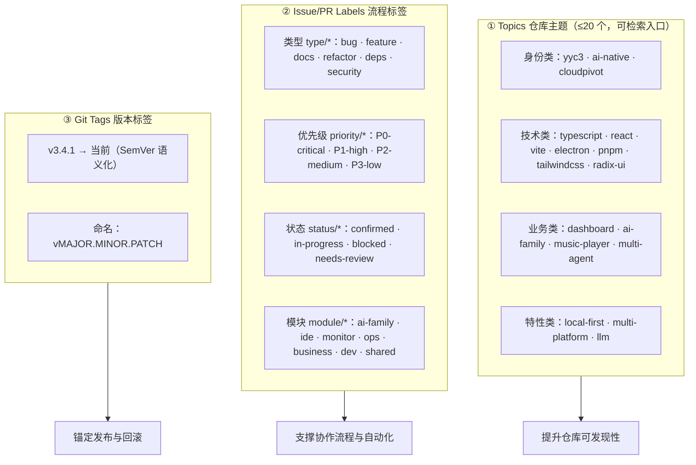
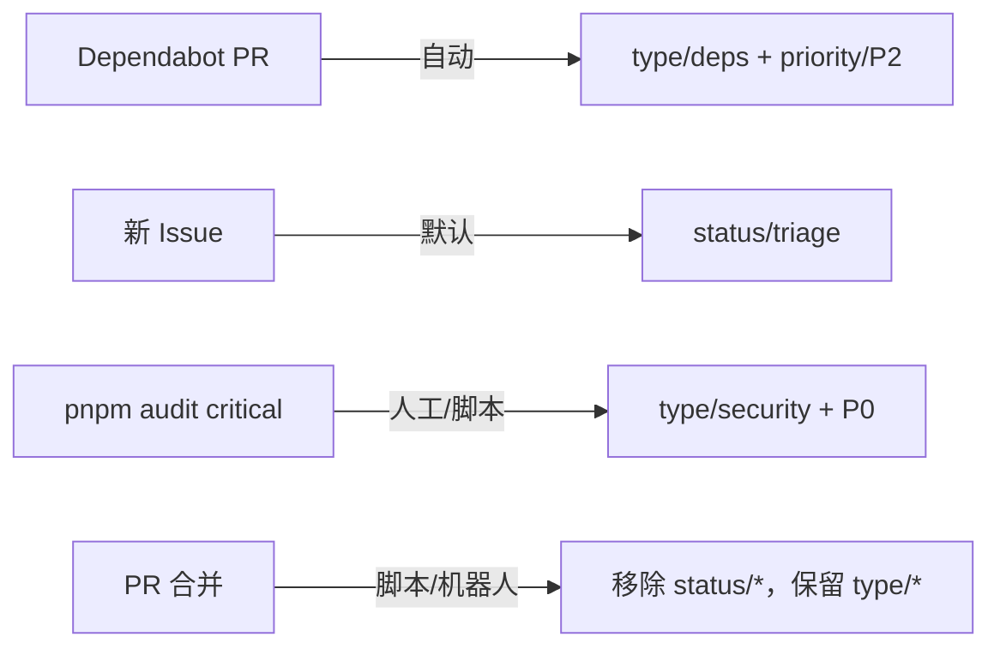

# 🏷️ YYC3-Cloud-Matrix 仓库标签体系设计

> **设计原则**：可检索 · 可分类 · 可追溯 · 可自动化（对应「五标体系」之标准化/规范化/自动化/可视化）
> 适用范围：GitHub Repository Topics · Issue/PR Labels · Git Tags 三维一体

## 一、三维标签体系总览



## 二、① Topics 仓库主题（GitHub 可检索）

| 类别 | Topics | 说明 |
|------|--------|------|
| 身份 | `yyc3` `yanyucloudcube` `ai-native` | 品牌与理念标识 |
| 技术 | `typescript` `react` `vite` `electron` `pnpm` `tailwindcss` `radix-ui` `shadcn-ui` | 核心技术栈（与 README 徽章一致） |
| 业务 | `dashboard` `ai-family` `music-player` `terminal` `multi-agent` | 8 大模块亮点能力 |
| 特性 | `local-first` `multi-platform` `llm` `d music` → `dmusic` | 差异化特性 |

> 上限 20 个，GitHub 会基于 Topics 推荐仓库；全部小写、连字符分隔。

## 三、② Issue/PR 标签体系

### 3.1 类型标签 `type/*`

| 标签 | 颜色 | 用途 |
|------|------|------|
| `type/bug` | `#d73a4a` | 功能缺陷 |
| `type/feature` | `#a2eeef` | 新功能 |
| `type/docs` | `#0075ca` | 文档变更 |
| `type/refactor` | `#fbca04` | 重构优化 |
| `type/deps` | `#0366d6` | 依赖升级（Dependabot 自动打） |
| `type/security` | `#b60205` | 安全治理（当前 79 项漏洞专项） |
| `type/perf` | `#f9d0c4` | 性能优化 |
| `type/chore` | `#c5def5` | 工程/构建杂务 |

### 3.2 优先级标签 `priority/*`

| 标签 | 颜色 | 判定标准 |
|------|------|----------|
| `priority/P0-critical` | `#b60205` | 阻断主流程 / 数据丢失 / 安全 critical |
| `priority/P1-high` | `#d93f0b` | 核心功能受损，本周内处理 |
| `priority/P2-medium` | `#fbca04` | 一般问题，迭代内排期 |
| `priority/P3-low` | `#0e8a16` | 锦上添花，择机处理 |

### 3.3 状态标签 `status/*`

| 标签 | 颜色 | 说明 |
|------|------|------|
| `status/triage` | `#ededed` | 待分诊（新 Issue 默认） |
| `status/confirmed` | `#1d76db` | 已确认有效 |
| `status/in-progress` | `#c2e0c6` | 处理中 |
| `status/blocked` | `#5319e7` | 被阻塞（需注明阻塞原因） |
| `status/needs-review` | `#fef2c0` | 待评审/待复核 |

### 3.4 模块标签 `module/*`（对应 src/app/modules 八大模块）

`module/ai-family` `module/ide` `module/monitor` `module/ops` `module/business` `module/dev` `module/admin` `module/shared`

### 3.5 自动化联动（规范建议）



## 四、③ Git 版本标签（SemVer）

| 标签 | 指向 | 说明 |
|------|------|------|
| `v3.4.1` | `a026823` | 当前版本锚点（与 package.json 一致，含音乐资源 LFS 初始化） |

**打标规范**：

```bash
git tag -a v3.4.1 -m "YYC3-Cloud-Matrix v3.4.1：五高架构稳定版（含 AI Family 音乐资源）"
git push origin v3.4.1
```

**演进规则**：
- MAJOR：破坏性 API/存储结构变更
- MINOR：新增模块或向后兼容功能（如 docs/16+ 阶段）
- PATCH：修复、依赖升级、文档完善

## 五、落地清单

- [x] ① Topics：`gh repo edit --add-topic ...` 一次性写入 19 个
- [x] ② Labels：`gh label create` 批量创建 22 个（type×8 + priority×4 + status×5 + module×8，去重后）
- [x] ③ Git Tag：`v3.4.1` 已打并推送
- [x] GitHub 默认标签清理：保留 `bug` `documentation` `enhancement` 并映射（`good first issue`/`help wanted`/`invalid`/`question`/`wontfix` 按需停用）

---
**维护约定**：标签变更需同步更新本文档版本历史；CI 可基于 labels 做 path-filtered 审查路由（后续可扩展）。
