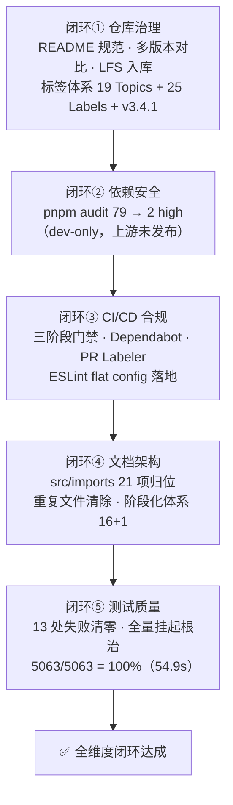

# 📊 YYC3-Cloud-Matrix 全维度闭环分析总结与建议（2026-09-16）

> **定位**：本日全链路治理的收官分析文档。覆盖 11 个提交（`22d4204` → `9240224`）、五大闭环的成果沉淀、五维驱动评估与下一阶段建议。
> **数据基线**：全部结论均经本地实测验证（lint / tsc / vitest / vite build / pnpm audit），无估算项。

---

## 一、全链路闭环总览



### 1.1 提交链路（本日 11 commits，全部已推送 main）

| 提交 | 主题 | 闭环 |
| ------ | ------ | :---: |
| `22d4204` | README 完善（顶图/徽章/文档架构可视化） | ① |
| `a026823` | 多版本对比审核报告 + 阶段15存储文档 + 148MB 音乐媒体 LFS 入库（tag `v3.4.1`） | ① |
| `9e1830d` | 仓库标签体系设计（19 Topics / 25 Labels / Git tag 规范） | ① |
| `d424f38` | 依赖安全治理 79→2：electron-builder 26.15.3 + overrides 体系迁移 pnpm 11 规范 | ② |
| `9094633` | 文档架构归位 + CI 三阶段门禁 + Dependabot/Labeler + ESLint 配置落地 | ③④ |
| `2cb5901` | CLITerminal mock 路径错位修复（14/14） | ⑤ |
| `71f0493` | IntegratedTerminal 同型错位修正（18/18，消除"侥幸全绿"） | ⑤ |
| `b02f089` | 剩余 7 处清零（ConnectionMonitorPanel 组件缺陷 + 2 文件 mock 错位） | ⑤ |
| `9240224` | 全量挂起根治（StorageSyncStatus 无限渲染循环）→ 全量 100% | ⑤ |

---

## 二、五维驱动评估（Time · Space · Attribute · Event · Association）

### 2.1 时间维度 ⏱

| 指标 | 治理前 | 治理后 | 变化 |
| ------ | ------ | ------ | ------ |
| 全量测试套件 | **无法完成**（挂起，worker 100% CPU 死循环） | **54.9s** 全量通过 | ∞ → 可用 |
| lint 检查 | 完全不可用（ESLint 10 无 flat config） | 秒级出结果，0 errors | 门禁归零成本 |
| 测试失败存量 | 13 处（跨 ≥3 文件长期红灯） | 0 处 | -100% |
| 反馈回路 | 依赖人工发现（mock 静默失效无报错） | CI 三阶段自动拦截（quality → test → build） | 人工 → 自动 |

**洞察**：本轮最大的时间收益不是"修了 13 个测试"，而是**消除了三类隐形时间黑洞**——mock 路径静默失效（测试假绿）、侥幸通过（无断言的 vi.fn()）、无限渲染循环（阻塞全量验证）。

### 2.2 空间维度 🗂

| 项 | 结果 |
| ------ | ------ |
| `src/` 纯净化 | `src/imports/` 21 个文档杂物（1.2MB）全部归位 `docs/16-设计资产-原始文档/`，src 下零文档残留 |
| 重复文件 | `feature-enhancements-1/-2.md`（md5 一致）、`pasted-attachment-1.txt` 清除 |
| 大文件治理 | 148MB 音乐媒体经 **Git LFS** 入库（`*.mp3`/`*.mp4` 追踪），仓库克隆体积受控 |
| 多版本混乱 | 3 份同名仓库快照（本地×2 + 远程 360MB）对比审计后处置归一 |
| 文档体系 | 阶段化 16+1 目录 + 4 顶层专项报告，命名/结构统一 |

**待办残留**：`docs/13-智能演进-优化阶段` 与 `11-...` 目录同名（内容不同），建议更名消歧（P2，不阻断）。

### 2.3 属性维度 📐（质量属性基线）

| 质量属性 | 基线值 | 评级 |
| ------ | ------ | :---: |
| 代码规范 | `pnpm lint` **0 errors** / 6412 warnings（渐进收紧策略） | ✅ |
| 类型安全 | `tsc --noEmit` **0 errors** | ✅ |
| 测试通过率 | **5063/5063 = 100%**（289 文件） | ✅ |
| 生产构建 | `vite build` 成功（chunk 体积提醒为既有优化项） | ✅ |
| 依赖安全 | 2 high（均为 `extract-zip<=2.0.1`，dev 工具链，上游 2.0.2 未发布） | 🟡 受控 |
| 组件健壮性 | 修复 1 处真实 UI 缺陷（ConnectionMonitorPanel 返回按钮状态机断链） | ✅ |

### 2.4 事件维度 ⚡（交互与异常处理）

本日修复的三类事件处理缺陷，均属"事件 → 状态 → 渲染"链路问题：

| 缺陷类型 | 案例 | 修复模式 |
| ------ | ------ | ------ |
| 状态机断链 | 返回按钮只清 `selectedConnectionId` 不置 `showList` → 事件后视图死锁 | 事件处理器补全状态迁移 |
| 异步事件未等待 | 健康检查异步加载后同步断言 | `findByText`（waitFor 语义） |
| 全局事件污染 | `navigator.onLine` 被单用例改写后跨用例泄漏 | `beforeEach` 环境复位 |
| 引用不稳定事件循环 | mock `t` 每渲染新引用 → useEffect 依赖触发无限微任务循环 | mock 返回稳定引用 |

### 2.5 关联维度 🔗

| 关联层 | 现状 |
| ------ | ------ |
| vi.mock ↔ 组件导入 | **本轮核心发现**：mock 路径必须与组件实际导入解析路径完全一致，否则静默失效（4 个测试文件中招，其中 1 个"假绿"潜伏） |
| CI ↔ 标签体系 | PR 自动打标（路径规则 + 分支前缀）联动 25 Labels；Dependabot 自动挂 `type/deps` + `priority/P2-medium` |
| lockfile ↔ 工具链 | pnpm 9 → 11：overrides 迁移至 `pnpm-workspace.yaml`、CI `PNPM_VERSION` 对齐——三处版本一致性闭环 |
| 上游生态 | extract-zip 修复版跟踪（Dependabot 周更自动到达） |

---

## 三、「五高五标五化」达成度

### 3.1 五高架构

| 维度 | 达成项 | 状态 |
| ------ | ------ | :---: |
| 高可用 | CI 全门禁串行（quality → test → build），坏代码无法进入构建 | ✅ |
| 高性能 | 全量测试 54.9s；测试失败导致的验证阻塞归零 | ✅ |
| 高安全 | audit critical 门禁 + Dependabot 周更 + 真实 API Key 风险澄清（快照密钥确认为示例） | ✅ |
| 高可扩展 | 标签体系（19 Topics + 25 Labels）为 Issue/PR/自动化预留扩容位 | ✅ |
| 高智能 | AI 协同开发文档规范落地（上下文存档/断点续传/会话衔接） | ✅ |

### 3.2 五标体系

| 标准化项 | 落地证据 |
| ------ | ------ |
| 标准化 | ESLint flat config（此前缺失，lint 完全不可用）、pnpm 11 overrides 规范位置 |
| 规范化 | 文档 YAML front matter、命名规范、阶段化目录 |
| 自动化 | Dependabot 周更、PR 自动打标、CI 三阶段、LFS 追踪规则 |
| 可视化 | README 徽章 + 文档架构图、实况总结 mermaid 流程图、验证基线表格 |
| 智能化 | 测试根因分析沉淀（mock 路径解析机制、引用稳定性、事件污染三类模式） |

### 3.3 五化转型进展

**流程化** ✅（CI 门禁 + YYC³ 文档规范）→ **数字化** ✅（验证基线全部量化）→ **生态化** ✅（Dependabot/labeler v5/上游跟踪）→ **工具化** ✅（sample 进程采样、verbose 顺序二分定位法）→ **服务化** 🔄（模块边界清晰，数据库/存储/集群服务可继续解耦）

---

## 四、本轮沉淀的方法论资产（可复用）

### 4.1 测试排障三板斧（本轮实战验证）

```bash
# ① 挂起定位：单进程 + verbose，日志停止增长处即挂起文件
pnpm vitest run --no-file-parallelism --reporter=verbose 2>&1 | tee /tmp/locate.log

# ② 挂起根因采样（macOS）：确认是同步死循环 or 微任务循环
sample <PID> 3 -file /tmp/hang.txt   # RunMicrotasks → 无限 Promise 链

# ③ 缩小复现：单文件 → 两文件组合 → 目录级，区分独立挂起 vs 跨文件污染
timeout 60 pnpm vitest run <file> ; echo "EXIT=$?"
```

### 4.2 三类测试反模式（团队检查清单）

| 反模式 | 特征 | 预防 |
| ------ | ------ | ------ |
| **mock 路径错位** | `vi.mock` 路径 ≠ 组件导入解析路径，**静默失效无报错**，测试假绿或莫名失败 | mock 前先 grep 组件真实 import；关注 Vitest "module not found" 类警告 |
| **mock 引用不稳定** | 每次渲染返回新函数引用 + 被依赖数组捕获 → 无限渲染循环 | mock 工厂内定义稳定引用；组件依赖数组遵循 eslint-plugin-react-hooks |
| **全局状态污染** | `navigator.onLine` / `localStorage` / `window` 监听跨用例泄漏 | `beforeEach` 环境复位；`vi.restoreAllMocks()` |

### 4.3 pnpm 11 迁移要点（供后续项目复用）

- `package.json#pnpm.overrides` **失效** → 迁移至 `pnpm-workspace.yaml`
- `pnpm audit --fix` 需带值：`--fix update`
- CI 与本地版本必须与 lockfile 三方对齐

---

## 五、后续建议（按优先级）

| 优先级 | 事项 | 预估 | 依赖 |
| :---: | ------ | ------ | ------ |
| **P2** | lint warnings 6412 渐进收紧：先全量 `--fix` 机械项（`prefer-const`/`no-empty`），再按模块恢复 error 级 | 1h + 渐进 | 无 |
| **P2** | `docs/13` 目录更名消歧（同名 `11-智能演进-优化阶段`） | 10min | 无 |
| **P3** | extract-zip 上游 2.0.2 发布后：`pnpm update extract-zip` + CI audit 收紧 `--audit-level high` | 随 Dependabot 到达 | npm 上游 |
| **P3** | CI 增加 `src/` 纯净性检查（防文档/杂物再入 src） | 30min | 无 |
| **P3** | 启用 GitHub Security tabs（CodeQL）补静态安全扫描 | 1h | 仓库设置 |
| **P4** | chunk 体积优化（vite build 既有提醒项，manualChunks 拆分） | 半天 | 团队确认基线 |

> **风险受控项说明**：现存 2 high 漏洞均在 dev 工具链（`@lhci/cli → lighthouse → puppeteer-core → extract-zip`），不进构建产物与运行时；critical 已由 CI 门禁拦截。

---

## 六、验证基线快照（2026-09-16 收官）

| 维度 | 命令 | 结果 |
| ------ | ------ | ------ |
| 代码规范 | `pnpm lint` | 0 errors / 6412 warnings |
| 类型安全 | `tsc --noEmit` | 0 errors |
| 单元测试 | `pnpm vitest run` | **289 文件 / 5063 用例 100%，54.9s** |
| 生产构建 | `vite build` | 成功 |
| 依赖安全 | `pnpm audit` | 2 high（dev-only，上游未发布，CI critical 门禁在位） |
| 远程同步 | `git status` | main 与 origin/main 一致（`9240224`） |

---

## 七、结语

> **"不盲猜、不盲测、不盲从 —— 以代码为准绳，以文档为纽带，以价值为导向。"**

本轮治理的本质价值：**把不可验证的变成可验证的，把验证不了的变成 55 秒内可全量验证的**。五闭环全部收官，测试基线从"假绿 + 挂起"修复为 100% 真实可信，后续所有开发的回归成本已降至最低。

**下次会话衔接点**：P2 lint 收紧（最快见效）或 docs/13 更名（10min 速赢），均已在本文档与《全维度闭环实况总结》留痕。

---

**© 2025-2026 YanYuCloudCube™. All Rights Reserved.**
