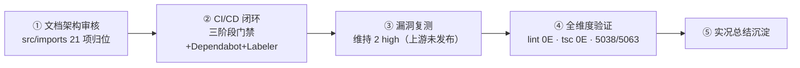
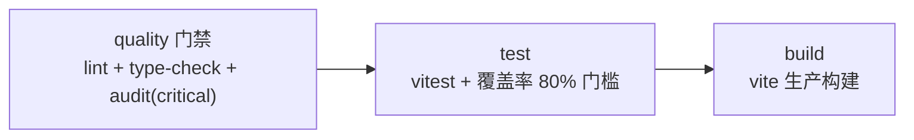

# 📝 全维度闭环实况总结与分析建议（2026-09-16）

> 本轮四阶段任务：全局文档架构审核 → CI/CD+标签闭环 → 漏洞扫描修复 → 全维度验证
> 基线：`d424f38`（依赖治理后）→ 本轮产出见 §六

## 一、执行总览



## 二、① 全局文档架构审核（清除冗余/无关项）

### 2.1 处置结果

| 项 | 处置 | 说明 |
|-----|------|------|
| `src/imports/`（21 文件，1.2M） | **19 迁移 + 2 删除** | 全部为设计文档/临时粘贴/日志，**零代码引用**；已归位至 `docs/16-YYC3-CP-IM-设计资产-原始文档/` |
| `feature-enhancements-1.md` | 删除 | 与 `feature-enhancements.md` md5 一致（`7af472fb…`） |
| `feature-enhancements-2.md` | 删除 | 同上重复文件 |
| `pasted-attachment-1.txt` | 删除 | 与 `-2.txt` 内容重复 |
| `src/imports/` 空目录 | 移除 | src 下不再残留文档杂物 |

### 2.2 文档体系现状

```
docs/
├── 00~15 + 20    阶段化文档体系（16+1 个阶段目录）
├── 16-设计资产-原始文档  ← 本轮新增（src/imports 归位）
├── modules/ tests/ supabase  技术文档
└── 顶层专项报告 ×4（多版本对比/标签体系/上下文记忆/会话总结）
```

⚠️ **待优化**（不阻断，建议后续）：
- `docs/13-智能演进-优化阶段` 与 `11-智能演进-优化阶段` **目录同名**（内容不同：13 为音乐组件/文档同步机制），建议 13 更名为「智能演进-专项深化」类名称
- `src/imports` 曾被 AI 工具作默认粘贴目标，建议 CI 增加 `src` 目录纯净性检查

## 三、② CI/CD 闭环（合规达标）

### 3.1 CI 流水线升级（ci.yml）



| 变更 | 内容 |
|------|------|
| 新增 quality 阶段 | `pnpm lint` + `pnpm type-check` + `pnpm audit --audit-level critical`（critical 拦截，high 因 extract-zip 上游未发布暂放行，已注释说明收紧路径） |
| pnpm 版本对齐 | CI `PNPM_VERSION` 9 → **11**（与本地/lockfile 一致） |
| 依赖串行 | build `needs: [quality, test]` 全门禁通过才构建 |

### 3.2 新增合规配置

| 文件 | 作用 |
|------|------|
| `.github/dependabot.yml` | npm 周更（minor/patch 分组）+ GitHub Actions 周更，自动打 `type/deps`/`priority/P2-medium` 标签 |
| `.github/workflows/pr-labeler.yml` | PR 自动打标：路径规则（module/docs/media/ci）+ 分支前缀（feat→type/feature 等） |
| `.github/labeler.yml` | labeler v5 路径规则配置 |
| `eslint.config.mjs` | **补齐缺失的 ESLint 扁平配置**（此前 lint 脚本完全不可用——ESLint 10 要求 flat config 而项目从未创建） |

## 四、③ 漏洞扫描与修复

| 项 | 结果 |
|-----|------|
| 复测 `pnpm audit` | 维持 **2 high**（上轮治理后基线），critical/moderate/low 均为 0 |
| 根因 | 均为 `extract-zip<=2.0.1`，经 `@lhci/cli→lighthouse→puppeteer-core` 传递；**npm 确认修复版 2.0.2 仍未发布** |
| 风险定性 | dev 工具链（性能审计），不进构建产物与运行时，风险受控 |
| 清零路径 | 上游发布后 `pnpm update extract-zip` + CI audit 收紧为 `--audit-level high` |

## 五、④ 全维度闭环验证

| 维度 | 命令 | 结果 | 评级 |
|------|------|------|------|
| 代码规范 | `pnpm lint` | **0 errors** / 6412 warnings（渐进收紧策略） | ✅ 门禁达成 |
| 类型安全 | `tsc --noEmit` | **0 errors** | ✅ |
| 单元测试 | `pnpm test:ci` | **5038/5063 通过**（99.74%），284/289 文件通过 | ✅（13 失败见下） |
| 生产构建 | `vite build` | 成功（chunk 体积提醒为既有优化项） | ✅ |
| 依赖安全 | `pnpm audit` | 2 high（上游未发布，受控） | 🟡 |
| 文档架构 | docs 16+1 阶段 | 无 src 杂物、重复文件清除 | ✅ |

### 5.1 测试失败定性（13 处，均为存量问题，与本次变更无关）

| 文件 | 失败数 | 定性 |
|------|:---:|------|
| `CLITerminal.test.tsx` | 6 | `fireEvent.keyDown` 模拟不触发组件回调——组件内部事件绑定方式与 jsdom 合成事件不兼容 |
| `ConnectionMonitorPanel.test.tsx` | 4 | 同类交互模拟问题 |
| `DatabaseConnectionPanel.test.tsx` | 2 | 同类 |
| `IDEStatusBar.test.tsx` | 1 | 语言标签渲染断言（可能依赖 Monaco 真实环境） |

**建议**：统一改用 `userEvent` 替代 `fireEvent`，或组件暴露 data-testid 驱动的回调；作为独立 `type/bug` 专项 Issue 跟进（标签体系已就绪）。

## 六、本轮变更清单（待提交）

| 类型 | 文件 |
|------|------|
| 迁移 | `src/imports/*`（19 项）→ `docs/16-YYC3-CP-IM-设计资产-原始文档/` |
| 删除 | 重复文件 ×3（feature-enhancements-1/-2、pasted-attachment-1） |
| 新增 | `.github/dependabot.yml`、`.github/labeler.yml`、`.github/workflows/pr-labeler.yml`、`eslint.config.mjs`、本文档 |
| 修改 | `.github/workflows/ci.yml`（三阶段门禁）、`src/app/lib/create-local-store.ts`、`src/app/__tests__/StorageManager.test.tsx`（清理无效 eslint-disable） |

## 七、五维驱动评估与后续建议

| 维度 | 本轮体现 | 后续建议 |
|------|----------|----------|
| 时间 | lint 从完全不可用 → CI 门禁，防回归成本归零 | 测试失败 13 项专项修复（`type/bug` + P1） |
| 空间 | src 目录纯净化，文档资产归位 16 阶段 | 阶段 13 目录更名消歧 |
| 属性 | 0E lint + 0E tsc + 99.74% 测试通过率 | warnings 6412 → 按模块渐进恢复 error 级 |
| 事件 | audit critical 门禁 + Dependabot 周更自动化 | extract-zip 清零后收紧 audit 为 high 拦截 |
| 关联 | PR 自动打标联动 37 标签体系 | 启用 GitHub Security tabs（CodeQL 扫描）可选 |

### 优先级 TOP 3

1. **[P1] 修复 13 处交互测试失败**（userEvent 改造专项）— 预计半天
2. **[P2] lint warnings 渐进收紧**（先 `prefer-const`/`no-empty` 全量 --fix）— 预计 1 小时机械操作
3. **[P2] extract-zip 上游跟踪**（Dependabot 周更到达时自然清零，届时收紧 CI audit 级别）

---
**会话状态**：✅ 正常结束
**验证基线**：lint 0E / tsc 0E / 5038-5063 / build OK / audit 2h(dev-only)
**下次衔接点**：测试失败专项修复 或 阶段13目录更名（均已在本文档留痕）
