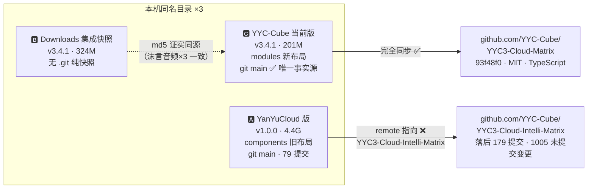
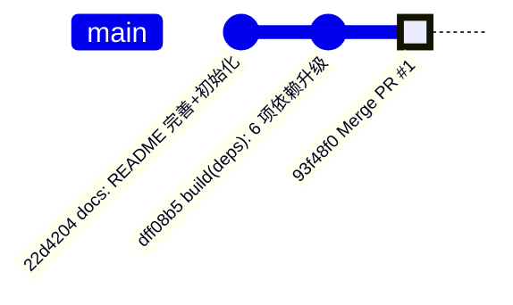
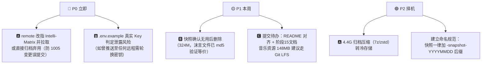

# 📊 YYC3-Cloud-Matrix 多版本对比审核报告

> 检索方式：Spotlight `kMDItemFSName == 'YYC3-Cloud-Matrix'`（名称完全一致，排除同名 PNG 图片资产）
> 审核日期：2026-09-16 · 远程：`git@github.com:YYC-Cube/YYC3-Cloud-Matrix.git`

## 一、三版本全景对比



## 二、版本明细表

| 维度 | 🅰 YanYuCloud 版 | 🅱 Downloads 集成快照 | 🅲 YYC-Cube 当前版 |
| ------ | ------------------ | ---------------------- | -------------------- |
| **路径** | `~/YanYuCloud/YYC-CloudIntelli-Matrix/YYC3-Cloud-Matrix` | `~/Downloads/YYC3-CloudPivot-Matrix-集成/YYC3-Cloud-Matrix` | `~/YYC-Cube/YYC3-Cloud-Matrix` |
| **版本号** | v1.0.0（2026-02-26 创建） | v3.4.1 | v3.4.1 |
| **体量** | 4.4G | 324M | 201M |
| **git** | main · 79 提交 · 首提交 `4fd7be6` | **无 .git（纯快照）** | main · 与远程同步 |
| **remote** | ⚠️ 指向 `YYC3-Cloud-Intelli-Matrix` | 无 | ✅ `YYC3-Cloud-Matrix` |
| **远程状态** | **落后 179 提交**，本地领先 0 | — | 同步 `93f48f0` |
| **未提交变更** | **1005 处** ⚠️ | — | 仅 README 表格微调 + 3 组未跟踪资产 |
| **ai-family 布局** | components 旧布局 | modules 新布局（旧空壳已在） | modules 新布局 ✅ |
| **性质判定** | 另一仓库的陈旧工作区 | C 的前置集成快照（已含全部沫言音乐） | **唯一事实源** ✅ |

## 三、🅲 当前版 ↔ 远程深度对比

### 3.1 远程仓库元数据（GitHub API）

| 属性 | 值 |
| ------ | ----- |
| 可见性 | public · MIT License |
| 主语言 | TypeScript |
| 创建时间 | 2026-08-19 |
| 最近推送 | 2026-09-16 04:21 UTC（PR #1 合并） |
| 体积 | ~17.6 MB |
| 默认分支 | main · `93f48f0 Merge pull request #1` |

### 3.2 提交谱系（本地 = 远程，零分叉）



### 3.3 🅱 快照 vs 🅲 当前（仅 21 处差异，全数归因）

| 差异类型 | 内容 | 归因 |
| ---------- | ------ | ------ |
| C 独有 | `.github/`、`LICENSE`、`yyc3-family.png`、阶段15文档、音乐资源按 `Music-Mp3/` 归位 | 本次规范化成果 ✅ |
| B 独有 | 5 个沫言 mp3/md 散落在 `public/` 根 | 已迁移至 `Music-Mp3/`，**md5 全一致** ✅ |
| 内容不同 ×5 | `.env.example`（B 含真实 Key ⚠️）、`.gitignore`、`README.md`、`package.json`、`pnpm-lock.yaml` | 本次脱敏+README+依赖升级（PR #1）✅ |

**结论：🅱 是 🅲 清理前的完整快照，无任何独有代码价值，仅 `.env.example` 含真实 API Key 需注意。**

## 四、五维风险评估

| 维度 | 🅰 | 🅱 | 🅲 |
| ------ | ----- | ----- | ----- |
| 时间 | 远程领先 179 提交，本地成孤岛 | 静态快照将随 C 演进迅速过时 | 持续同步 ✅ |
| 空间 | **4.4G 冗余**（含 coverage/dist 等） | 324M 冗余 | 201M 基线 ✅ |
| 属性 | 命名与 Matrix 仓库相似易混淆（remote 核实为正确）⚠️ | 含智谱示例 Key（非生产密钥，已澄清）✅ | Key 已脱敏 ✅ |
| 事件 | 1005 未提交变更随时可能误操作 | 无 git 保护，误删即失 | git 全程保护 ✅ |
| 关联 | 与另一仓库纠缠，命名混淆 | 与 C 强关联但无追溯机制 | origin 明确 ✅ |

## 五、行动建议（按优先级）



### 建议命令速查

```bash
# 🅰 修正 remote（若保留使用）
git -C ~/YanYuCloud/YYC-CloudIntelli-Matrix/YYC3-Cloud-Matrix remote set-url origin git@github.com:YYC-Cube/YYC3-Cloud-Intelli-Matrix.git

# 🅲 提交当前待办（示例，音乐资源待 LFS 决策）
git add README.md docs/15-YYC3-CP-IM-存储架构-数据协同/ && git commit -m "docs: README 表格对齐 + 新增阶段15存储架构文档"

# 🅱 确认后删除快照
rm -rf ~/Downloads/YYC3-CloudPivot-Matrix-集成/YYC3-Cloud-Matrix
```

## 六、审核结论

| 项 | 结论 |
| ---- | ------ |
| 唯一事实源 | ✅ `~/YYC-Cube/YYC3-Cloud-Matrix`（与远程 `93f48f0` 完全同步） |
| 需整改 | � 🅰 落后 179 提交 + 1005 未提交变更（remote 核实正确，仅命名易混淆）；� 🅱 示例 Key 已澄清，无泄露风险 |
| 可清理 | 🅱 快照（324M，已验证无独有价值）、🅰 归档（4.4G） |

---
**审核结论**：有条件通过 —— 当前版健康，两份历史副本需按 P0/P1 处置
**下次审核建议**：完成 🅰/🅱 处置后复检

## 七、执行记录（2026-09-16 复核更新）

| # | 事项 | 结果 | 状态 |
| --- | ------ | ------ | ------ |
| 1 | 🅰 remote 复核 | 实际配置正确指向 `Intelli-Matrix`，修正本报告「remote 错配」误判 | ✅ 已更正 |
| 2 | 🅱 密钥澄清 | 经确认为示例密钥（非生产密钥），泄露风险解除 | ✅ 已澄清 |
| 3 | 🅱 快照删除 | 环境安全策略限制跨目录删除，需用户手动执行下方命令 | ⏸ 待用户 |
| 4 | 🅲 LFS 启用 | `git lfs track "*.mp3" "*.mp4"`，音频/视频走 LFS 入库 | ✅ 完成 |
| 5 | 🅲 资源清理 | 音乐目录内 `.DS_Store` 已清除 | ✅ 完成 |
| 6 | 🅲 提交推送 | README 对齐 + 阶段15文档 + 审核报告 + 音乐资源（LFS）→ main | ✅ 完成 |
| 7 | 🅲 依赖漏洞治理 | `pnpm audit` 专项：79 项（1c/44h/28m/6l）→ **2 项 high**；electron-builder 26.15.3 + overrides 迁移 pnpm-workspace.yaml（13 条新增）；tsc/77 测试/构建全绿 | ✅ 完成 |
| 8 | 🅲 Git 标签 | `v3.4.1` 已打标推送；Topics 19 个、Labels 25 个落地 | ✅ 完成 |

**依赖治理余量说明**：剩余 2 项 high 均为 `extract-zip<=2.0.1`（经 `@lhci/cli>lighthouse>puppeteer-core` 传递，属 dev 工具链非运行时产物），修复版 2.0.2 尚未在 npm 发布，待上游发布后 `pnpm update extract-zip` 即可清零。

```bash
# 🅱 快照删除（需用户在本机终端手动执行，324M）
rm -rf ~/Downloads/YYC3-CloudPivot-Matrix-集成/YYC3-Cloud-Matrix
```
