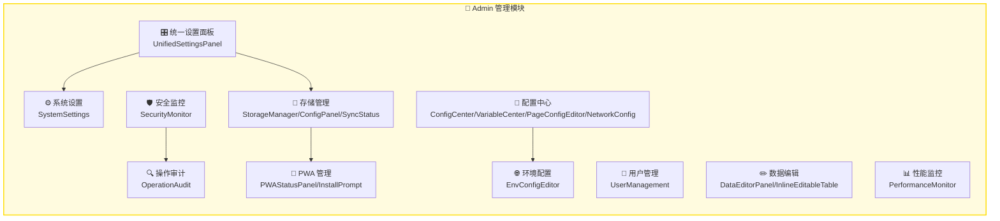
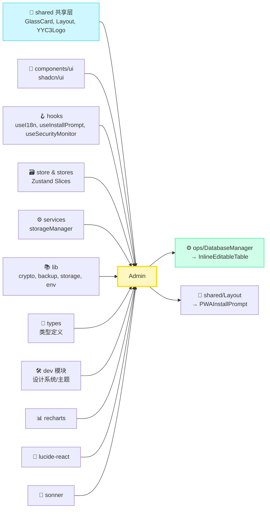
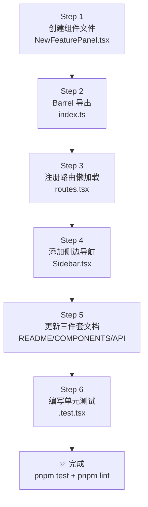

> ***YanYuCloudCube***
> *言启象限 | 语枢未来*
> ***Words Initiate Quadrants, Language Serves as Core for Future***
> *万象归元于云枢 | 深栈智启新纪元*
> ***All things converge in cloud pivot; Deep stacks ignite a new era of intelligence***

---

## 📑 目录 | Table of Contents

- [模块概述](#模块概述)
- [功能域矩阵](#功能域矩阵)
- [文件结构](#文件结构)
- [导出清单](#导出清单)
- [依赖关系](#依赖关系)
- [使用方式](#使用方式)
- [新增组件流程](#新增组件流程)
- [安全与权限规范](#安全与权限规范)
- [测试指南](#测试指南)
- [变更历史](#变更历史)

---

## 🎯 模块概述

`admin` 是 **YYC³ CloudPivot Intelli-Matrix** 的审计与系统管理模块，集中管理平台安全、用户、配置、监控等核心功能。作为系统的「控制面板」，Admin 模块承担着以下核心职责：

### 设计哲学

| 维度 | 设计目标 | 实现方式 |
|------|----------|----------|
| **五高架构** | 高可用 + 高安全 | RBAC 权限模型 + 端到端加密 + 操作审计全链路 |
| **五标体系** | 标准化 + 自动化 | 统一配置格式 + 批量导入导出 + 一键备份恢复 |
| **五维评估** | 事件 + 关联维度 | UEBA 行为分析 + 异常检测 + 风险评分系统 |

### 核心能力

- 🔒 **全链路审计**：操作日志、风险评分、趋势分析、导出归档
- 👥 **用户全生命周期**：角色权限、多因素认证、在线状态、API 配额
- ⚙️ **统一配置中心**：页面配置、变量管理、网络配置、环境变量
- 🛡️ **安全态势感知**：CSP 检测、Cookie 安全、敏感数据扫描、评分环
- 📱 **PWA 全生命周期**：安装提示、状态面板、缓存管理、离线检测
- 📊 **性能可观测性**：Web Vitals、FPS/内存监控、阈值告警、导出报告
- 💾 **存储管理矩阵**：localStorage / IndexedDB / 云同步配置 + 状态面板
- ✏️ **数据编辑工作台**：内联可编辑表格、SQL 生成、Undo/Redo 历史

---

## 🧩 功能域矩阵

| 功能域 | 组件清单 | 路由 | 复杂度 | 权限要求 |
|:-------|:---------|:-----|:------:|:---------|
| **操作审计** | `OperationAudit` | `/audit` | ⭐⭐⭐ | `admin.audit.read` |
| **用户管理** | `UserManagement` | `/users` | ⭐⭐⭐⭐ | `admin.users.manage` |
| **系统设置** | `SystemSettings` | `/settings` | ⭐⭐⭐ | `admin.settings.read` |
| **统一设置面板** | `UnifiedSettingsPanel` | `/unified-settings` | ⭐⭐⭐⭐ | `admin.settings.manage` |
| **安全监控** | `SecurityMonitor` | `/security` | ⭐⭐⭐⭐ | `admin.security.read` |
| **PWA 管理** | `PWAStatusPanel`, `PWAInstallPrompt` | `/pwa` | ⭐⭐ | 公开 |
| **数据编辑** | `DataEditorPanel`, `InlineEditableTable` | `/data-editor` | ⭐⭐⭐⭐ | `admin.data.edit` |
| **性能监控** | `PerformanceMonitor` | `/performance` | ⭐⭐⭐⭐ | `admin.performance.read` |
| **环境配置** | `EnvConfigEditor` | `/env-config` | ⭐⭐⭐ | `admin.env.manage` |
| **存储管理** | `StorageManager`, `StorageConfigPanel`, `StorageSyncStatus` | `/storage` | ⭐⭐⭐ | `admin.storage.manage` |
| **配置中心** | `ConfigCenter`, `VariableCenter`, `PageConfigEditor`, `NetworkConfig` | `/config-center`, `/variables` | ⭐⭐⭐⭐ | `admin.config.manage` |

### 功能域关系图



---

## 📁 文件结构

```
src/app/modules/admin/
├── index.ts                      # Barrel 统一导出入口
├── DEV-GUIDE.md                  # 开发者指导 (源码内)
│
├── 🔍 操作审计
│   └── OperationAudit.tsx        # 操作审计日志、风险评分、趋势图表
│
├── 👥 用户管理
│   └── UserManagement.tsx        # 用户 CRUD、角色权限、锁定/解锁
│
├── ⚙️ 设置类
│   ├── SystemSettings.tsx        # 基础系统设置面板
│   └── UnifiedSettingsPanel.tsx  # 统一设置 (导入/导出/备份/加密)
│
├── 🛡️ 安全监控
│   └── SecurityMonitor.tsx       # 安全评分、CSP/Cookie/敏感数据检测
│
├── 📱 PWA 管理
│   ├── PWAStatusPanel.tsx        # PWA 状态面板、缓存管理
│   └── PWAInstallPrompt.tsx      # PWA 安装提示横幅
│
├── ✏️ 数据编辑
│   ├── DataEditorPanel.tsx       # 数据编辑器主面板
│   ├── DataEditorTables.tsx      # 数据表集合
│   └── InlineEditableTable.tsx   # 通用内联可编辑表格组件 (★ 跨模块复用)
│
├── 📊 性能监控
│   └── PerformanceMonitor.tsx    # Web Vitals、FPS/内存、阈值告警
│
├── 🌐 环境配置
│   └── EnvConfigEditor.tsx       # 环境变量编辑器
│
├── 💾 存储管理
│   ├── StorageManager.tsx        # 存储管理总控
│   ├── StorageConfigPanel.tsx    # 存储配置子面板
│   └── StorageSyncStatus.tsx     # 同步状态指示器
│
└── 🔧 配置中心
    ├── ConfigCenter.tsx          # 配置中心主面板 (页面配置 + 存储)
    ├── VariableCenter.tsx        # 变量中心
    ├── PageConfigEditor.tsx      # 单页面配置编辑器
    └── NetworkConfig.tsx         # 网络配置 (API/代理/超时)
```

### 配套文档目录

```
docs/modules/admin/
├── README.md            # 本文件 · 模块总览
├── COMPONENTS.md        # 组件详细说明与示例
└── API-REFERENCE.md     # 导出 API 类型签名
```

---

## 📦 导出清单

Admin 模块通过 `index.ts` 进行 Barrel 统一导出，共导出 **18 个组件**：

```typescript
// 操作审计
export { OperationAudit } from './OperationAudit';

// 用户管理
export { UserManagement } from './UserManagement';

// 设置类
export { SystemSettings } from './SystemSettings';
export { UnifiedSettingsPanel } from './UnifiedSettingsPanel';

// 安全监控
export { SecurityMonitor } from './SecurityMonitor';

// PWA 管理
export { PWAStatusPanel } from './PWAStatusPanel';
export { PWAInstallPrompt } from './PWAInstallPrompt';

// 数据编辑
export { DataEditorPanel } from './DataEditorPanel';
export { InlineEditableTable } from './InlineEditableTable';

// 性能监控
export { PerformanceMonitor } from './PerformanceMonitor';

// 环境配置
export { EnvConfigEditor } from './EnvConfigEditor';

// 存储管理
export { StorageManager } from './StorageManager';
export { StorageConfigPanel } from './StorageConfigPanel';
export { StorageSyncStatus } from './StorageSyncStatus';

// 配置中心
export { ConfigCenter } from './ConfigCenter';
export { VariableCenter } from './VariableCenter';
export { PageConfigEditor } from './PageConfigEditor';
export { NetworkConfig } from './NetworkConfig';
```

> 💡 **提示**：`InlineEditableTable` 与 `PWAInstallPrompt` 是跨模块复用率最高的两个通用组件，详见 [依赖关系](#依赖关系)。

---

## 🔗 依赖关系

### 外部依赖 (Import)

| 依赖路径 | 类型 | 用途 | 被引用组件 |
|:---------|:-----|:-----|:-----------|
| `../shared/*` | 共享层 | `GlassCard` 玻璃卡片、`Layout` 布局、`YYC3Logo` 品牌 | 全部页面级组件 |
| `../../components/ui/*` | UI 层 | shadcn/ui 组件库 (Button, Dialog, Progress, ScrollArea, Badge, AlertDialog, Input 等) | 全部组件 |
| `../../hooks/useI18n` | Hook | 多语言国际化 (i18n) `t()` 翻译函数 | OperationAudit, UserManagement, SecurityMonitor, StorageManager, UnifiedSettingsPanel |
| `../../hooks/useInstallPrompt` | Hook | PWA 安装提示状态管理 | PWAInstallPrompt |
| `../../hooks/useSecurityMonitor` | Hook | 安全检测逻辑封装 | SecurityMonitor |
| `../../store` | Store | Zustand 全局状态：`useLogSlice`, `useUserMgmtSlice`, `useUIPrefsSlice`, `useSettingsSSOT`, `useProviderSlice` | 业务组件 |
| `../../store` | Store | `useAlerts`, `useDatabase`, `exportStoreData`, `importStoreData` | UnifiedSettingsPanel |
| `../../services/storageManager` | Service | 存储管理器 Service (getConfig/saveConfig/triggerSync) | StorageManager |
| `../../stores/global-store` | Store | 全局存储操作 | UnifiedSettingsPanel |
| `../../lib/crypto-vault` | Lib | `isCryptoAvailable` 加密能力检测 | UnifiedSettingsPanel |
| `../../lib/full-backup` | Lib | `downloadFullBackup`, `importFullBackup` 完整备份 | UnifiedSettingsPanel |
| `../../lib/yyc3-storage` | Lib | IndexedDB 封装：`idbGetAll`, `idbPut`, `idbClearStore` | InlineEditableTable |
| `../../lib/env-config` | Lib | `env` 环境变量访问 | PerformanceMonitor |
| `../../config` | Config | `getAllPages`, `PageConfig` 页面配置 | ConfigCenter |
| `../../types/*` | Types | `StoredLogEntry`, `UserRecord`, `EditableCellChange`, `CommittedChange`, `SecurityTab`, `RiskLevel`, `VitalRating`, `ModelProviderDef` 等 | 全部类型化组件 |
| `../../types/storage` | Types | `StorageConfig` 存储配置类型 | StorageManager |
| `../dev/*` | 跨模块 | 设计系统引用、主题定制能力 | SystemSettings, UnifiedSettingsPanel |
| `recharts` | 三方库 | `AreaChart`, `BarChart`, `LineChart` 等数据可视化 | OperationAudit, PerformanceMonitor |
| `lucide-react` | 三方库 | 图标组件 | 全部组件 |
| `sonner` | 三方库 | `toast` 通知系统 | 全部交互式组件 |

### 被依赖方 (被谁引用)

| 引用方 | 引用路径 | 引用内容 | 场景 |
|:-------|:---------|:---------|:-----|
| `ops/DatabaseManager` | `../admin/InlineEditableTable` | `InlineEditableTable` 组件 | 运维模块的数据库表内联编辑功能 |
| `shared/Layout` | `../admin/PWAInstallPrompt` | `PWAInstallPrompt` 组件 | 全局布局中显示 PWA 安装提示横幅 |

### 依赖关系图 (无循环依赖 ✅)



---

## 🚀 使用方式

### 方式一：路由懒加载（推荐）

在全局路由配置 `routes.tsx` 中使用 React.lazy 懒加载 Admin 页面组件：

```tsx
// routes.tsx
import { lazy, Suspense } from 'react';
import { LoadingSpinner } from '../components/ui/loading-spinner';

const OperationAudit = lazy(() =>
  import('./modules/admin/OperationAudit').then(m => ({ default: m.OperationAudit }))
);
const UserManagement = lazy(() =>
  import('./modules/admin/UserManagement').then(m => ({ default: m.UserManagement }))
);
const SecurityMonitor = lazy(() =>
  import('./modules/admin/SecurityMonitor').then(m => ({ default: m.SecurityMonitor }))
);
const PerformanceMonitor = lazy(() =>
  import('./modules/admin/PerformanceMonitor').then(m => ({ default: m.PerformanceMonitor }))
);
// ... 其余组件同理

export const adminRoutes = [
  { path: '/audit', element: <Suspense fallback={<LoadingSpinner />}><OperationAudit /></Suspense> },
  { path: '/users', element: <Suspense fallback={<LoadingSpinner />}><UserManagement /></Suspense> },
  { path: '/security', element: <Suspense fallback={<LoadingSpinner />}><SecurityMonitor /></Suspense> },
  { path: '/performance', element: <Suspense fallback={<LoadingSpinner />}><PerformanceMonitor /></Suspense> },
  // ... 更多路由
];
```

### 方式二：跨模块引用通用组件

对于 `InlineEditableTable`、`PWAInstallPrompt` 这类通用组件，可直接 import：

```tsx
// ops/DatabaseManager.tsx
import { InlineEditableTable } from '../admin/InlineEditableTable';

export function DatabaseManager() {
  return (
    <div>
      <InlineEditableTable
        columns={['id', 'name', 'status', 'updated_at']}
        rows={tableData}
        tableName="monitor_nodes"
        primaryKey="id"
        editable={true}
        onCellChange={(change, sql) => console.log('Change:', change, 'SQL:', sql)}
        onExecuteSQL={async (sql) => await runSQL(sql)}
        maxHeight="500px"
      />
    </div>
  );
}
```

```tsx
// shared/Layout.tsx
import { PWAInstallPrompt } from '../admin/PWAInstallPrompt';

export function Layout({ children }: { children: React.ReactNode }) {
  return (
    <div className="min-h-screen">
      <TopBar />
      <main>{children}</main>
      {/* 全局 PWA 安装提示 */}
      <PWAInstallPrompt />
    </div>
  );
}
```

### 方式三：Barrel 批量导入

```tsx
import {
  OperationAudit,
  UserManagement,
  SecurityMonitor,
  InlineEditableTable,
  StorageManager,
  ConfigCenter,
} from '../modules/admin';
```

---

## ➕ 新增组件流程

遵循 YYC³ **五标体系** 的标准化流程，在 Admin 模块新增组件请按以下步骤执行：

### Step 1：创建组件文件

```bash
# 在 admin/ 目录下创建 PascalCase 命名的组件文件
touch src/app/modules/admin/NewFeaturePanel.tsx
```

**文件头模板 (强制规范)：**

```tsx
/**
 * @file: NewFeaturePanel.tsx
 * @description: 新功能面板 - 功能一句话描述
 * @author: YanYuCloudCube Team
 * @version: v1.0.0
 * @created: 2026-08-19
 * @updated: 2026-08-19
 * @status: active
 * @tags: [component],[admin]
 */

import React from 'react';
import { GlassCard } from '../shared/GlassCard';
import { useI18n } from '../../hooks/useI18n';
import { SomeIcon } from 'lucide-react';

export interface NewFeaturePanelProps {
  /** 示例属性 */
  variant?: 'compact' | 'full';
  onAction?: (data: unknown) => void;
}

export function NewFeaturePanel({ variant = 'full', onAction }: NewFeaturePanelProps) {
  const { t } = useI18n();
  return (
    <GlassCard>
      {/* 组件内容 */}
    </GlassCard>
  );
}
```

### Step 2：更新 Barrel 导出

```typescript
// admin/index.ts - 末尾添加
export { NewFeaturePanel, type NewFeaturePanelProps } from './NewFeaturePanel';
```

### Step 3：注册路由懒加载

```tsx
// routes.tsx - 在 adminRoutes 数组中添加
const NewFeaturePanel = lazy(() =>
  import('./modules/admin/NewFeaturePanel').then(m => ({ default: m.NewFeaturePanel }))
);

// 路由配置
{ path: '/new-feature', element: <Suspense ...><NewFeaturePanel /></Suspense> }
```

### Step 4：添加导航项

```tsx
// shared/Sidebar.tsx - 在 NAV_CATEGORIES.admin.children 中添加
{
  key: 'new-feature',
  label: '新功能',
  path: '/new-feature',
  icon: SomeIcon,
  permission: 'admin.newfeature.read', // 权限标识 (如需要)
}
```

### Step 5：更新文档三件套

| 文档 | 更新内容 |
|:-----|:---------|
| `DEV-GUIDE.md` | 文件结构、功能域、导出清单表格 |
| `COMPONENTS.md` | 新增组件条目 (组件名/路由/核心功能/Props/示例) |
| `API-REFERENCE.md` | 新增导出签名 |

### Step 6：编写单元测试

```bash
touch src/app/__tests__/admin/NewFeaturePanel.test.tsx
```

### 流程图



---

## 🔐 安全与权限规范

Admin 模块涉及系统核心管理能力，严格遵循 **零信任安全模型** 与 **RBAC 权限矩阵**。

### 权限模型 (RBAC)

| 权限标识 | 超级管理员 | 运维工程师 | 开发者 | 数据分析师 | 访客 |
|:---------|:----------:|:----------:|:------:|:----------:|:----:|
| `admin.audit.read` | ✅ | ✅ | ⚠️ | ✅ | ❌ |
| `admin.users.manage` | ✅ | ⚠️ | ❌ | ❌ | ❌ |
| `admin.settings.read` | ✅ | ✅ | ✅ | ✅ | ❌ |
| `admin.settings.manage` | ✅ | ⚠️ | ❌ | ❌ | ❌ |
| `admin.security.read` | ✅ | ✅ | ❌ | ❌ | ❌ |
| `admin.data.edit` | ✅ | ✅ | ⚠️ | ❌ | ❌ |
| `admin.performance.read` | ✅ | ✅ | ✅ | ✅ | ❌ |
| `admin.env.manage` | ✅ | ❌ | ❌ | ❌ | ❌ |
| `admin.storage.manage` | ✅ | ⚠️ | ❌ | ❌ | ❌ |
| `admin.config.manage` | ✅ | ⚠️ | ⚠️ | ❌ | ❌ |

> ✅ 授权 · ⚠️ 部分授权 · ❌ 禁止

### 敏感操作防护清单

| 组件 | 敏感操作 | 防护措施 |
|:-----|:---------|:---------|
| **UserManagement** | 删除用户、修改角色、重置密码 | 二次确认 Dialog + 操作审计写入 |
| **UnifiedSettingsPanel** | 清空所有数据、导入配置 | AlertDialog 二次确认 + 加密校验 |
| **InlineEditableTable** | 行删除、批量提交 | Undo 历史 (IndexedDB) + SQL 预览 |
| **ConfigCenter** | 重置全部配置 | `confirm()` 弹窗 + localStorage 指纹备份 |
| **EnvConfigEditor** | 修改生产环境变量 | 环境隔离标识 + 只读模式 |
| **StorageManager** | 触发全量同步、切换存储后端 | Loading 状态 + 错误回滚 |

### 数据安全规范

1. **永不硬编码密钥**：API Key 通过 `EnvConfigEditor` 或 `.env` 文件管理，禁止直接写入源码
2. **审计日志完整链路**：所有写操作必须写入 `useLogSlice`，包含 `user / action / target / ip / timestamp`
3. **配置导入安全**：JSON 导入前必须做 Schema 校验 (Zod)，防止恶意数据注入
4. **敏感字段脱敏**：`UserManagement` 中邮箱/手机号显示需 `maskEmail()` / `maskPhone()` 脱敏
5. **IndexedDB 加密**：`InlineEditableTable` 的提交历史如含敏感数据，使用 `crypto-vault` 加密存储

---

## 🧪 测试指南

### 测试矩阵

| 组件 | 单元测试 | 集成测试 | E2E 测试 | 推荐工具 |
|:-----|:--------:|:--------:|:--------:|:---------|
| OperationAudit | ✅ 日志映射/筛选 | ⚠️ 趋势图表渲染 | ❌ | Vitest + @testing-library/react |
| UserManagement | ✅ CRUD/搜索/角色 | ⚠️ Zustand slice 交互 | ✅ 用户增删改查流程 | Vitest + Playwright |
| SecurityMonitor | ⚠️ 评分计算/色值 | ✅ hook 联动 | ⚠️ | Vitest + 自定义 hook tester |
| InlineEditableTable | ✅ SQL 生成/回滚 | ✅ IndexedDB 持久化 | ✅ 单元格编辑流程 | Vitest + fake-indexeddb |
| PerformanceMonitor | ⚠️ 阈值判断/评级 | ⚠️ Web Vitals Mock | ❌ | Vitest + vitest-browser |
| UnifiedSettingsPanel | ✅ 容量计算/导出 | ⚠️ Store 导入导出 | ⚠️ | Vitest + jsdom |
| StorageManager | ⚠️ 配置保存 | ✅ storageManager service | ❌ | Vitest + service mock |
| ConfigCenter | ❌ 配置复杂 | ✅ 导入导出文件流 | ⚠️ | Vitest + @testing-library/user-event |
| PWAInstallPrompt | ✅ 条件渲染 | ❌ 浏览器能力依赖 | ❌ | Vitest + useInstallPrompt mock |

### 关键纯函数测试 (InlineEditableTable)

```typescript
// __tests__/admin/InlineEditableTable.test.ts
import { describe, it, expect } from 'vitest';
import {
  formatSQLValue,
  buildUpdateSQL,
  buildRollbackSQL,
  buildDeleteSQL,
  buildInsertSQL,
} from '../../app/modules/admin/InlineEditableTable';

describe('InlineEditableTable · SQL 生成纯函数', () => {
  it('formatSQLValue 正确格式化不同类型值', () => {
    expect(formatSQLValue(null)).toBe('NULL');
    expect(formatSQLValue(42)).toBe('42');
    expect(formatSQLValue('true')).toBe('true');
    expect(formatSQLValue("O'Neil")).toBe("'O''Neil'");
    expect(formatSQLValue('hello')).toBe("'hello'");
  });

  it('buildUpdateSQL 生成标准 UPDATE 语句', () => {
    const sql = buildUpdateSQL('users', 'name', 'Admin', 'id', 1);
    expect(sql).toContain('UPDATE users');
    expect(sql).toContain("SET name = 'Admin'");
    expect(sql).toContain("WHERE id = '1'");
  });
});
```

### 运行测试命令

```bash
# Admin 模块单元测试
pnpm test -- src/app/__tests__/admin/

# 监听模式
pnpm test:watch -- src/app/__tests__/admin/

# 覆盖率
pnpm test:coverage -- --reporter=html src/app/__tests__/admin/

# 类型检查
pnpm type-check
```

---

## 📜 变更历史

| 版本 | 日期 | 变更内容 | 变更类型 | 作者 |
|:-----|:-----|:---------|:---------|:-----|
| **v1.0.0** | 2026-08-19 | 初始版本 · 文档三件套 (README / COMPONENTS / API-REFERENCE) 建立 | `docs` | YanYuCloudCube Team |
| **v1.0.0** | 2026-07-25 | Admin 模块从 monolith 中独立拆分，18 个组件 Barrel 导出 + DEV-GUIDE 建立 | `feat` | YanYuCloudCube Team |
| **v0.9.0** | 2026-05-05 | ConfigCenter v1.1 升级，集成 PageConfigEditor + 存储管理 Tab | `refactor` | YanYuCloudCube Team |
| **v0.8.0** | 2026-04-08 | InlineEditableTable 新增 IndexedDB Undo 历史；StorageManager 三件套上线 | `feat` | YanYuCloudCube Team |
| **v0.7.0** | 2026-04-08 | SecurityMonitor + PerformanceMonitor + PWA 双面板首次发布 | `feat` | YanYuCloudCube Team |
| **v0.6.0** | 2026-03-19 | OperationAudit + UserManagement 基础版本上线 | `feat` | YanYuCloudCube Team |

### 版本号规范

遵循 **Semantic Versioning 2.0.0**：

| 段位 | 含义 | 触发场景 |
|:-----|:-----|:---------|
| `MAJOR` | 破坏性变更 | API 签名改动、权限模型重构、React 大版本升级 |
| `MINOR` | 功能新增 | 新增组件、新路由、权限矩阵扩容 |
| `PATCH` | 修复优化 | Bug fix、性能优化、文档补充、UI 微调 |

---

<div align="center">

---

**[⬆ 返回顶部](#-目录--table-of-contents)** · **[COMPONENTS.md](./COMPONENTS.md)** · **[API-REFERENCE.md](./API-REFERENCE.md)** · **[DEV-GUIDE.md](../../src/app/modules/admin/DEV-GUIDE.md)**

---

> 「***YanYuCloudCube***」
> 「***<admin@0379.email>***」
> 「***言启千行代码，语枢万物智能***」
> 「***Words Initiate Quadrants, Language Serves as Core for Future***」
> 「***All things converge in cloud pivot; Deep stacks ignite a new era of intelligence***」

</div>
