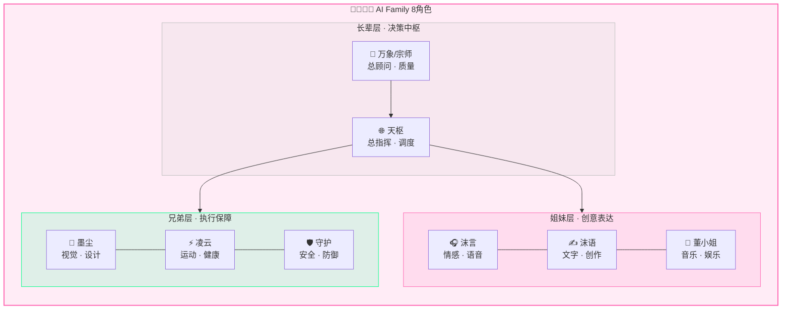
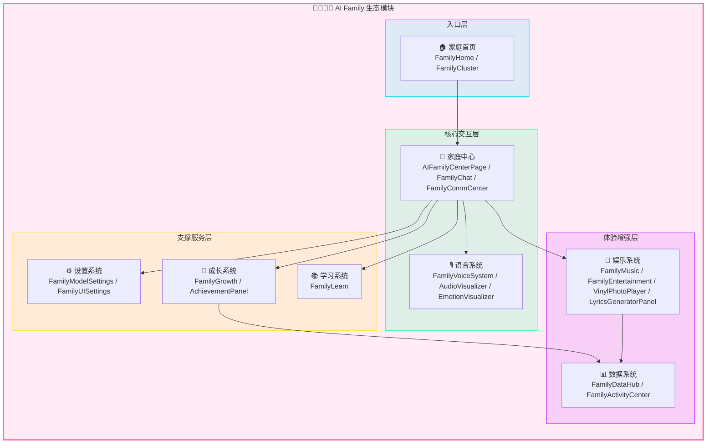
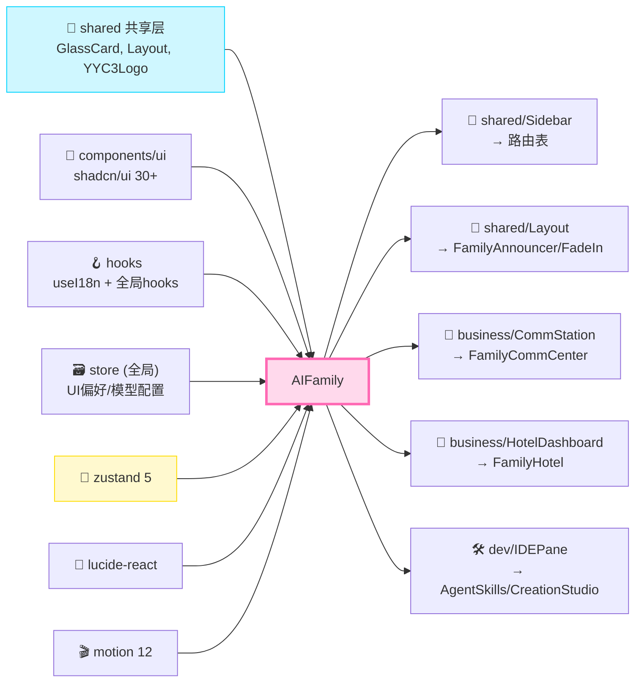
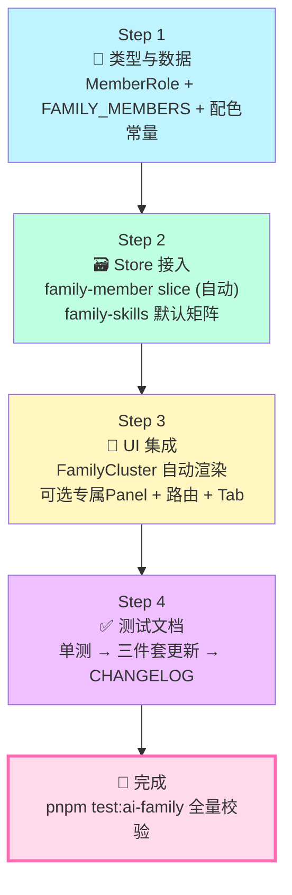
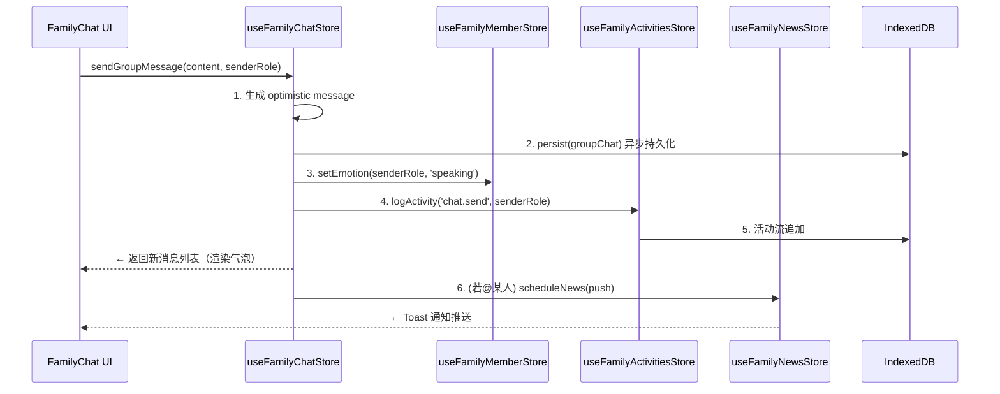

> ***YanYuCloudCube***
> *言启象限 | 语枢未来*
> ***Words Initiate Quadrants, Language Serves as Core for Future***
> *万象归元于云枢 | 深栈智启新纪元*
> ***All things converge in cloud pivot; Deep stacks ignite a new era of intelligence***

---

## 📑 目录 | Table of Contents

- [🎯 模块概述](#-模块概述)
- [👨‍👩‍👧‍👦 8位家人角色介绍](#-8位家人角色介绍)
- [🧩 功能域矩阵](#-功能域矩阵)
- [📁 文件结构](#-文件结构)
- [📦 导出清单](#-导出清单)
- [🔗 依赖关系](#-依赖关系)
- [🛣️ 子路由配置示例](#️-子路由配置示例)
- [➕ 新增家人流程（4步）](#-新增家人流程4步)
- [🗃️ 状态管理架构（13 slices）](#️-状态管理架构13-slices)
- [🧪 测试指南](#-测试指南)
- [📜 变更历史](#-变更历史)

---

## 🎯 模块概述

`ai-family` 是 **YYC³ CloudPivot Intelli-Matrix** 中**复杂度最高、功能最丰富**的核心模块（complexity: advanced），构建了包含 **8位拟人化AI家人** 的完整情感交互生态系统。作为系统的「情感中枢」与「智能协作层」，AI Family 模块承担着以下核心职责：

### 设计哲学

| 维度 | 设计目标 | 实现方式 |
|------|----------|----------|
| **五高架构** | 高智能 + 高可用 | 8角色分布式协作 + IndexedDB记忆持久化 + 多模型热切换 |
| **五标体系** | 智能化 + 可视化 | 情感可视化波纹 + 语音交互闭环 + 成长勋章自动化 |
| **五维评估** | 时间 + 事件 + 关联维度 | 时间轴记忆系统 + 家庭事件流 + 跨角色关联情感图谱 |

### 核心能力（八大功能域）

- 🏠 **家庭首页**：家人集群展示（FamilyCluster）、状态概览、快速入口
- 💬 **家庭中心**：多角色群聊（FamilyChat）、通讯中心（FamilyCommCenter）、语音通话
- ⚙️ **模型设置**：每位家人独立模型绑定（FamilyModelSettings）、UI皮肤定制（FamilyUISettings）
- 🎵 **娱乐系统**：家庭音乐台（FamilyMusic）、娱乐中心（FamilyEntertainment）、黑胶唱片播放器（VinylPhotoPlayer）、AI歌词生成器（LyricsGeneratorPanel）
- 🌱 **成长系统**：成长轨迹（FamilyGrowth）、勋章成就面板（AchievementPanel）
- 🎙️ **语音系统**：全双工语音交互（FamilyVoiceSystem）、音频可视化（AudioVisualizer）、情感波纹（EmotionVisualizer）
- 📚 **学习系统**：家庭学习中心（FamilyLearn）、AI导师协作教学
- 📊 **数据系统**：家庭数据枢纽（FamilyDataHub）、活动中心（FamilyActivityCenter）

---

## 👨‍👩‍👧‍👦 8位家人角色介绍

AI Family 由 8 位性格鲜明、能力互补的拟人化AI家人构成完整的智能协作家庭：

| 角色头像 | 名字 | 代号 | 主题色 | 性格定位 | 核心能力 | 绑定模型建议 |
|:--------:|:----:|:----:|:-------|:---------|:---------|:-------------|
| 🎧 | **沫言** | `moyan` | `#FF69B4` 霓虹粉 | 温柔大姐 · 情感倾诉官 | 语音识别 · NLP情感分析 · 多语言翻译 · 心理陪伴 | 智谱 GLM-4-Flash / 语音模型 |
| ✍️ | **沫语** | `moyu` | `#00D4FF` 霓虹青 | 知性二姐 · 文字艺术家 | 文案创作 · 诗歌生成 · 书信撰写 · 对话润色 | DeepSeek V3 / 文心一言 |
| 🎤 | **董小姐** | `dongxiaojie` | `#FFD700` 霓虹金 | 音乐女神 · 娱乐总监 | 音乐推荐 · 歌词创作 · 电台主持 · 卡拉OK评分 | 音乐专用模型 / Suno API |
| 🎨 | **墨尘** | `mochen` | `#8B5CF6` 霓虹紫 | 沉默三哥 · 视觉大师 | 图像生成 · UI设计 · 视频剪辑 · 视觉审美 | Midjourney / Stable Diffusion |
| ⚡ | **凌云** | `lingyun` | `#00FF88` 霓虹绿 | 热血四哥 · 运动教练 | 健身计划 · 运动数据分析 · 健康提醒 · 户外导航 | 专业领域模型 |
| 🛡️ | **守护** | `shouhu` | `#BF00FF` 霓虹紫罗 | 安全卫士 · 五弟 | UEBA行为分析 · 异常检测 · SOAR安全编排 · 隐私保护 | 安全审计模型 / Sentinel |
| 🌐 | **天枢** | `tianshu` | `#00BFFF` 深天蓝 | 家族大脑 · 总指挥 | 强化学习 · 运筹优化 · 分布式调度 · 全局决策 | 元模型 Orchestrator |
| 🧙 | **万象 / 宗师** | `wanxiang` / `zongshi` | `#C0C0C0` 铂金 | 智慧长老 · 质量官 | 深度推理 · 代码审查 · 性能分析 · LLM代码理解 | 最强旗舰模型 / GPT-4 级别 |

### 角色关系图谱



### 家人配色常量

```typescript
export const NEON_CYAN   = "#00D4FF";  // 沫语
export const NEON_PINK   = "#FF69B4";  // 沫言
export const NEON_GOLD   = "#FFD700";  // 董小姐
export const NEON_PURPLE = "#8B5CF6";  // 墨尘
export const NEON_GREEN  = "#00FF88";  // 凌云
export const NEON_VIOLET = "#BF00FF";  // 守护
export const NEON_SKY    = "#00BFFF";  // 天枢
export const NEON_PLATINUM = "#C0C0C0"; // 万象/宗师
```

---

## 🧩 功能域矩阵

| 功能域 | 核心组件 | 路由路径 | 复杂度 | Store依赖 | 权限要求 |
|:-------|:---------|:---------|:------:|:----------|:---------|
| 🏠 **家庭首页** | `FamilyHome`, `FamilyCluster` | `/ai-family/home` | ⭐⭐⭐ | family-member, family-activities | 公开 |
| 💬 **家庭中心** | `AIFamilyCenterPage`, `FamilyChat`, `FamilyCommCenter` | `/ai-family/center` | ⭐⭐⭐⭐⭐ | family-chat, family-message, family-calllog | 登录用户 |
| ⚙️ **模型设置** | `FamilyModelSettings`, `FamilyUISettings` | `/ai-family/settings` | ⭐⭐⭐⭐ | family-settings, family-member | `family.settings.manage` |
| 🎵 **娱乐系统** | `FamilyMusic`, `FamilyEntertainment`, `VinylPhotoPlayer`, `LyricsGeneratorPanel` | 子路由嵌套 | ⭐⭐⭐⭐ | family-skills, family-memories | 登录用户 |
| 🌱 **成长系统** | `FamilyGrowth`, `AchievementPanel` | 子路由嵌套 | ⭐⭐⭐ | family-milestones, family-medals | 登录用户 |
| 🎙️ **语音系统** | `FamilyVoiceSystem`, `AudioVisualizer`, `EmotionVisualizer` | 子路由嵌套 | ⭐⭐⭐⭐⭐ | family-chat, family-message | 麦克风权限 |
| 📚 **学习系统** | `FamilyLearn` | 子路由嵌套 | ⭐⭐⭐ | family-milestones, family-skills | 登录用户 |
| 📊 **数据系统** | `FamilyDataHub`, `FamilyActivityCenter` | 子路由嵌套 | ⭐⭐⭐⭐ | family-activities, family-posts, family-moments, family-news | `family.data.read` |

### 功能域关系图



---

## 📁 文件结构

```
src/app/modules/ai-family/
├── index.ts                          # Barrel 统一导出入口（30+组件 + 13 hooks + 类型）
├── DEV-GUIDE.md                      # 源码内开发者指南
├── routes.ts                         # 模块子路由配置表
├── AIFamilyPage.tsx                  # 模块总入口页（路由容器）
│
├── components/                       # 30+ 组件目录
│   ├── shared/                       # 共享小组件（跨功能域复用）
│   │   ├── FamilyPageHeader.tsx      # 统一页面头部（带家人Tab切换）
│   │   ├── LazyWrap.tsx              # 懒加载包装器 + Skeleton
│   │   ├── FadeIn.tsx                # 渐入动画包装器
│   │   ├── CoverFlow.tsx             # 3D CoverFlow 家人轮播
│   │   ├── EmotionRipple.tsx         # 情感波纹可视化
│   │   └── ai-family-local.ts        # 本地化文案 + i18n 资源包
│   │
│   ├── AIFamilyRouter.tsx            # 模块内部路由分发器
│   │
│   ├── 🏠 家庭首页
│   │   ├── FamilyHome.tsx            # 首页总控（欢迎语 + 快捷卡片）
│   │   └── FamilyCluster.tsx         # 8家人集群卡片（3D翻转 + 在线状态）
│   │
│   ├── 💬 家庭中心
│   │   ├── AIFamilyCenterPage.tsx    # 中心页总布局（Tab导航）
│   │   ├── FamilyChat.tsx            # 家庭群聊（多角色消息气泡）
│   │   └── FamilyCommCenter.tsx      # 通讯中心（通话记录 + 拨号盘）
│   │
│   ├── ⚙️ 设置系统
│   │   ├── FamilyModelSettings.tsx   # 模型绑定（每位家人独立配置）
│   │   └── FamilyUISettings.tsx      # UI皮肤 / 主题色 / 动画级别
│   │
│   ├── 🎵 娱乐系统
│   │   ├── FamilyMusic.tsx           # 家庭音乐台（8位家人DJ）
│   │   ├── FamilyEntertainment.tsx   # 娱乐中心总控
│   │   ├── VinylPhotoPlayer.tsx      # 黑胶唱片风格播放器 + 相册
│   │   └── LyricsGeneratorPanel.tsx  # AI歌词生成器（调参 + 导出）
│   │
│   ├── 🌱 成长系统
│   │   ├── FamilyGrowth.tsx          # 成长时间轴 + 经验值进度
│   │   └── AchievementPanel.tsx      # 勋章墙 + 成就解锁动画
│   │
│   ├── 🎙️ 语音系统
│   │   ├── FamilyVoiceSystem.tsx     # 语音交互主控（STT/TTS闭环）
│   │   ├── AudioVisualizer.tsx       # Canvas频谱可视化
│   │   └── EmotionVisualizer.tsx     # 实时情感雷达图
│   │
│   ├── 📚 学习系统
│   │   └── FamilyLearn.tsx           # 学习中心（课程 + AI导师分配）
│   │
│   ├── 📊 数据系统
│   │   ├── FamilyDataHub.tsx         # 数据总览仪表盘
│   │   └── FamilyActivityCenter.tsx  # 活动流 + 动态墙
│   │
│   └── 🏨 业务映射子系统
│       ├── FamilyHotel.tsx           # 智慧酒店映射控制台
│       ├── FamilyPhone.tsx           # 家庭电话（模拟机）
│       ├── FamilyShare.tsx           # 分享面板（卡片生成）
│       ├── FamilyAnnouncer.tsx       # 家庭公告广播器
│       ├── CreationStudio.tsx        # 创意工坊（多模态创作台）
│       ├── ThemeSwitcher.tsx         # 家族主题切换器
│       └── AgentSkills.tsx           # 家人技能矩阵面板
│
├── store/                            # Zustand 状态分片（13个独立 slices）
│   ├── family-member.ts              # 8位家人元数据 + 在线状态
│   ├── family-message.ts             # 单聊消息列表 + 已读状态
│   ├── family-settings.ts            # 全局设置（模型/UI/语音）
│   ├── family-skills.ts              # 家人技能树 + 熟练度
│   ├── family-memories.ts            # 家庭记忆库（向量索引元数据）
│   ├── family-calllog.ts             # 通话记录 + 通话时长统计
│   ├── family-milestones.ts          # 成长里程碑 + 经验值
│   ├── family-medals.ts              # 勋章定义 + 解锁状态
│   ├── family-posts.ts               # 家庭动态发布 + 点赞评论
│   ├── family-moments.ts             # 时光相册 + 照片墙
│   ├── family-news.ts                # 家庭公告 + 通知推送
│   ├── family-chat.ts                # 群聊会话（多角色并发）
│   └── family-activities.ts          # 活动日志 + 事件流
│
└── types/                            # 类型定义
    ├── family-member.ts              # FamilyMember / MemberRole / EmotionState
    └── family-message.ts             # ChatMessage / VoiceMessage / CallRecord
```

### 配套文档目录（即本目录）

```
docs/modules/ai-family/
├── README.md            # 本文件 · 模块总览 + 架构 + 流程
├── COMPONENTS.md        # 30+ 组件详解 · 按功能域分组
└── API-REFERENCE.md     # 组件签名 · 13 Store Hooks · 类型 · 常量 · 函数
```

---

## 📦 导出清单

AI Family 模块通过 `index.ts` Barrel 统一导出，共导出 **30+ 组件** + **13 Zustand Hooks** + **完整类型系统** + **共享数据常量**：

### 🧩 组件导出（30+）

```typescript
// 路由容器
export { AIFamilyPage } from './AIFamilyPage';
export { AIFamilyRouter } from './components/AIFamilyRouter';

// 🏠 家庭首页
export { FamilyHome } from './components/FamilyHome';
export { FamilyCluster } from './components/FamilyCluster';

// 💬 家庭中心
export { AIFamilyCenterPage } from './components/AIFamilyCenterPage';
export { FamilyChat } from './components/FamilyChat';
export { FamilyCommCenter } from './components/FamilyCommCenter';

// ⚙️ 设置系统
export { FamilyModelSettings } from './components/FamilyModelSettings';
export { FamilyUISettings } from './components/FamilyUISettings';

// 🎵 娱乐系统
export { FamilyMusic } from './components/FamilyMusic';
export { FamilyEntertainment } from './components/FamilyEntertainment';
export { VinylPhotoPlayer } from './components/VinylPhotoPlayer';
export { LyricsGeneratorPanel } from './components/LyricsGeneratorPanel';

// 🌱 成长系统
export { FamilyGrowth } from './components/FamilyGrowth';
export { AchievementPanel } from './components/AchievementPanel';

// 🎙️ 语音系统
export { FamilyVoiceSystem } from './components/FamilyVoiceSystem';
export { AudioVisualizer } from './components/AudioVisualizer';
export { EmotionVisualizer } from './components/EmotionVisualizer';

// 📚 学习系统
export { FamilyLearn } from './components/FamilyLearn';

// 📊 数据系统
export { FamilyDataHub } from './components/FamilyDataHub';
export { FamilyActivityCenter } from './components/FamilyActivityCenter';

// 🏨 业务映射子系统
export { FamilyHotel } from './components/FamilyHotel';
export { FamilyPhone } from './components/FamilyPhone';
export { FamilyShare } from './components/FamilyShare';
export { FamilyAnnouncer } from './components/FamilyAnnouncer';
export { CreationStudio } from './components/CreationStudio';
export { ThemeSwitcher } from './components/ThemeSwitcher';
export { AgentSkills } from './components/AgentSkills';

// 🔷 通用/共享组件
export { FamilyPageHeader } from './components/shared/FamilyPageHeader';
export { LazyWrap } from './components/shared/LazyWrap';
export { FadeIn } from './components/shared/FadeIn';
export { CoverFlow } from './components/shared/CoverFlow';
export { EmotionRipple } from './components/shared/EmotionRipple';
```

### 🗃️ Store Hooks 导出（13）

```typescript
export { useFamilyMemberStore }   from './store/family-member';
export { useFamilyMessageStore }  from './store/family-message';
export { useFamilySettingsStore } from './store/family-settings';
export { useFamilySkillsStore }   from './store/family-skills';
export { useFamilyMemoriesStore } from './store/family-memories';
export { useFamilyCallLogStore }  from './store/family-calllog';
export { useFamilyMilestonesStore } from './store/family-milestones';
export { useFamilyMedalsStore }   from './store/family-medals';
export { useFamilyPostsStore }    from './store/family-posts';
export { useFamilyMomentsStore }  from './store/family-moments';
export { useFamilyNewsStore }     from './store/family-news';
export { useFamilyChatStore }     from './store/family-chat';
export { useFamilyActivitiesStore } from './store/family-activities';
```

### 📐 类型与常量导出

```typescript
// 类型定义
export type {
  FamilyMember, MemberRole, EmotionState, MemberStatus,
  MemberSkill, MemberPreferences,
} from './types/family-member';

export type {
  ChatMessage, MessageType, MessageStatus, VoiceMessage,
  CallRecord, CallDirection, CallStatus,
} from './types/family-message';

// 共享数据常量
export { FAMILY_MEMBERS }       from './components/shared/ai-family-local';   // 8位家人基础数据
export { NEON_COLORS }          from './components/shared/ai-family-local';   // 8色主题对象
export { NEON_CYAN, NEON_PINK, NEON_GOLD, NEON_PURPLE } from './components/shared/ai-family-local';
export { NEON_GREEN, NEON_VIOLET, NEON_SKY, NEON_PLATINUM } from './components/shared/ai-family-local';
export { MEMBER_ROLE_ORDER }    from './components/shared/ai-family-local';   // 家人排序权重
export { DEFAULT_SKILL_MATRIX } from './components/shared/ai-family-local';   // 初始技能矩阵

// 辅助函数
export { getGreeting }          from './components/shared/ai-family-local';   // 时段问候语
export { getHourlyCare }        from './components/shared/ai-family-local';   // 小时关怀建议
export { getMemberThemeColor }  from './components/shared/ai-family-local';   // 获取家人主题色
export { getMemberByRole }      from './components/shared/ai-family-local';   // 按role查家人
export { formatDuration }       from './components/shared/ai-family-local';   // 通话时长格式化
export { timeAgo }              from './components/shared/ai-family-local';   // 相对时间
```

---

## 🔗 依赖关系

### 外部依赖（Import）

| 依赖路径 | 类型 | 用途 | 被引用组件 |
|:---------|:-----|:-----|:-----------|
| `../shared/*` | 共享层 | `GlassCard` 玻璃卡片、`Layout` 布局、`YYC3Logo` 品牌、`LoadingSpinner` | 全部页面级组件 |
| `../../components/ui/*` | UI层 | shadcn/ui（Button/Dialog/Tabs/Avatar/Badge/Card/Slider/Progress/ScrollArea/Sheet/Accordion/Carousel等） | 全部组件 |
| `../../hooks/useI18n` | Hook | 多语言 `t()` 翻译函数 | 全部文本组件 |
| `../../store/*` | Store | 全局 Zustand Slices（`useUIPrefsSlice`, `useSettingsSSOT`, `useProviderSlice` 等） | 设置/模型绑定类组件 |
| `zustand` | 三方库 | 轻量级状态管理 + `useShallow` 选择器优化 | store/ 全部 13 slices |
| `lucide-react` | 三方库 | 图标体系（30+种图标跨组件复用） | 全部组件 |
| `motion` (`framer-motion`) | 三方库 | 高性能动画（`motion.div`, `AnimatePresence`, `useSpring`） | FamilyCluster / CoverFlow / FadeIn / EmotionRipple / AchievementPanel |

### 被依赖方（被谁引用）

| 引用方 | 引用内容 | 场景 |
|:-------|:---------|:-----|
| `shared/Sidebar` | `routes.ts` 路由表 · `FamilyHome` 入口 | 侧边栏导航注入 AI Family 菜单组 |
| `shared/Layout` | `FamilyAnnouncer` 通知组件 · `FadeIn` 动画包装器 | 全局布局层嵌入家庭公告 + 统一入场动画 |
| `business/CommStationPanel` | `FamilyCommCenter` 通讯能力 + `FamilyPhone` UI | 通讯基站业务复用家庭通话体系 |
| `business/HotelDashboard` | `FamilyHotel` 智慧酒店映射控制台 | 酒店业务直接嵌入8角色映射面板 |
| `dev/IDEPane` | `AgentSkills` 技能矩阵 + `CreationStudio` 创意工坊 | IDE工作台嵌入家人创作辅助能力 |

### 依赖关系图（无循环依赖 ✅）



---

## 🛣️ 子路由配置示例

AI Family 模块使用嵌套路由结构，推荐在全局 `routes.tsx` 中按如下方式配置（React Router 7 + lazy 懒加载）：

```tsx
// routes.tsx - AI Family 子路由
import { lazy, Suspense } from 'react';
import { LoadingSpinner } from '../../components/ui/loading-spinner';
import { FadeIn } from '../ai-family/components/shared/FadeIn';

// 总入口容器
const AIFamilyPage = lazy(() =>
  import('../ai-family/AIFamilyPage').then(m => ({ default: m.AIFamilyPage }))
);

// 🏠 家庭首页
const FamilyHome = lazy(() =>
  import('../ai-family/components/FamilyHome').then(m => ({ default: m.FamilyHome }))
);

// 💬 家庭中心
const AIFamilyCenterPage = lazy(() =>
  import('../ai-family/components/AIFamilyCenterPage').then(m => ({ default: m.AIFamilyCenterPage }))
);

// ⚙️ 设置系统
const FamilyModelSettings = lazy(() =>
  import('../ai-family/components/FamilyModelSettings').then(m => ({ default: m.FamilyModelSettings }))
);
const FamilyUISettings = lazy(() =>
  import('../ai-family/components/FamilyUISettings').then(m => ({ default: m.FamilyUISettings }))
);

// 🎵 娱乐系统
const FamilyEntertainment = lazy(() =>
  import('../ai-family/components/FamilyEntertainment').then(m => ({ default: m.FamilyEntertainment }))
);

// 🌱 成长系统
const FamilyGrowth = lazy(() =>
  import('../ai-family/components/FamilyGrowth').then(m => ({ default: m.FamilyGrowth }))
);

// 🎙️ 语音系统
const FamilyVoiceSystem = lazy(() =>
  import('../ai-family/components/FamilyVoiceSystem').then(m => ({ default: m.FamilyVoiceSystem }))
);

// 📚 学习系统
const FamilyLearn = lazy(() =>
  import('../ai-family/components/FamilyLearn').then(m => ({ default: m.FamilyLearn }))
);

// 📊 数据系统
const FamilyDataHub = lazy(() =>
  import('../ai-family/components/FamilyDataHub').then(m => ({ default: m.FamilyDataHub }))
);

// 辅助：Suspense + FadeIn 包装器
const withLoading = (Element: React.LazyExoticComponent<React.FC>) => (
  <Suspense fallback={<LoadingSpinner className="py-20" />}>
    <FadeIn>
      <Element />
    </FadeIn>
  </Suspense>
);

// AI Family 路由表（嵌套在 /ai-family 下）
export const aiFamilyRoutes = [
  {
    path: '/ai-family',
    element: withLoading(AIFamilyPage),
    children: [
      { index: true, element: <Navigate to="/ai-family/home" replace /> },
      { path: 'home',     element: withLoading(FamilyHome) },
      { path: 'center',   element: withLoading(AIFamilyCenterPage) },
      { path: 'settings', element: withLoading(FamilyModelSettings) },
      { path: 'settings/ui', element: withLoading(FamilyUISettings) },
      { path: 'entertainment', element: withLoading(FamilyEntertainment) },
      { path: 'growth',   element: withLoading(FamilyGrowth) },
      { path: 'voice',    element: withLoading(FamilyVoiceSystem) },
      { path: 'learn',    element: withLoading(FamilyLearn) },
      { path: 'datahub',  element: withLoading(FamilyDataHub) },
    ],
  },
];
```

---

## ➕ 新增家人流程（4步）

遵循 YYC³ 五标体系标准化流程，新增第9位家人需严格按以下 4 步执行：

### Step 1：类型与数据层扩展

```typescript
// 1. types/family-member.ts - 扩展 MemberRole 枚举
export type MemberRole =
  | 'moyan' | 'moyu' | 'dongxiaojie' | 'mochen'
  | 'lingyun' | 'shouhu' | 'tianshu' | 'wanxiang'
  | 'xinjiaren';  // 新增角色代号

// 2. components/shared/ai-family-local.ts
import { NEON_ORANGE } from '../../lib/theme-tokens'; // 分配主题色

export const FAMILY_MEMBERS: FamilyMember[] = [
  // ... 原有 8 位
  {
    id: 'member-9',
    role: 'xinjiaren',
    name: '新家人名字',
    title: '角色定位头衔',
    emoji: '🆕',
    themeColor: NEON_ORANGE,
    description: '一句话角色介绍',
    defaultModel: 'provider-x/model-y',
    skills: ['skill-1', 'skill-2'],
    personality: ['性格标签1', '性格标签2'],
    birthday: '2026-08-19',
    joinDate: Date.now(),
    status: 'online',
    exp: 0,
    level: 1,
  } satisfies FamilyMember,
];

export const MEMBER_ROLE_ORDER = [
  'wanxiang', 'tianshu', 'moyan', 'moyu', 'dongxiaojie',
  'mochen', 'lingyun', 'shouhu', 'xinjiaren', // 追加
];

// 3. 配色常量
export const NEON_ORANGE = '#FF7043';
```

### Step 2：Store 与业务逻辑接入

```typescript
// store/family-member.ts - 初始数据会自动加载 FAMILY_MEMBERS
// 无需修改 slice 逻辑（数据驱动设计）

// store/family-skills.ts - 如需要特殊技能树
export const DEFAULT_SKILL_MATRIX = {
  // ... 原有 8 位
  xinjiaren: { creativity: 90, analysis: 60, empathy: 85 },
};
```

### Step 3：UI 组件集成

```tsx
// 1. components/FamilyCluster.tsx - 会自动渲染 FAMILY_MEMBERS 中的第9位
// （无需修改，数组驱动）

// 2. 如果需要专属交互面板：创建 components/XinjiarenPanel.tsx
import { GlassCard } from '../../shared/GlassCard';
import { useFamilyMemberStore } from '../store/family-member';
import { NEON_ORANGE } from '../components/shared/ai-family-local';

export function XinjiarenPanel() {
  const member = useFamilyMemberStore(s => s.getMemberByRole('xinjiaren'));
  return <GlassCard accent={NEON_ORANGE}>{/* 专属内容 */}</GlassCard>;
}

// 3. routes.ts - 追加专属路由
{ path: 'xinjiaren', element: withLoading(XinjiarenPanel) },

// 4. components/shared/FamilyPageHeader.tsx - Tab导航追加
const FAMILY_TABS = [
  // ... 原有
  { key: 'xinjiaren', label: '新家人', icon: NewIcon, role: 'xinjiaren' },
];
```

### Step 4：测试 + 文档 + 变更记录

```bash
# 1. 单元测试
touch src/app/__tests__/ai-family/family-member-xinjiaren.test.ts

# 2. 更新三件套文档
#    README.md      → 8位→9位角色表 + 关系图 + 流程验证
#    COMPONENTS.md  → XinjiarenPanel 条目
#    API-REFERENCE.md → XinjiarenPanel 签名 + 新类型/常量

# 3. CHANGELOG 追加
echo "- feat(ai-family): 新增家人「新家人」角色 (#9)" >> CHANGELOG.md
```

### 流程图



---

## 🗃️ 状态管理架构（13 slices）

AI Family 模块采用 **Zustand 分片模式**，按业务边界拆分为 13 个独立 Store Slice，各自负责单一职责，通过 `selectors` 组合使用：

### 13 Slices 全景矩阵

| # | Slice 文件 | Hook 名 | 状态字段 | Actions | 持久化 | 复杂度 |
|:-:|:-----------|:--------|:---------|:--------|:-------:|:------:|
| 1 | `family-member.ts` | `useFamilyMemberStore` | `members: FamilyMember[]`, `activeMemberId`, `onlineStatusMap` | `setOnline()` / `setEmotion()` / `getMemberByRole()` / `updateMemberExp()` | ✅ IndexedDB | ⭐⭐⭐ |
| 2 | `family-message.ts` | `useFamilyMessageStore` | `threads: Map<memberId, ChatMessage[]>`, `unreadCount` | `sendMessage()` / `markRead()` / `recallMessage()` / `searchMessages()` | ✅ IndexedDB | ⭐⭐⭐⭐ |
| 3 | `family-settings.ts` | `useFamilySettingsStore` | `modelBindings`, `uiTheme`, `voiceConfig`, `notificationPrefs` | `bindModel()` / `setThemeColor()` / `setVoiceParams()` / `exportSettings()` | ✅ localStorage | ⭐⭐⭐ |
| 4 | `family-skills.ts` | `useFamilySkillsStore` | `skillMatrix`, `skillCooldowns` | `upgradeSkill()` / `triggerSkill()` / `getSkillRecommendations()` | ✅ IndexedDB | ⭐⭐⭐ |
| 5 | `family-memories.ts` | `useFamilyMemoriesStore` | `memories: Memory[]`, `vectorIndexMeta` | `saveMemory()` / `recallMemories()` / `semanticSearch()` / `forgetMemory()` | ✅ IndexedDB | ⭐⭐⭐⭐ |
| 6 | `family-calllog.ts` | `useFamilyCallLogStore` | `callLogs: CallRecord[]`, `activeCall`, `totalMinutes` | `startCall()` / `endCall()` / `missedCall()` / `getStatsByMember()` | ✅ IndexedDB | ⭐⭐⭐ |
| 7 | `family-milestones.ts` | `useFamilyMilestonesStore` | `milestones`, `expMap`, `levelMap` | `grantExp()` / `levelUp()` / `unlockMilestone()` / `getExpRank()` | ✅ IndexedDB | ⭐⭐⭐ |
| 8 | `family-medals.ts` | `useFamilyMedalsStore` | `medalDefinitions`, `unlockedMedals` | `unlockMedal()` / `revokeMedal()` / `getMedalProgress()` | ✅ IndexedDB | ⭐⭐ |
| 9 | `family-posts.ts` | `useFamilyPostsStore` | `posts`, `likes`, `comments` | `publishPost()` / `likePost()` / `commentPost()` / `deletePost()` | ✅ IndexedDB | ⭐⭐⭐ |
| 10 | `family-moments.ts` | `useFamilyMomentsStore` | `moments: PhotoMoment[]`, `albums` | `uploadMoment()` / `createAlbum()` / `deleteMoment()` | ✅ IndexedDB | ⭐⭐⭐ |
| 11 | `family-news.ts` | `useFamilyNewsStore` | `announcements`, `pushQueue` | `broadcast()` / `dismiss()` / `scheduleNews()` | ✅ localStorage | ⭐⭐ |
| 12 | `family-chat.ts` | `useFamilyChatStore` | `groupChat: ChatMessage[]`, `typingMembers`, `pinnedMessage` | `sendGroupMessage()` / `setTyping()` / `pinMessage()` | ✅ IndexedDB | ⭐⭐⭐⭐ |
| 13 | `family-activities.ts` | `useFamilyActivitiesStore` | `activityStream`, `eventCounters` | `logActivity()` / `getDailyDigest()` / `getActivityHeatmap()` | ✅ IndexedDB | ⭐⭐⭐ |

### 数据流示意图（以家庭群聊发送消息为例）



### 跨 Slice 组合使用示例

```tsx
// FamilyHome.tsx - 同时依赖多个 slices（使用 useShallow 优化重渲染）
import { useShallow } from 'zustand/react/shallow';
import { useFamilyMemberStore }   from '../store/family-member';
import { useFamilyActivitiesStore } from '../store/family-activities';
import { useFamilyMedalsStore }   from '../store/family-medals';
import { useFamilyMilestonesStore } from '../store/family-milestones';

export function FamilyHome() {
  const { members, activeMemberId, setActiveMember } = useFamilyMemberStore(
    useShallow(s => ({
      members: s.members,
      activeMemberId: s.activeMemberId,
      setActiveMember: s.setActiveMember,
    }))
  );
  const todayActivity = useFamilyActivitiesStore(s => s.getDailyDigest(new Date()));
  const unlockedCount = useFamilyMedalsStore(s => s.unlockedMedals.length);
  const totalExp = useFamilyMilestonesStore(s =>
    Object.values(s.expMap).reduce((a, b) => a + b, 0)
  );
  // ...
}
```

---

## 🧪 测试指南

AI Family 模块采用「Store 纯函数 → Actions 业务逻辑 → UI 组件交互」三层测试金字塔，推荐 **Vitest 4 + @testing-library/react + Playwright** 工具链：

### 测试矩阵

| 层级 | 测试对象 | 覆盖要求 | 推荐工具 | 示例文件 |
|:-----|:---------|:---------|:---------|:---------|
| **Store 层**（基础） | 13 Zustand Slices | 100% Actions + Selectors | Vitest 4 | `__tests__/ai-family/store/*.test.ts` |
| **Actions 层**（业务） | 发送消息 / 解锁勋章 / 通话记录 / 技能触发 | 90%+ 关键流程 | Vitest 4 | `__tests__/ai-family/actions/*.test.ts` |
| **UI 层**（组件） | 30+ React 组件 · 关键用户交互 | 核心组件 80%+ | Testing Library + Playwright | `__tests__/ai-family/ui/*.test.tsx` |
| **E2E 层**（集成） | 家庭群聊 → 语音通话 → 勋章解锁完整链路 | 关键路径 100% | Playwright | `__tests__/ai-family/e2e/*.spec.ts` |

### 1️⃣ Store 单元测试示例

```typescript
// __tests__/ai-family/store/family-member.test.ts
import { describe, it, expect, beforeEach } from 'vitest';
import { useFamilyMemberStore } from '../../../app/modules/ai-family/store/family-member';
import { FAMILY_MEMBERS } from '../../../app/modules/ai-family/components/shared/ai-family-local';

describe('family-member slice', () => {
  beforeEach(() => useFamilyMemberStore.setState(useFamilyMemberStore.getInitialState()));

  it('初始状态包含全部 8 位家人', () => {
    const members = useFamilyMemberStore.getState().members;
    expect(members).toHaveLength(FAMILY_MEMBERS.length);
    expect(members.map(m => m.role)).toEqual(expect.arrayContaining([
      'moyan', 'moyu', 'dongxiaojie', 'mochen',
      'lingyun', 'shouhu', 'tianshu', 'wanxiang',
    ]));
  });

  it('getMemberByRole 正确按 role 检索家人', () => {
    const moyan = useFamilyMemberStore.getState().getMemberByRole('moyan');
    expect(moyan?.name).toBe('沫言');
    expect(moyan?.themeColor).toBeTruthy();
  });

  it('updateMemberExp 正确累加经验并触发升级', () => {
    const state = useFamilyMemberStore.getState();
    const moyanBefore = state.getMemberByRole('moyan')!;
    const beforeExp = moyanBefore.exp;

    state.updateMemberExp(moyanBefore.id, 150);

    const moyanAfter = state.getMemberByRole('moyan')!;
    expect(moyanAfter.exp).toBe(beforeExp + 150);
  });
});
```

### 2️⃣ Actions 业务流程测试示例

```typescript
// __tests__/ai-family/actions/chat-and-unlock.test.ts
import { describe, it, expect } from 'vitest';
import { useFamilyChatStore } from '../../../app/modules/ai-family/store/family-chat';
import { useFamilyActivitiesStore } from '../../../app/modules/ai-family/store/family-activities';
import { useFamilyMedalsStore } from '../../../app/modules/ai-family/store/family-medals';

describe('连续发消息 100 条 → 解锁「话痨」勋章', () => {
  it('完整闭环触发', () => {
    // 1. 循环发送 100 条群消息
    for (let i = 0; i < 100; i++) {
      useFamilyChatStore.getState().sendGroupMessage(`消息${i}`, 'moyan');
    }

    // 2. 验证活动日志正确记录
    const digest = useFamilyActivitiesStore.getState().getDailyDigest(new Date());
    expect(digest.chatCount).toBeGreaterThanOrEqual(100);

    // 3. 验证勋章自动解锁
    const medals = useFamilyMedalsStore.getState().unlockedMedals;
    expect(medals.map(m => m.code)).toContain('FIRST_100_CHATS');
  });
});
```

### 3️⃣ UI 组件测试示例

```tsx
// __tests__/ai-family/ui/FamilyCluster.test.tsx
import { describe, it, expect, vi } from 'vitest';
import { render, screen, fireEvent, within } from '@testing-library/react';
import { FamilyCluster } from '../../../app/modules/ai-family/components/FamilyCluster';

// 自动 mock 动画库，避免测试干扰
vi.mock('motion', () => ({
  motion: { div: ({ children, ...props }: any) => <div {...props}>{children}</div> },
  AnimatePresence: ({ children }: any) => <>{children}</>,
}));

describe('<FamilyCluster />', () => {
  it('渲染 8 位家人卡片，沫言卡片可点击切换激活状态', () => {
    const { container } = render(<FamilyCluster />);

    // 断言 8 张卡片存在
    const cards = screen.getAllByTestId(/^member-card-/);
    expect(cards).toHaveLength(8);

    // 点击沫言卡片
    const moyanCard = screen.getByTestId('member-card-moyan');
    fireEvent.click(moyanCard);

    // 断言激活样式
    expect(moyanCard).toHaveClass(/active|ring-2|ring-offset/);
  });
});
```

### 运行测试命令

```bash
# AI Family 模块全量测试
pnpm test -- src/app/__tests__/ai-family/

# Store 层单独测试（最基础，先跑）
pnpm test -- src/app/__tests__/ai-family/store/

# UI 层 + 覆盖率报告
pnpm test:coverage -- --reporter=html src/app/__tests__/ai-family/ui/

# 监听模式（开发时推荐）
pnpm test:watch -- src/app/__tests__/ai-family/

# 类型检查 + 测试 + lint 三合一（CI 提交前）
pnpm type-check && pnpm lint && pnpm test:ci -- src/app/__tests__/ai-family/
```

---

## 📜 变更历史

| 版本 | 日期 | 变更内容 | 变更类型 | 作者 |
|:-----|:-----|:---------|:---------|:-----|
| **v1.0.0** | 2026-08-19 | 文档三件套（README / COMPONENTS / API-REFERENCE）正式建立 · 覆盖 30+组件 + 13 slices + 完整流程 | `docs` | YanYuCloudCube Team |
| **v1.0.0** | 2026-07-20 | AI Family 模块从 monolith 中独立拆分，Barrel 统一导出，DEV-GUIDE + routes.ts 落地 | `feat` | YanYuCloudCube Team |
| **v0.9.2** | 2026-07-05 | 语音系统（FamilyVoiceSystem / AudioVisualizer / EmotionVisualizer）上线 + 娱乐系统四件套完成 | `feat` | YanYuCloudCube Team |
| **v0.9.0** | 2026-06-18 | 成长系统（FamilyGrowth / AchievementPanel）+ 数据系统（FamilyDataHub / FamilyActivityCenter）首次发布 | `feat` | YanYuCloudCube Team |
| **v0.8.0** | 2026-05-30 | 家庭中心三件套（AIFamilyCenterPage / FamilyChat / FamilyCommCenter）联调通过 | `feat` | YanYuCloudCube Team |
| **v0.7.0** | 2026-05-08 | 8位家人角色体系定稿（沫言/沫语/董小姐/墨尘/凌云/守护/天枢/万象）+ 13 Store Slices 架构确定 | `refactor` | YanYuCloudCube Team |
| **v0.5.0** | 2026-04-01 | AI Family MVP 上线：FamilyHome + FamilyCluster + FamilyModelSettings | `feat` | YanYuCloudCube Team |

### 版本号规范（SemVer 2.0.0）

| 段位 | 含义 | AI Family 触发场景示例 |
|:-----|:-----|:-----------------------|
| `MAJOR` | 破坏性变更 | 家人角色架构重构（如：8位→多家族）、Store Slice 合并/重命名、React大版本升级 |
| `MINOR` | 功能新增 | 新增第9位家人、新增功能域组件、新增路由、新增Store Slice、权限模型扩展 |
| `PATCH` | 修复优化 | UI 动画微调、消息气泡样式修正、状态持久化 Bug 修复、性能优化、文档补充 |

---

<div align="center">

---

**[⬆ 返回顶部](#-目录--table-of-contents)** · **[COMPONENTS.md](./COMPONENTS.md)** · **[API-REFERENCE.md](./API-REFERENCE.md)** · **[DEV-GUIDE.md](../../src/app/modules/ai-family/DEV-GUIDE.md)**

---

> 「***YanYuCloudCube***」
> 「***<admin@0379.email>***」
> 「***言启千行代码，语枢万物智能***」
> 「***Words Initiate Quadrants, Language Serves as Core for Future***」
> 「***All things converge in cloud pivot; Deep stacks ignite a new era of intelligence***」

</div>
