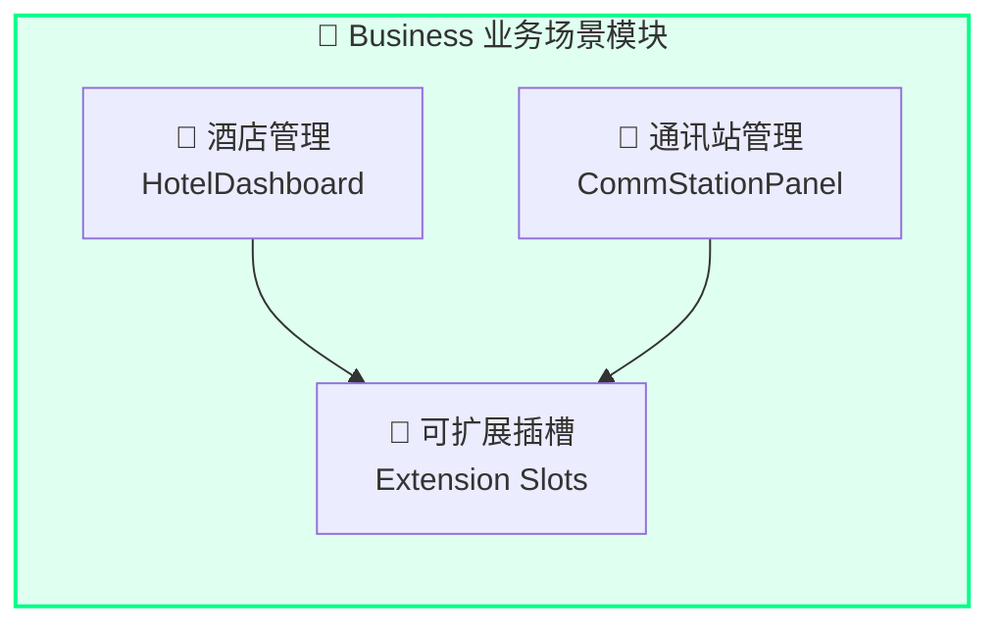
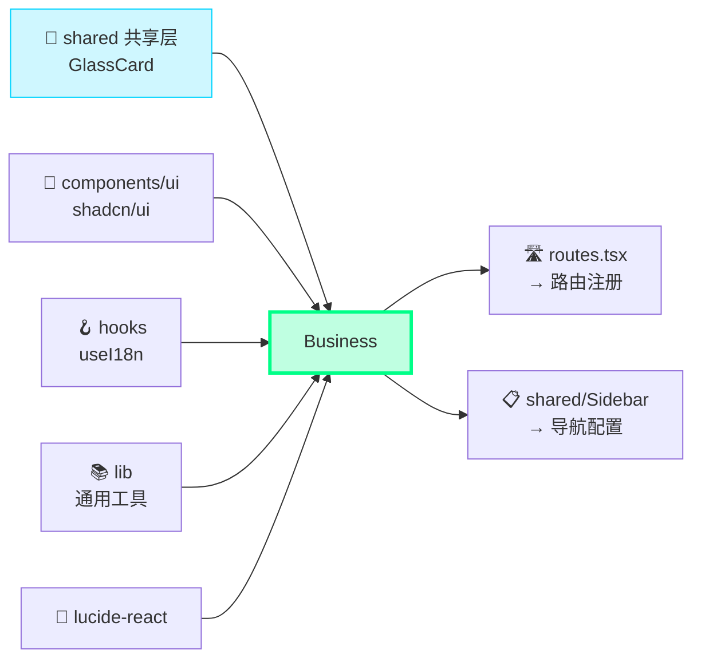
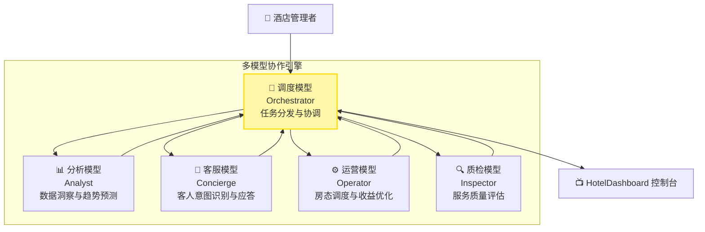
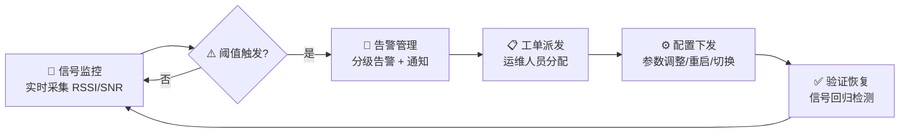
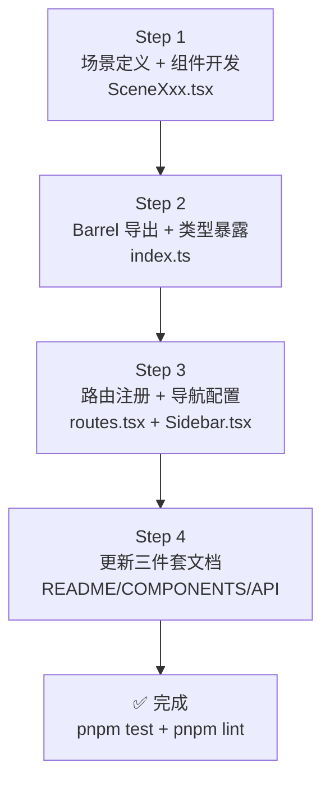
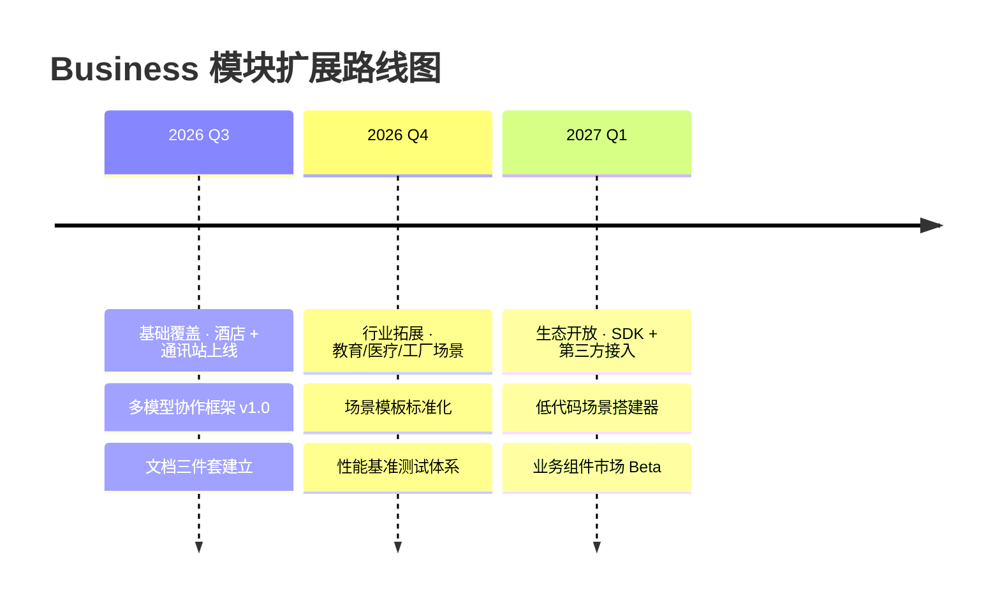

> ***YanYuCloudCube***
> *言启象限 | 语枢未来*
> ***Words Initiate Quadrants, Language Serves as Core for Future***
> *万象归元于云枢 | 深栈智启新纪元*
> ***All things converge in cloud pivot; Deep stacks ignite a new era of intelligence***

---

## 📑 目录 | Table of Contents

- [模块概述](#模块概述)
- [功能域矩阵](#功能域矩阵)
- [文件结构](#文件结构)
- [导出清单](#导出清单)
- [依赖关系](#依赖关系)
- [酒店管理功能说明](#酒店管理功能说明)
- [通讯站管理功能说明](#通讯站管理功能说明)
- [新增业务场景流程](#新增业务场景流程)
- [扩展规划路线图](#扩展规划路线图)
- [测试指南](#测试指南)
- [变更历史](#变更历史)

---

## 🎯 模块概述

`business` 是 **YYC³ CloudPivot Intelli-Matrix** 的业务场景模块，承载平台面向具体垂直行业的功能组件。作为系统的「业务落地层」，Business 模块承担着以下核心职责：

### 设计哲学

| 维度 | 设计目标 | 实现方式 |
|------|----------|----------|
| **五高架构** | 高可扩展性 + 高智能化 | 模块化业务插槽 + 多模型协作引擎 + AI 智能推荐 |
| **五标体系** | 标准化 + 生态化 | 统一业务组件规范 + 可插拔场景模板 + 行业生态扩展 |
| **五维评估** | 事件 + 关联维度 | 场景事件流转 + 多维度数据关联 + 业务闭环分析 |

### 核心能力

- 🏨 **智慧酒店管理**：多模型协作控制台，酒店运营全链路智能化
- 📡 **通讯基站管理**：通讯站监控面板，信号监测与告警闭环管理
- 🔌 **可扩展插槽**：预留标准接口，支持快速接入新业务场景
- 🤖 **AI 赋能**：内置多模型协作框架，智能推荐与自动化决策
- 📊 **业务洞察**：场景化数据分析仪表盘，辅助管理决策

---

## 🧩 功能域矩阵

| 功能域 | 组件清单 | 路由 | 复杂度 | 权限要求 |
|:-------|:---------|:-----|:------:|:---------|
| **酒店管理** | `HotelDashboard` | `/hotel` | ⭐⭐ | `business.hotel.read` |
| **通讯站管理** | `CommStationPanel` | `/comm-station` | ⭐⭐ | `business.comm.read` |

### 功能域关系图



---

## 📁 文件结构

```
src/app/modules/business/
├── index.ts                      # Barrel 统一导出入口
├── DEV-GUIDE.md                  # 开发者指导 (源码内)
│
├── 🏨 酒店管理
│   └── HotelDashboard.tsx        # 智慧酒店多模型协作控制台
│
└── 📡 通讯站管理
    └── CommStationPanel.tsx      # 通讯基站管理面板
```

### 配套文档目录

```
docs/modules/business/
├── README.md            # 本文件 · 模块总览
├── COMPONENTS.md        # 组件详细说明与示例
└── API-REFERENCE.md     # 导出 API 类型签名
```

---

## 📦 导出清单

Business 模块通过 `index.ts` 进行 Barrel 统一导出，共导出 **2 个组件**：

```typescript
// 酒店管理
export { HotelDashboard } from './HotelDashboard';
export type { HotelDashboardProps, HotelConfig } from './HotelDashboard';

// 通讯站管理
export { CommStationPanel } from './CommStationPanel';
export type { CommStationPanelProps, StationInfo, SignalLevel } from './CommStationPanel';
```

> 💡 **提示**：后续新增业务场景组件时，需同步更新 Barrel 导出与文档三件套。

---

## 🔗 依赖关系

### 外部依赖 (Import)

| 依赖路径 | 类型 | 用途 | 被引用组件 |
|:---------|:-----|:-----|:-----------|
| `../shared/GlassCard` | 共享层 | 玻璃拟态卡片容器 | HotelDashboard, CommStationPanel |
| `../../hooks/useI18n` | Hook | 多语言国际化 (i18n) `t()` 翻译函数 | 全部组件 |
| `../../lib/*` | Lib | 通用工具库 (格式化、验证、数据处理) | 全部组件 |
| `../../components/ui/*` | UI 层 | shadcn/ui 组件库 (Button, Badge, Progress, Table, Card 等) | 全部组件 |
| `lucide-react` | 三方库 | 图标组件 | 全部组件 |

### 被依赖方 (被谁引用)

| 引用方 | 引用路径 | 引用内容 | 场景 |
|:-------|:---------|:---------|:-----|
| `routes.tsx` | `./modules/business` | 全部业务场景组件 | 全局路由懒加载注册 |
| `shared/Sidebar` | `./modules/business` | 业务场景导航配置 | 侧边栏业务分组导航 |

### 依赖关系图 (无循环依赖 ✅)



---

## 🏨 酒店管理功能说明

### 多模型协作架构

`HotelDashboard` 采用**多模型协作 (Multi-Model Collaboration)** 架构，通过不同专长的 AI 模型协同完成酒店运营智能化任务：



### 核心功能模块

| 功能模块 | 描述 | 协作模型 |
|:---------|:-----|:---------|
| **运营控制台** | 入住率、RevPAR、客房状态一览 | 调度模型 + 分析模型 |
| **模型协作区** | 多模型对话与任务协同面板 | 全部模型 |
| **场景配置** | 酒店类型、服务等级、价格策略配置 | 运营模型 |
| **智能推荐** | 收益优化建议、人员排班推荐、促销策略 | 分析模型 + 运营模型 |
| **客人洞察** | 客群画像、满意度分析、投诉预测 | 客服模型 + 质检模型 |

### 典型协作流程

1. **数据采集层**：PMS 系统同步入住、订单、财务数据
2. **调度模型**：分析任务类型，分发给对应专长模型
3. **并行处理**：多模型同时进行趋势分析、客群分析、收益计算
4. **结果融合**：调度模型整合各模型输出，形成决策建议
5. **智能推荐**：在控制台展示可执行的优化方案

---

## 📡 通讯站管理功能说明

### 信号监控闭环

`CommStationPanel` 实现**信号监控 → 告警触发 → 工单流转 → 配置下发 → 验证恢复**的全闭环管理：



### 核心功能模块

| 功能模块 | 描述 | 关键指标 |
|:---------|:-----|:---------|
| **基站列表** | 基站总览，状态/型号/位置分组展示 | 在线率、故障数 |
| **信号监控** | RSSI、SNR、带宽、延迟实时趋势图 | RSSI ≥ -70dBm / SNR ≥ 20dB |
| **告警管理** | 三级告警（一般/重要/紧急）+ 历史记录 | 告警响应时长、MTTR |
| **配置下发** | 远程参数配置、固件升级、批量操作 | 配置成功率、生效时长 |

---

## ➕ 新增业务场景流程

遵循 YYC³ **五标体系** 的标准化流程，在 Business 模块新增业务场景请按以下 **4 步** 执行：

### Step 1：场景定义与组件开发

```bash
# 在 business/ 目录下创建 PascalCase 命名的组件文件
# 命名规则：{行业/场景}{Panel|Dashboard|Console}.tsx
touch src/app/modules/business/SmartEducationDashboard.tsx
```

**文件头模板 (强制规范)：**

```tsx
/**
 * @file: SmartEducationDashboard.tsx
 * @description: 智慧教育控制台 - 面向 K12/高校的智慧教学管理场景
 * @author: YanYuCloudCube Team
 * @version: v1.0.0
 * @created: 2026-08-19
 * @updated: 2026-08-19
 * @status: active
 * @tags: [component],[business],[education]
 */

import React from 'react';
import { GlassCard } from '../shared/GlassCard';
import { useI18n } from '../../hooks/useI18n';
import { GraduationCap } from 'lucide-react';

export interface SmartEducationDashboardProps {
  /** 布局变体 */
  variant?: 'compact' | 'full';
  /** 场景 ID，用于多租户区分 */
  sceneId?: string;
  /** 操作回调 */
  onAction?: (action: string, data: unknown) => void;
}

export interface EduSceneConfig {
  schoolType: 'k12' | 'university' | 'training';
  studentCount: number;
  enabledModules: string[];
}

export function SmartEducationDashboard({
  variant = 'full',
  sceneId,
  onAction,
}: SmartEducationDashboardProps) {
  const { t } = useI18n();
  return (
    <GlassCard>
      <div className="flex items-center gap-3">
        <GraduationCap className="w-6 h-6 text-emerald-400" />
        <h2 className="text-xl font-semibold">{t('business.education.title')}</h2>
      </div>
      {/* 场景专属内容 */}
    </GlassCard>
  );
}
```

### Step 2：Barrel 导出与类型暴露

```typescript
// business/index.ts - 末尾添加
export { SmartEducationDashboard } from './SmartEducationDashboard';
export type {
  SmartEducationDashboardProps,
  EduSceneConfig,
} from './SmartEducationDashboard';
```

### Step 3：路由注册与导航配置

```tsx
// routes.tsx - 在 businessRoutes 数组中添加
const SmartEducationDashboard = lazy(() =>
  import('./modules/business/SmartEducationDashboard').then(
    m => ({ default: m.SmartEducationDashboard })
  )
);

// 路由配置
{ path: '/education', element: <Suspense ...><SmartEducationDashboard /></Suspense> }
```

```tsx
// shared/Sidebar.tsx - 在 NAV_CATEGORIES.business.children 中添加
{
  key: 'smart-education',
  label: '智慧教育',
  path: '/education',
  icon: GraduationCap,
  permission: 'business.education.read',
}
```

### Step 4：文档三件套更新

| 文档 | 更新内容 |
|:-----|:---------|
| `README.md` | 功能域矩阵新增行、文件结构新增目录、导出清单添加条目 |
| `COMPONENTS.md` | 新增组件条目 (组件名/路由/用途/核心功能/Props/示例) |
| `API-REFERENCE.md` | 新增导出签名、Props 接口、类型定义索引 |

### 流程图



---

## 🗺️ 扩展规划路线图

### Phase 1 · 基础覆盖 (Q3 2026) ✅

| 场景 | 组件名 | 路由 | 优先级 | 状态 |
|:-----|:-------|:-----|:------:|:-----|
| 智慧酒店 | `HotelDashboard` | `/hotel` | P0 | ✅ 已规划 |
| 通讯基站 | `CommStationPanel` | `/comm-station` | P0 | ✅ 已规划 |

### Phase 2 · 行业拓展 (Q4 2026)

| 场景 | 组件名 | 路由 | 优先级 | 核心能力 |
|:-----|:-------|:-----|:------:|:---------|
| 智慧教育 | `SmartEduDashboard` | `/education` | P1 | 学情分析 + 智能排课 + 家校沟通 |
| 智慧医疗 | `HealthcarePanel` | `/healthcare` | P1 | 患者流 + 设备监控 + 辅助诊断 |
| 智慧工厂 | `FactoryConsole` | `/factory` | P2 | 设备 OEE + 工艺优化 + 质检 AI |

### Phase 3 · 生态开放 (Q1 2027)

| 能力 | 描述 | 交付物 |
|:-----|:-----|:-------|
| **场景模板 SDK** | 标准化业务场景开发脚手架 | NPM 包 + CLI 工具 |
| **第三方接入** | 开放业务组件注册机制 | Plugin API + 市场平台 |
| **低代码配置** | 可视化场景搭建器 | 拖拽配置 + 一键发布 |

### 路线图时间轴



---

## 🧪 测试指南

### 测试矩阵

| 组件 | 单元测试 | 集成测试 | E2E 测试 | 推荐工具 |
|:-----|:--------:|:--------:|:--------:|:---------|
| HotelDashboard | ✅ 多模型协作调度逻辑 | ⚠️ GlassCard 渲染 + 推荐算法 | ⚠️ 控制台完整交互流程 | Vitest + @testing-library/react |
| CommStationPanel | ✅ 信号阈值判断 + 告警分级 | ✅ 信号趋势数据渲染 | ⚠️ 告警 → 配置下发闭环 | Vitest + Playwright |

### 关键纯函数测试示例

```typescript
// __tests__/business/CommStationPanel.test.ts
import { describe, it, expect } from 'vitest';
import {
  classifySignalLevel,
  calculateStationHealth,
  shouldTriggerAlert,
} from '../../app/modules/business/CommStationPanel';

describe('CommStationPanel · 信号与告警纯函数', () => {
  it('classifySignalLevel 正确分级信号强度', () => {
    expect(classifySignalLevel(-55)).toBe('excellent');
    expect(classifySignalLevel(-75)).toBe('good');
    expect(classifySignalLevel(-85)).toBe('fair');
    expect(classifySignalLevel(-95)).toBe('poor');
  });

  it('shouldTriggerAlert 基于阈值正确触发告警', () => {
    const config = { rssiThreshold: -85, snrThreshold: 15 };
    expect(shouldTriggerAlert({ rssi: -90, snr: 10 }, config)).toBe(true);
    expect(shouldTriggerAlert({ rssi: -70, snr: 25 }, config)).toBe(false);
  });
});
```

### 运行测试命令

```bash
# Business 模块单元测试
pnpm test -- src/app/__tests__/business/

# 监听模式
pnpm test:watch -- src/app/__tests__/business/

# 覆盖率
pnpm test:coverage -- --reporter=html src/app/__tests__/business/

# 类型检查
pnpm type-check
```

---

## 📜 变更历史

| 版本 | 日期 | 变更内容 | 变更类型 | 作者 |
|:-----|:-----|:---------|:---------|:-----|
| **v1.0.0** | 2026-08-19 | 初始版本 · 文档三件套 (README / COMPONENTS / API-REFERENCE) 建立 | `docs` | YanYuCloudCube Team |
| **v1.0.0** | 2026-08-19 | Business 模块初始架构：2 个场景组件 (HotelDashboard + CommStationPanel) + 标准化扩展流程 | `feat` | YanYuCloudCube Team |

### 版本号规范

遵循 **Semantic Versioning 2.0.0**：

| 段位 | 含义 | 触发场景 |
|:-----|:-----|:---------|
| `MAJOR` | 破坏性变更 | 场景接口签名改动、多模型协作框架重构 |
| `MINOR` | 功能新增 | 新增业务场景组件、新路由、扩展能力 |
| `PATCH` | 修复优化 | Bug fix、性能优化、文档补充、UI 微调 |

---

<div align="center">

---

**[⬆ 返回顶部](#-目录--table-of-contents)** · **[COMPONENTS.md](./COMPONENTS.md)** · **[API-REFERENCE.md](./API-REFERENCE.md)** · **[DEV-GUIDE.md](../../src/app/modules/business/DEV-GUIDE.md)**

---

> 「***YanYuCloudCube***」
> 「***<admin@0379.email>***」
> 「***言启千行代码，语枢万物智能***」
> 「***Words Initiate Quadrants, Language Serves as Core for Future***」
> 「***All things converge in cloud pivot; Deep stacks ignite a new era of intelligence***」

</div>
