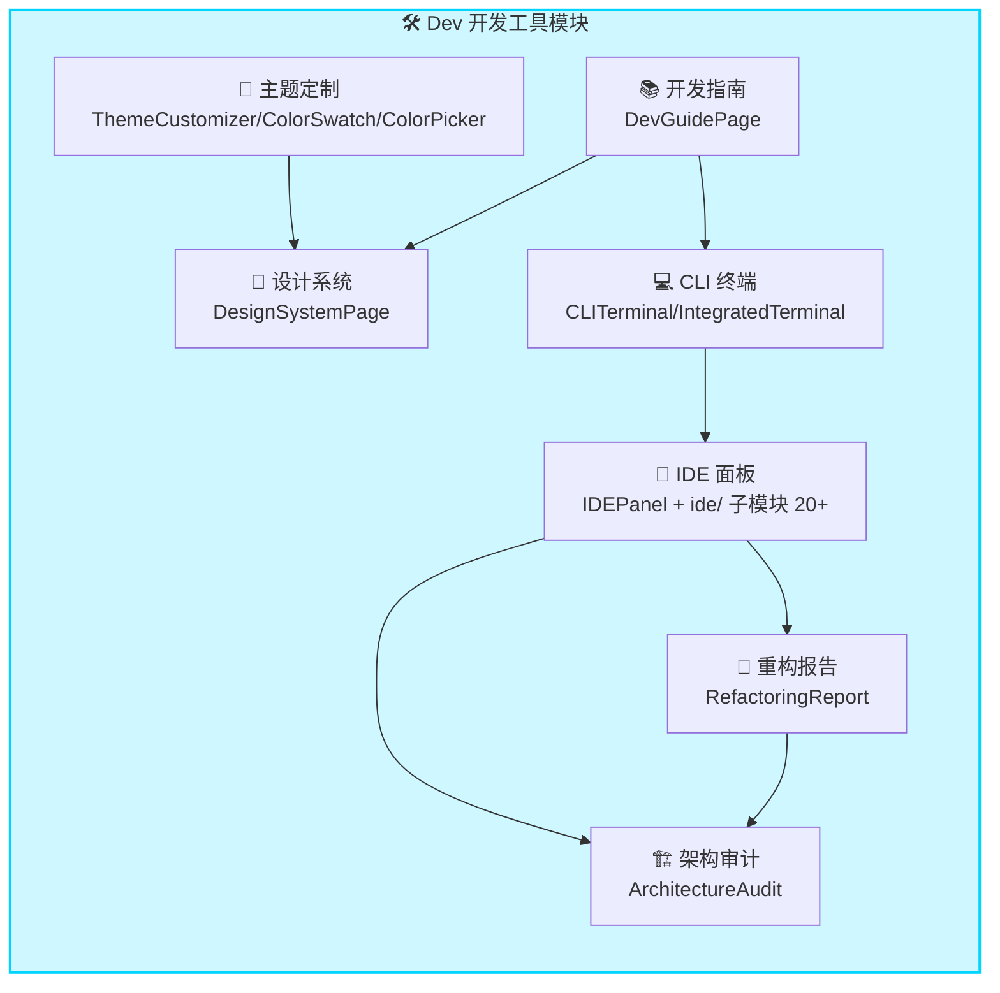
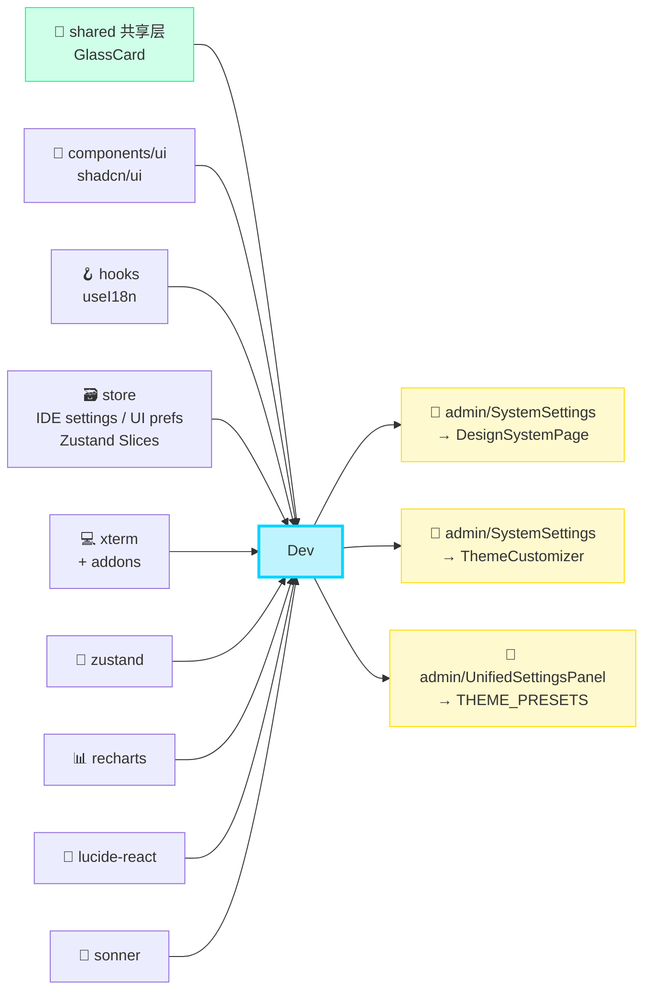
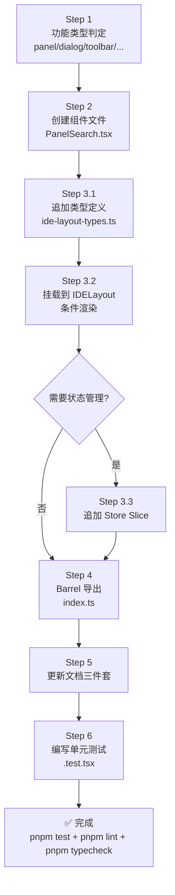

> ***YanYuCloudCube***
> *言启象限 | 语枢未来*
> ***Words Initiate Quadrants, Language Serves as Core for Future***
> *万象归元于云枢 | 深栈智启新纪元*
> ***All things converge in cloud pivot; Deep stacks ignite a new era of intelligence***

---

## 📑 目录 | Table of Contents

- [模块概述](#模块概述)
- [功能域矩阵](#功能域矩阵)
- [文件结构](#文件结构)
- [导出清单](#导出清单)
- [依赖关系](#依赖关系)
- [IDE 状态管理说明](#ide-状态管理说明)
- [主题系统 Oklch 色彩体系说明](#主题系统-oklch-色彩体系说明)
- [终端命令说明](#终端命令说明)
- [新增 IDE 功能流程](#新增-ide-功能流程)
- [测试策略](#测试策略)
- [变更历史](#变更历史)

---

## 🎯 模块概述

`dev` 是 **YYC³ CloudPivot Intelli-Matrix** 的开发工具与 IDE 模块，为开发者提供从设计系统到代码构建的全套开发基础设施。作为平台的「开发者座舱」，Dev 模块承担着以下核心职责：

### 设计哲学

| 维度 | 设计目标 | 实现方式 |
|------|----------|----------|
| **五高架构** | 高可用 + 高性能 + 高扩展 | 模块化 IDE 布局 + xterm 高性能终端 + Zustand 轻量状态 |
| **五标体系** | 标准化 + 自动化 + 可视化 | 设计系统 Token 化 + CLI 命令自动补全 + 架构审计可视化 |
| **五维评估** | 属性 + 关联 + 事件维度 | Oklch 色彩感知体系 + 组件依赖图谱 + 重构事件驱动报告 |

### 核心能力

- 🎨 **设计系统展示**：设计 Token、组件库展示、间距/圆角/阴影规范可视化
- 🌈 **主题定制引擎**：Oklch 色彩空间调色板、预设主题一键切换、CSS 变量实时预览
- 💻 **集成 CLI 终端**：xterm.js 驱动的终端模拟器，内置 cpim/env/goto/ai/kb 等专属命令
- 🧩 **完整 IDE 面板**：文件树、Git 面板、AI 聊天、代码预览、Tab 栏、多面板布局、通知中心、部署对话框等 10+ 子组件
- 🔧 **重构报告引擎**：代码复杂度、坏味道检测、重构建议、改造前后对比
- 🏗️ **架构审计工具**：依赖图谱、循环依赖检测、模块健康度评分、架构合规校验
- 📚 **开发指南门户**：快速上手、最佳实践、FAQ、贡献指南一站式入口

---

## 🧩 功能域矩阵

| 功能域 | 组件清单 | 路由 | 复杂度 | 权限要求 |
|:-------|:---------|:-----|:------:|:---------|
| **设计系统** | `DesignSystemPage` | `/design-system` | ⭐⭐⭐ | 开发者及以上 |
| **主题定制** | `ThemeCustomizer`, `ColorSwatch`, `ColorPicker` | `/theme` | ⭐⭐⭐⭐ | 开发者及以上 |
| **CLI 终端** | `CLITerminal`, `IntegratedTerminal` | `/terminal` | ⭐⭐⭐⭐ | 开发者及以上 |
| **IDE 面板** | `IDEPanel`, `IDELayout`, `IDETopBar`, `IDEStatusBar`, `IDESettingsPanel` + ide/ 子模块 20+ 组件 | `/ide` | ⭐⭐⭐⭐⭐ | 开发者及以上 |
| **重构报告** | `RefactoringReport` | `/refactoring` | ⭐⭐⭐⭐ | 架构师 |
| **架构审计** | `ArchitectureAudit` | `/architecture` | ⭐⭐⭐⭐⭐ | 架构师 |
| **开发指南** | `DevGuidePage` | `/dev-guide` | ⭐⭐ | 公开 |

### 功能域关系图



---

## 📁 文件结构

```
src/app/modules/dev/
├── index.ts                      # Barrel 统一导出入口
├── DEV-GUIDE.md                  # 开发者指导 (源码内)
├── routes.ts                     # 模块路由配置
│
├── 🎨 设计系统
│   └── DesignSystemPage.tsx      # 设计 Token/组件库/规范展示
│
├── 📚 开发指南
│   └── DevGuidePage.tsx          # 快速上手 + 最佳实践门户
│
├── 🌈 主题定制
│   ├── ThemeCustomizer.tsx       # 主题定制主控面板
│   └── theme/                    # 主题系统子目录
│       ├── theme-presets.ts      # 内置主题预设 (THEME_PRESETS)
│       ├── color-utils.ts        # Oklch ↔ Hex 转换工具
│       ├── ColorSwatch.tsx       # 色块选择器组件
│       └── ColorPicker.tsx       # 取色器组件 (Oklch 支持)
│
├── 💻 CLI 终端
│   ├── CLITerminal.tsx           # CLI 终端主组件
│   ├── IntegratedTerminal.tsx    # 嵌入式终端变体
│   └── hooks/
│       └── useTerminal.ts        # 终端状态与命令处理 Hook
│
├── 🧩 IDE 面板
│   ├── IDEPanel.tsx              # IDE 主入口页
│   └── ide/                      # IDE 子模块 (10+ 组件)
│       ├── IDELayout.tsx         # IDE 整体布局容器
│       ├── IDETopBar.tsx         # 顶部菜单栏 (面包屑/窗口控制)
│       ├── IDEStatusBar.tsx      # 底部状态栏 (分支/编码/错误计数)
│       ├── IDESettingsPanel.tsx  # IDE 设置面板
│       ├── IDETerminal.tsx       # IDE 内嵌终端面板
│       ├── IDEViewSwitcher.tsx   # 视图切换器 (拆分/最大化)
│       ├── FileExplorer.tsx      # 文件资源管理器 (树状)
│       ├── GitPanel.tsx          # Git 版本控制面板
│       ├── AIChatPanel.tsx       # AI 编程助手聊天面板
│       ├── CodePreviewPanel.tsx  # 代码预览 + 语法高亮
│       ├── Workspace.tsx         # 工作区根容器
│       ├── TabBar.tsx            # 标签页栏 (多文件切换)
│       ├── PanelEditor.tsx       # 编辑器面板
│       ├── PanelTerminal.tsx     # 终端面板
│       ├── PanelProblems.tsx     # 问题列表面板
│       ├── PanelOutput.tsx       # 输出日志面板
│       ├── PanelDebug.tsx        # 调试器面板
│       ├── PanelExtensions.tsx   # 扩展市场面板
│       ├── LayoutContext.tsx     # IDE 布局 Context
│       ├── NotificationPanel.tsx # 通知中心面板
│       ├── DeployDialog.tsx      # 部署确认对话框
│       ├── ShareDialog.tsx       # 分享协作对话框
│       ├── GPUNodeCard.tsx       # GPU 节点资源卡片
│       ├── XtermTerminal.tsx     # xterm.js 封装组件
│       ├── XtermAddons.ts        # xterm 插件注册
│       ├── XtermTheme.ts         # xterm 主题适配
│       ├── ide-types.ts          # IDE 类型定义集合
│       ├── ide-layout-types.ts   # 布局系统类型
│       ├── ide-mock-data.ts      # IDE Mock 数据
│       └── layout.css            # IDE 布局样式
│
├── 🔧 重构报告
│   └── RefactoringReport.tsx     # 重构分析报告展示
│
└── 🏗️ 架构审计
    └── ArchitectureAudit.tsx     # 架构健康度审计仪表盘
```

### 配套文档目录

```
docs/modules/dev/
├── README.md            # 本文件 · 模块总览
├── COMPONENTS.md        # 组件详细说明与示例
└── API-REFERENCE.md     # 导出 API 类型签名
```

---

## 📦 导出清单

Dev 模块通过 `index.ts` 进行 Barrel 统一导出，共导出 **30+ 组件/类型**：

```typescript
// ============ 页面级组件 ============
export { DesignSystemPage } from './DesignSystemPage';
export { DevGuidePage } from './DevGuidePage';
export { ThemeCustomizer } from './ThemeCustomizer';
export { CLITerminal } from './CLITerminal';
export { IntegratedTerminal } from './IntegratedTerminal';
export { IDEPanel } from './IDEPanel';
export { RefactoringReport } from './RefactoringReport';
export { ArchitectureAudit } from './ArchitectureAudit';

// ============ IDE 子模块 ============
export { IDELayout } from './ide/IDELayout';
export { IDETopBar } from './ide/IDETopBar';
export { IDEStatusBar } from './ide/IDEStatusBar';
export { IDESettingsPanel } from './ide/IDESettingsPanel';
export { IDETerminal } from './ide/IDETerminal';
export { IDEViewSwitcher } from './ide/IDEViewSwitcher';
export { FileExplorer } from './ide/FileExplorer';
export { GitPanel } from './ide/GitPanel';
export { AIChatPanel } from './ide/AIChatPanel';
export { CodePreviewPanel } from './ide/CodePreviewPanel';
export { Workspace } from './ide/Workspace';
export { TabBar } from './ide/TabBar';
export { PanelEditor } from './ide/PanelEditor';
export { PanelTerminal } from './ide/PanelTerminal';
export { PanelProblems } from './ide/PanelProblems';
export { PanelOutput } from './ide/PanelOutput';
export { PanelDebug } from './ide/PanelDebug';
export { PanelExtensions } from './ide/PanelExtensions';
export { NotificationPanel } from './ide/NotificationPanel';
export { DeployDialog } from './ide/DeployDialog';
export { ShareDialog } from './ide/ShareDialog';
export { GPUNodeCard } from './ide/GPUNodeCard';
export { XtermTerminal } from './ide/XtermTerminal';

// ============ Hooks ============
export { useTerminal } from './hooks/useTerminal';

// ============ 主题系统 ============
export { ColorSwatch } from './theme/ColorSwatch';
export { ColorPicker } from './theme/ColorPicker';
export { THEME_PRESETS, DEFAULT_COLORS } from './theme/theme-presets';
export { hexToOklch, oklchToHex, formatOklch } from './theme/color-utils';

// ============ 类型 ============
export type { BrandingConfig, ThemeColors } from './theme/color-utils';
export * from './ide/ide-types';
export * from './ide/ide-layout-types';

// ============ 路由 ============
export { devRoutes } from './routes';
```

> 💡 **提示**：IDE 子模块是 Dev 模块最复杂的部分，包含布局 Context、多面板协调、xterm 终端集成等核心能力。

---

## 🔗 依赖关系

### 外部依赖 (Import)

| 依赖路径 | 类型 | 用途 | 被引用组件 |
|:---------|:-----|:-----|:-----------|
| `../shared/GlassCard` | 共享层 | 玻璃拟态卡片容器 | 全部页面级组件 |
| `../../hooks/useI18n` | Hook | 多语言国际化 `t()` 翻译函数 | DesignSystemPage, ThemeCustomizer, IDEPanel, RefactoringReport, ArchitectureAudit |
| `../../store/*` | Store | Zustand 全局状态：IDE settings, UI preferences, 主题配置 | IDE 系列组件, ThemeCustomizer |
| `xterm` | 三方库 | 终端模拟器核心 (Terminal, ITerminalOptions) | CLITerminal, IntegratedTerminal, XtermTerminal |
| `xterm-addon-fit` | 三方库 | xterm 自动适应容器 | XtermTerminal |
| `xterm-addon-web-links` | 三方库 | xterm 链接可点击 | XtermTerminal |
| `zustand` | 三方库 | 轻量状态管理 (create, useStore) | LayoutContext, useTerminal, IDE 子模块 |
| `../../components/ui/*` | UI 层 | shadcn/ui (Button, Dialog, Tabs, Slider, DropdownMenu, Tooltip 等) | 全部组件 |
| `lucide-react` | 三方库 | 图标组件库 | 全部组件 |
| `sonner` | 三方库 | `toast` 通知系统 | 全部交互式组件 |
| `recharts` | 三方库 | 数据可视化 (AreaChart, BarChart, PieChart, RadarChart) | RefactoringReport, ArchitectureAudit |

### 被依赖方 (被谁引用)

| 引用方 | 引用路径 | 引用内容 | 场景 |
|:-------|:---------|:---------|:-----|
| `admin/SystemSettings` | `../dev/DesignSystemPage` | `DesignSystemPage` 片段嵌入 | 系统设置页的设计系统预览区 |
| `admin/SystemSettings` | `../dev/ThemeCustomizer` | `ThemeCustomizer` 组件 | 系统设置页的主题定制 Tab |
| `admin/UnifiedSettingsPanel` | `../dev/theme/theme-presets` | `THEME_PRESETS` | 设置导入导出时的主题解析 |

### 依赖关系图 (无循环依赖 ✅)



---

## 🗃️ IDE 状态管理说明

Dev 模块的 IDE 功能采用 **Zustand Context + 原子化 Slice** 的混合架构，兼顾性能与可维护性。

### 分层架构

```
┌─────────────────────────────────────────────────────┐
│  UI 层 (IDELayout / IDETopBar / Panels...)           │
└─────────────┬───────────────────────────────────────┘
              │ useLayoutStore() / useIDEStore()
┌─────────────▼───────────────────────────────────────┐
│  Zustand Store 层                                    │
│  ├─ layoutSlice: 面板尺寸/可见性/拆分状态             │
│  ├─ workspaceSlice: 打开文件/Tab/活跃编辑器          │
│  ├─ terminalSlice: 终端实例/命令历史/缓冲区          │
│  ├─ notificationSlice: 通知队列/已读标记             │
│  └─ gpuSlice: GPU 节点实时指标/资源分配              │
└─────────────┬───────────────────────────────────────┘
              │ subscribe() / persist middleware
┌─────────────▼───────────────────────────────────────┐
│  持久化层                                            │
│  ├─ localStorage: 布局偏好/Tab 历史 (5MB)           │
│  ├─ IndexedDB: 终端历史/通知记录 (50MB+)            │
│  └─ Memory: GPU 实时数据 (不持久化)                  │
└─────────────────────────────────────────────────────┘
```

### 核心 Store 切片

```typescript
// layoutSlice - 面板布局状态
interface LayoutSlice {
  leftPanelWidth: number;          // 左侧面板宽度 (px)
  rightPanelWidth: number;         // 右侧面板宽度
  bottomPanelHeight: number;       // 底部面板高度
  leftPanelVisible: boolean;       // 左侧面板可见性
  rightPanelVisible: boolean;      // 右侧面板可见性
  bottomPanelVisible: boolean;     // 底部面板可见性
  activeBottomTab: 'terminal' | 'problems' | 'output' | 'debug';
  splitMode: 'none' | 'horizontal' | 'vertical';
  toggleLeftPanel: () => void;
  toggleRightPanel: () => void;
  toggleBottomPanel: () => void;
  setPanelSize: (panel: 'left'|'right'|'bottom', size: number) => void;
  setActiveBottomTab: (tab: LayoutSlice['activeBottomTab']) => void;
  setSplitMode: (mode: LayoutSlice['splitMode']) => void;
}

// workspaceSlice - 工作区与编辑器
interface WorkspaceSlice {
  openTabs: WorkspaceTab[];
  activeTabId: string | null;
  pinnedTabs: string[];
  editorContent: Record<string, string>;   // tabId → content
  openFile: (file: FileNode) => void;
  closeTab: (tabId: string) => void;
  setActiveTab: (tabId: string) => void;
  updateEditorContent: (tabId: string, content: string) => void;
  togglePinTab: (tabId: string) => void;
}
```

### LayoutContext 使用方式

```tsx
// 在 IDE 子树顶层包裹 Provider
import { LayoutProvider } from './ide/LayoutContext';

<LayoutProvider defaultLayout={presetLayout}>
  <IDELayout>
    {/* 子组件通过 useLayoutStore() 消费状态 */}
  </IDELayout>
</LayoutProvider>
```

---

## 🌈 主题系统 Oklch 色彩体系说明

Dev 模块的主题系统采用 **Oklch 色彩空间** 作为核心色彩模型，相比传统 HSL/RGB 具有更准确的人类感知均匀性。

### Oklch vs HSL 对比

| 维度 | HSL | Oklch |
|:-----|:----|:------|
| **感知均匀性** | ❌ 相同 L 值但视觉亮度差异大 | ✅ L 值与感知亮度线性对应 |
| **色彩插值** | ❌ 色相过渡易出现脏色 | ✅ 色相过渡自然平滑 |
| **可访问性** | ❌ 需要额外对比度计算 | ✅ 直接通过 L 值控制对比度 |
| **可打印性** | ❌ 高饱和度超色域 | ✅ 色域内色彩更可控 |

### Oklch 参数模型

```
oklch(L C H)
  ├─ L: Lightness 明度 (0 ~ 1)   — 0 = 纯黑, 1 = 纯白
  ├─ C: Chroma 彩度 (0 ~ 0.37)   — 0 = 灰度, 值越大越鲜艳
  └─ H: Hue 色相 (0 ~ 360deg)    — 色轮角度
```

### 色板生成算法 (Scale Generator)

```typescript
// 从单个品牌色生成 50-950 共 10 档色阶
function generateOklchScale(baseHex: string): Record<string, string> {
  const { l, c, h } = hexToOklch(baseHex);
  const lightnessSteps = [0.97, 0.94, 0.89, 0.83, 0.76, 0.67, 0.58, 0.48, 0.38, 0.27, 0.17];
  const chromaCurve = [0.01, 0.03, 0.06, 0.10, 0.14, c, c*0.95, c*0.9, c*0.8, c*0.65, c*0.45];

  return {
    '50':  oklchToHex(lightnessSteps[0],  chromaCurve[0],  h),
    '100': oklchToHex(lightnessSteps[1],  chromaCurve[1],  h),
    '200': oklchToHex(lightnessSteps[2],  chromaCurve[2],  h),
    '300': oklchToHex(lightnessSteps[3],  chromaCurve[3],  h),
    '400': oklchToHex(lightnessSteps[4],  chromaCurve[4],  h),
    '500': oklchToHex(lightnessSteps[5],  chromaCurve[5],  h),  // 基准色
    '600': oklchToHex(lightnessSteps[6],  chromaCurve[6],  h),
    '700': oklchToHex(lightnessSteps[7],  chromaCurve[7],  h),
    '800': oklchToHex(lightnessSteps[8],  chromaCurve[8],  h),
    '900': oklchToHex(lightnessSteps[9],  chromaCurve[9],  h),
    '950': oklchToHex(lightnessSteps[10], chromaCurve[10], h),
  };
}
```

### CSS 变量注入

```css
/* :root 中注入 Oklch 原生语法 + Fallback Hex */
:root {
  --primary-500-oklch: 67% 0.18 250;
  --primary-500: oklch(var(--primary-500-oklch));
  --primary-500-fallback: #3b82f6;
  color: var(--primary-500, var(--primary-500-fallback));
}
```

### 对比度保证机制

主题系统内置 WCAG 对比度自动校验，确保文字色与背景色的对比度：
- **正文文本** ≥ 4.5:1 (AA 级)
- **大文本** ≥ 3:1 (AA 级)
- **UI 组件** ≥ 3:1 (非文本)

```typescript
// 自动选择合适的文字色 (黑/白)
function getContrastText(bgHex: string): '#000000' | '#ffffff' {
  const { l } = hexToOklch(bgHex);
  return l > 0.6 ? '#000000' : '#ffffff';
}
```

---

## 💻 终端命令说明

Dev 模块内置终端支持以下 **YYC³ 专属命令**，以及常规 Shell 命令模拟。

### 🚀 专属命令一览

| 命令 | 全称 | 功能说明 | 参数 | 示例 |
|:-----|:-----|:---------|:-----|:-----|
| `cpim` | CloudPivot Intelli-Matrix CLI | 平台管理入口 | `init` / `deploy` / `status` / `doctor` | `cpim deploy --env prod` |
| `env` | Environment Manager | 环境变量管理 | `list` / `get <key>` / `set <k> <v>` / `switch <env>` | `env switch staging` |
| `goto` | Quick Navigator | 快速跳转到模块路由 | `<module>[/<page>]` | `goto dev/ide`, `goto monitor` |
| `ai` | AI Assistant | 触发 AI 助手面板 | `<prompt>` / `chat` / `explain` / `refactor` | `ai explain this code` |
| `kb` | Knowledge Base | 知识库查询 | `search <q>` / `list` / `open <id>` / `new` | `kb search oklch` |

### 命令详细说明

#### `cpim` - 平台 CLI

```bash
cpim init [project]          # 在当前工作区初始化新模块脚手架
cpim deploy --env <env>      # 部署到指定环境 (dev/staging/prod)
cpim status                  # 查看平台服务状态概览
cpim doctor                  # 环境诊断：检查依赖/配置/连通性
cpim version                 # 显示 CLI 与平台版本
cpim help [command]          # 命令帮助
```

#### `env` - 环境变量管理

```bash
env list                     # 列出当前环境所有变量
env get API_KEY              # 读取单个变量值 (脱敏显示)
env set FEATURE_FLAG_X true  # 设置变量 (临时会话有效)
env switch production        # 切换环境预设 (加载 .env.production)
env export                   # 导出当前环境为 .env 文件
env doctor                   # 校验必填环境变量
```

#### `goto` - 快速导航

```bash
goto dev                     # 跳转到 Dev 模块根页面
goto dev/ide                 # 跳转到 IDE 面板
goto monitor/nodes           # 跳转到节点监控
goto admin/audit             # 跳转到操作审计
goto back                    # 返回上一页 (等价于浏览器后退)
```

#### `ai` - AI 助手

```bash
ai chat                      # 打开 AI 聊天对话面板
ai "优化这段代码"             # 快速提问 (面板弹出并填入)
ai explain                   # 解释当前编辑器选中的代码
ai refactor                  # 重构建议当前文件
ai docstring                 # 为选中函数生成 JSDoc/TSDoc
ai test                      # 为选中函数生成单元测试
```

#### `kb` - 知识库

```bash
kb search "色彩空间"          # 全文搜索知识库条目
kb list                      # 列出最近访问的知识库条目
kb open 42                   # 打开 ID=42 的知识库文档
kb new                       # 创建新知识库条目 (在编辑器中打开)
kb tags                      # 列出所有分类标签
```

### 终端快捷键

| 快捷键 | 功能 |
|:-------|:-----|
| `Ctrl + L` | 清屏 |
| `Ctrl + C` | 中断当前命令 |
| `↑ / ↓` | 浏览命令历史 |
| `Tab` | 自动补全命令/参数 |
| `Ctrl + R` | 历史命令反向搜索 |
| `Ctrl + Shift + V` | 粘贴剪贴板内容 |

---

## ➕ 新增 IDE 功能流程

遵循 **五标体系** 的标准化流程，在 IDE 子模块新增功能请按以下步骤执行：

### Step 1：功能类型判定

```typescript
// 先确定要新增的功能属于哪一类：
type NewFeatureCategory =
  | 'panel'         // 新增面板 (如 PanelSearch.tsx)
  | 'dialog'        // 新增对话框 (如 SettingsDialog.tsx)
  | 'topbar-item'   // 顶部工具栏按钮
  | 'statusbar-item'// 底部状态栏项
  | 'context-menu'  // 右键菜单项
  | 'terminal-cmd'  // 终端新命令
  | 'store-slice';  // Store 新切片
```

### Step 2：创建组件文件

以新增 `PanelSearch.tsx (全局搜索面板)` 为例：

```bash
touch src/app/modules/dev/ide/PanelSearch.tsx
```

**文件头模板：**

```tsx
/**
 * @file: PanelSearch.tsx
 * @description: IDE 全局搜索面板 - 跨文件符号/文本搜索
 * @author: YanYuCloudCube Team
 * @version: v1.0.0
 * @created: 2026-08-19
 * @updated: 2026-08-19
 * @status: active
 * @tags: [component],[dev],[ide],[panel]
 */

import React, { useState } from 'react';
import { useI18n } from '../../../hooks/useI18n';
import { useLayoutStore } from './LayoutContext';
import { Search } from 'lucide-react';

export interface PanelSearchProps {
  /** 搜索占位符文本 */
  placeholder?: string;
  /** 选择搜索结果的回调 */
  onResultSelect?: (result: SearchResult) => void;
}

export interface SearchResult {
  type: 'file' | 'symbol' | 'text';
  path: string;
  line: number;
  column: number;
  match: string;
}

export function PanelSearch({ placeholder, onResultSelect }: PanelSearchProps) {
  const { t } = useI18n();
  const [query, setQuery] = useState('');
  // ... 组件实现
  return <div>{/* 面板内容 */}</div>;
}
```

### Step 3：注册到 Layout / Store

#### 3.1 面板类：在 `ide-layout-types.ts` 追加类型

```typescript
// ide-layout-types.ts
export type BottomTabKey =
  | 'terminal'
  | 'problems'
  | 'output'
  | 'debug'
  | 'search';  // ← 新增
```

#### 3.2 在 `IDELayout.tsx` 中挂载面板

```tsx
import { PanelSearch } from './PanelSearch';

// Bottom panels 区域添加条件渲染
{activeBottomTab === 'search' && (
  <PanelSearch onResultSelect={handleGotoFile} />
)}
```

#### 3.3 如需状态：在 Store 追加切片

```typescript
// store/ide-search-slice.ts
export const createSearchSlice: StateCreator<
  IDEStore, [], [], SearchSlice
> = (set, get) => ({
  searchHistory: [],
  recentResults: [],
  pushSearchHistory: (q) => set((s) => ({
    searchHistory: [q, ...s.searchHistory.slice(0, 49)],
  })),
});
```

### Step 4：更新 Barrel 导出

```typescript
// dev/index.ts - 在 IDE 子模块区块添加
export { PanelSearch, type PanelSearchProps, type SearchResult } from './ide/PanelSearch';
```

### Step 5：更新文档三件套

| 文档 | 更新内容 |
|:-----|:---------|
| `README.md` | 文件结构树 + 导出清单 + 变更历史 |
| `COMPONENTS.md` | 新增组件条目 (组件名/路由/核心能力/Props/示例) |
| `API-REFERENCE.md` | 新增组件签名 + 类型定义 |
| `DEV-GUIDE.md` | 开发指南中的功能索引 |

### Step 6：编写单元测试

```bash
touch src/app/__tests__/dev/ide/PanelSearch.test.tsx
```

### 流程图



---

## 🧪 测试策略

Dev 模块由于涉及 xterm、Canvas、拖拽等复杂交互，采用 **分层测试矩阵**：

### 测试矩阵

| 分类 | 组件 | 单元测试 | 集成测试 | E2E 测试 | 推荐工具 |
|:-----|:-----|:--------:|:--------:|:--------:|:---------|
| **设计系统** | DesignSystemPage | ✅ Token 渲染 | ⚠️ 色板交互 | ❌ | Vitest + Testing Library |
| **主题系统** | ThemeCustomizer, ColorSwatch, ColorPicker | ✅ 色彩转换纯函数 | ✅ 主题切换 + CSS Var | ⚠️ | Vitest + vitest-browser |
| **终端** | CLITerminal, IntegratedTerminal, useTerminal | ✅ 命令解析/历史 | ⚠️ xterm 初始化 (jsdom mock) | ✅ 命令输入输出 | Vitest + Playwright |
| **IDE 布局** | IDELayout, IDEViewSwitcher, LayoutContext | ✅ Store 切片 | ✅ 面板拖拽/拆分 | ⚠️ | Vitest + zustand mock |
| **文件资源** | FileExplorer, TabBar, Workspace | ✅ 树展开/节点选择 | ✅ Tab 打开/关闭联动 | ⚠️ | Vitest + Testing Library |
| **Git/AI** | GitPanel, AIChatPanel | ⚠️ UI 状态 | ❌ 外部 API 依赖 | ❌ | Vitest + API Mock |
| **GPU 卡片** | GPUNodeCard | ✅ 资源渲染 | ⚠️ 实时刷新 | ❌ | Vitest + fake timers |
| **重构/审计** | RefactoringReport, ArchitectureAudit | ✅ 评分算法 | ⚠️ 图表渲染 | ❌ | Vitest + recharts 纯数据 |
| **Xterm 系列** | XtermTerminal + Addons | ❌ 浏览器 API | ✅ 容器挂载测试 | ✅ | Playwright + real browser |

### 关键纯函数测试 (色彩转换)

```typescript
// __tests__/dev/theme/color-utils.test.ts
import { describe, it, expect } from 'vitest';
import { hexToOklch, oklchToHex, formatOklch } from '../../../app/modules/dev/theme/color-utils';

describe('Oklch 色彩转换 · 纯函数测试', () => {
  it('hexToOklch 正确解析纯蓝 #0000ff', () => {
    const result = hexToOklch('#0000ff');
    expect(result.l).toBeCloseTo(0.45, 1);  // 蓝色感知亮度约 45%
    expect(result.c).toBeGreaterThan(0.2);  // 高彩度
    expect(result.h).toBeCloseTo(264, 0);   // 色相约 264°
  });

  it('oklchToHex 往返转换误差 < 2 (ΔE 可接受)', () => {
    const original = '#3b82f6';
    const oklch = hexToOklch(original);
    const back = oklchToHex(oklch.l, oklch.c, oklch.h);
    // 允许 ±1 色阶误差
    expect(Math.abs(parseInt(original.slice(1,3),16) - parseInt(back.slice(1,3),16))).toBeLessThan(3);
  });

  it('formatOklch 输出 CSS 兼容语法', () => {
    const str = formatOklch(0.67, 0.18, 250);
    expect(str).toMatch(/^oklch\(\d+(\.\d+)?%? \d+(\.\d+)? \d+(\.\d+)?\)$/);
  });

  it('边界值：黑白灰三原色 Oklch C≈0 (灰度无彩度)', () => {
    expect(hexToOklch('#000000').c).toBeCloseTo(0, 2);
    expect(hexToOklch('#ffffff').c).toBeCloseTo(0, 2);
    expect(hexToOklch('#808080').c).toBeLessThan(0.01);
  });
});
```

### 关键 Hook 测试 (useTerminal)

```typescript
// __tests__/dev/hooks/useTerminal.test.ts
import { describe, it, expect, beforeEach, vi } from 'vitest';
import { renderHook, act } from '@testing-library/react';
import { useTerminal } from '../../../app/modules/dev/hooks/useTerminal';

describe('useTerminal Hook · 命令处理', () => {
  const { result } = renderHook(() => useTerminal());

  it('初始状态：空缓冲区 + 空历史', () => {
    expect(result.current.buffer).toHaveLength(0);
    expect(result.current.history).toHaveLength(0);
    expect(result.current.cwd).toBe('~/workspace');
  });

  it('执行 goto 命令后触发导航回调', () => {
    const onNavigate = vi.fn();
    const { result: r } = renderHook(() => useTerminal({ onNavigate }));
    act(() => r.current.execute('goto dev/ide'));
    expect(onNavigate).toHaveBeenCalledWith('/dev/ide');
  });

  it('命令历史支持 ↑↓ 回溯', () => {
    act(() => result.current.execute('cpim status'));
    act(() => result.current.execute('env list'));
    expect(result.current.history).toEqual(['cpim status', 'env list']);
    expect(result.current.getHistoryPrev()).toBe('env list');
    expect(result.current.getHistoryPrev()).toBe('cpim status');
    expect(result.current.getHistoryNext()).toBe('env list');
  });
});
```

### 运行测试命令

```bash
# Dev 模块单元测试
pnpm test -- src/app/__tests__/dev/

# 主题子模块单独测试
pnpm test -- src/app/__tests__/dev/theme/

# IDE 子模块单独测试
pnpm test -- src/app/__tests__/dev/ide/

# 监听模式
pnpm test:watch -- src/app/__tests__/dev/

# 覆盖率 (要求 ≥ 70%)
pnpm test:coverage -- --reporter=html src/app/__tests__/dev/

# 类型检查
pnpm type-check

# Lint
pnpm lint -- src/app/modules/dev/
```

---

## 📜 变更历史

| 版本 | 日期 | 变更内容 | 变更类型 | 作者 |
|:-----|:-----|:---------|:---------|:-----|
| **v1.0.0** | 2026-08-19 | 初始版本 · 文档三件套 (README / COMPONENTS / API-REFERENCE) 建立 | `docs` | YanYuCloudCube Team |
| **v1.0.0** | 2026-07-20 | Dev 模块完整发布：设计系统 + 主题定制 + 完整 IDE 20+ 子组件 + xterm 终端集成 + Oklch 色彩体系 | `feat` | YanYuCloudCube Team |
| **v0.9.0** | 2026-06-15 | IDE 子模块 v1：LayoutContext + 6 Panel + 终端 + AI 聊天面板 | `feat` | YanYuCloudCube Team |
| **v0.8.0** | 2026-05-28 | 主题系统升级：Oklch 色彩空间 + 5 种预设 + 实时 CSS 变量预览 | `refactor` | YanYuCloudCube Team |
| **v0.7.0** | 2026-05-10 | 重构报告 + 架构审计双仪表盘首次发布 | `feat` | YanYuCloudCube Team |
| **v0.6.0** | 2026-04-22 | CLI 终端 v1：xterm.js 集成 + cpim/env/goto/ai/kb 五大命令 | `feat` | YanYuCloudCube Team |
| **v0.5.0** | 2026-04-05 | 设计系统展示页 + ColorSwatch/ColorPicker 组件 | `feat` | YanYuCloudCube Team |

### 版本号规范

遵循 **Semantic Versioning 2.0.0**：

| 段位 | 含义 | 触发场景 |
|:-----|:-----|:---------|
| `MAJOR` | 破坏性变更 | Store 切片重构、主题体系升级、IDE 布局协议变更 |
| `MINOR` | 功能新增 | 新增 IDE 面板、新终端命令、新主题预设 |
| `PATCH` | 修复优化 | Bug fix、性能优化、文档补充、色阶算法微调 |

---

<div align="center">

---

**[⬆ 返回顶部](#-目录--table-of-contents)** · **[COMPONENTS.md](./COMPONENTS.md)** · **[API-REFERENCE.md](./API-REFERENCE.md)** · **[DEV-GUIDE.md](../../src/app/modules/dev/DEV-GUIDE.md)**

---

> 「***YanYuCloudCube***」
> 「***<admin@0379.email>***」
> 「***言启千行代码，语枢万物智能***」
> 「***Words Initiate Quadrants, Language Serves as Core for Future***」
> 「***All things converge in cloud pivot; Deep stacks ignite a new era of intelligence***」

</div>
