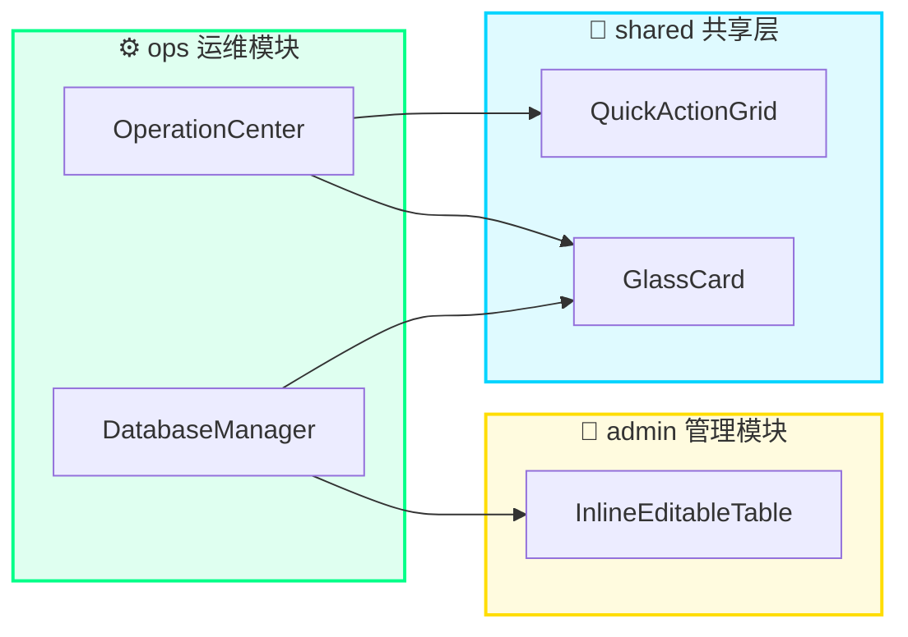
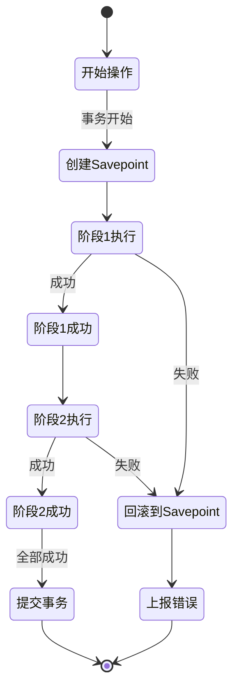
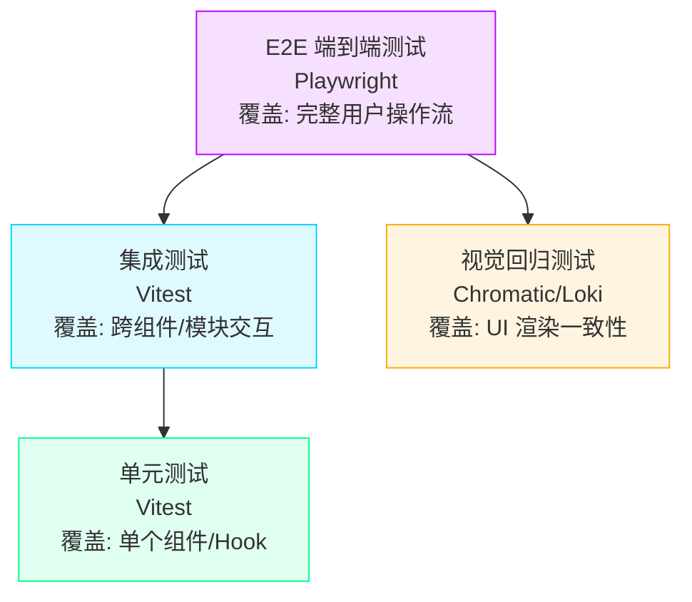

> ***YanYuCloudCube***
> *言启象限 | 语枢未来*
> ***Words Initiate Quadrants, Language Serves as Core for Future***
> *万象归元于云枢 | 深栈智启新纪元*
> ***All things converge in cloud pivot; Deep stacks ignite a new era of intelligence***

---

## 📑 目录

- [模块概述](#模块概述)
- [功能域矩阵](#功能域矩阵)
- [文件结构](#文件结构)
  - [操作中心](#操作中心)
  - [文件管理](#文件管理)
  - [数据库](#数据库)
  - [服务闭环](#服务闭环)
  - [报告导出](#报告导出)
  - [监控日志](#监控日志)
- [导出清单](#导出清单)
- [跨模块依赖说明](#跨模块依赖说明)
- [运维最佳实践](#运维最佳实践)
- [错误处理策略](#错误处理策略)
- [数据备份与恢复指南](#数据备份与恢复指南)
- [测试建议](#测试建议)
- [变更历史](#变更历史)

---

## 模块概述

`ops` 是 **OPS 运维与操作中心模块**，是 YYC³ CloudPivot Intelli-Matrix 系统的运维核心基础设施层。模块涵盖操作执行、文件管理、数据库管理、服务闭环验证和报告导出等全链路运维功能，为系统稳定运行提供全方位的操作保障与可观测性支撑。

### 核心设计理念

本模块严格遵循 **五高架构** 设计原则：

| 维度 | 实现策略 |
|------|----------|
| **高可用** | 操作幂等性设计、断点续执、事务回滚机制 |
| **高性能** | 虚拟滚动日志流、批量文件操作、连接池复用 |
| **高安全** | 操作审计追踪、权限分级、敏感信息脱敏 |
| **高扩展** | 插件化操作模板、多数据库驱动、自定义报告模板 |
| **高智能** | 操作链编排、异常自动恢复、智能报告生成 |

---

## 功能域矩阵

| 功能域 | 核心组件 | 路由 | 复杂度 | 描述 |
|:------:|:--------|:----|:------:|:-----|
| **操作中心** | `OperationCenter`, `OperationChain`, `OperationCategory`, `OperationLogStream`, `OperationTemplate` | `/operations` | ⭐⭐⭐ | 操作分类导航、快捷操作网格、操作模板管理、实时日志流、操作链编排执行 |
| **文件管理** | `LocalFileManager`, `FileBrowser`, `HostFileManager` | `/files`, `/host-files` | ⭐⭐ | 本地/主机文件浏览、文件编辑器、日志下载、报告生成入口 |
| **数据库** | `DatabaseManager`, `DatabaseConnectionPanel` | `/database`, `/db-connections` | ⭐⭐⭐⭐ | 多数据源连接管理、SQL 编辑器、数据表浏览、查询历史、备份恢复 |
| **服务闭环** | `ServiceLoopPanel`, `LoopStageCard`, `ServiceConnectionTest` | `/loop`, `/connection-test` | ⭐⭐⭐ | 五阶段闭环流程、数据流可视化、自动/手动触发、连接探活测试 |
| **报告导出** | `ReportExporter`, `ReportGenerator`, `ConfigExportCenter` | `/reports`, `/export-center` | ⭐⭐⭐ | 性能/安全/审计/综合报告、多格式导出、趋势图表、配置中心导出 |
| **连接监控** | `ConnectionMonitorPanel` | `/connection-monitor` | ⭐⭐ | 实时连接状态、延迟监控、断开告警、连接池指标 |
| **日志查看** | `LogViewer` | 内嵌组件 | ⭐⭐ | 多源日志聚合、级别过滤、关键词搜索、时间范围筛选 |

---

## 文件结构

### 操作中心

```
ops/operations/
├── OperationCenter.tsx      # 操作中心主面板 · 入口组件
│   ├── 操作分类导航栏 (OperationCategory)
│   ├── 快捷操作网格 (QuickActionGrid from shared)
│   ├── 操作模板管理 (OperationTemplate)
│   └── 实时日志流 (OperationLogStream)
│
├── OperationChain.tsx       # 操作链编排器
│   ├── 拖拽式节点编排
│   ├── 条件分支配置
│   ├── 依赖关系图
│   └── 链执行模拟与回放
│
├── OperationCategory.tsx    # 操作分类 Tabs
│   ├── 系统操作 / 数据操作 / 服务操作 / 自定义
│   └── 支持动态分类扩展
│
├── OperationLogStream.tsx   # 操作日志流
│   ├── 虚拟滚动渲染
│   ├── 级别高亮 (INFO/WARN/ERROR/FATAL)
│   ├── 关键字搜索 + 正则匹配
│   └── 实时追加 + 暂停模式
│
└── OperationTemplate.tsx    # 操作模板
    ├── 模板 CRUD 管理
    ├── 模板参数化配置
    ├── 一键执行模板
    └── 模板导入/导出
```

### 文件管理

```
ops/files/
├── LocalFileManager.tsx     # 本地文件管理器 · 入口组件
│   ├── Tab: 文件浏览 / 日志查看 / 报告生成
│   ├── 快速操作栏 (下载日志/清空缓存/导出配置)
│   └── 文件路径导航面包屑
│
├── FileBrowser.tsx          # 文件浏览器
│   ├── 树形目录结构
│   ├── 文件列表 (名称/大小/修改时间)
│   ├── 文件预览 (文本/代码/图片)
│   ├── 文件上传/下载/删除
│   └── 多文件批量操作
│
└── HostFileManager.tsx      # 主机文件管理器 (Electron)
    ├── 跨分区文件访问
    ├── 系统目录快捷入口
    ├── 大文件分片传输
    └── 文件权限展示
```

### 数据库

```
ops/database/
├── DatabaseManager.tsx      # 数据库管理器 · 入口组件
│   ├── Tab: 连接管理 / 表浏览 / SQL 查询 / 历史 / 备份
│   ├── 新建连接表单
│   ├── 连接测试与状态指示器
│   └── 数据库类型图标 (PG/MySQL/Redis/SQLite/MongoDB)
│
└── DatabaseConnectionPanel.tsx # 连接配置面板
    ├── 连接参数表单 (主机/端口/用户/密码)
    ├── 密码显隐切换
    ├── SSL 配置
    ├── SSH 隧道配置
    └── 连接池参数设置
```

### 服务闭环

```
ops/loop/
├── ServiceLoopPanel.tsx     # 服务闭环面板 · 入口组件
│   ├── 自动模式开关 Toggle
│   ├── 启动/中止闭环按钮
│   ├── 五阶段进度条
│   ├── 历史运行记录
│   ├── 数据流图 (DataFlowDiagram)
│   └── 统计指标 (成功率/平均耗时)
│
├── LoopStageCard.tsx        # 闭环阶段卡片
│   ├── 阶段图标 + 状态徽章
│   ├── 阶段执行耗时
│   ├── 阶段输出摘要
│   └── 展开查看阶段详情
│
└── ServiceConnectionTest.tsx # 服务连接测试
    ├── 输入目标服务地址
    ├── Ping / TCP / HTTP 多种测试模式
    ├── 延迟柱状图
    ├── 连续测试模式
    └── 测试报告导出
```

### 报告导出

```
ops/reports/
├── ReportExporter.tsx       # 报告导出器 · 入口组件
│   ├── 报告类型选择 (性能/安全/审计/综合)
│   ├── 时间范围选择器 (1h/6h/24h/7d/30d)
│   ├── 趋势面积图
│   ├── 指标卡片 (KPI + 趋势箭头)
│   └── 导出格式 (JSON/CSV/PDF)
│
├── ReportGenerator.tsx      # 报告生成引擎
│   ├── 报告模板系统
│   ├── 数据聚合计算
│   ├── 图表渲染引擎
│   └── 异步生成 + 进度条
│
└── ConfigExportCenter.tsx   # 配置导出中心
    ├── 配置分类树
    ├── 配置项对比 Diff
    ├── 导出格式 (YAML/JSON/ENV)
    ├── 版本标签
    └── 导入预览校验
```

### 监控日志

```
ops/monitor/
├── ConnectionMonitorPanel.tsx # 连接监控面板
│   ├── 连接列表 (服务名/地址/状态)
│   ├── 实时延迟折线图
│   ├── 连接池使用率
│   ├── 断开自动重连
│   └── 告警阈值配置
│
└── LogViewer.tsx             # 日志查看器
    ├── 日志源切换
    ├── 级别过滤 (DEBUG/INFO/WARN/ERROR)
    ├── 时间轴滑动窗口
    ├── 日志行高亮
    ├── 日志导出为文件
    └── 自动滚动锁定
```

---

## 导出清单

```typescript
// ============================================================
// 操作中心 · Operations Center
// ============================================================
export { OperationCenter }    from './OperationCenter';     // 主面板入口
export { OperationChain }     from './OperationChain';      // 操作链编排
export { OperationCategory }  from './OperationCategory';   // 分类导航
export { OperationLogStream } from './OperationLogStream';  // 日志流
export { OperationTemplate }  from './OperationTemplate';   // 模板管理

// ============================================================
// 文件管理 · File Management
// ============================================================
export { LocalFileManager }   from './LocalFileManager';    // 本地文件管理入口
export { FileBrowser }        from './FileBrowser';         // 文件浏览器
export { HostFileManager }    from './HostFileManager';     // 主机文件管理

// ============================================================
// 数据库 · Database
// ============================================================
export { DatabaseManager }         from './DatabaseManager';         // 数据库管理入口
export { DatabaseConnectionPanel } from './DatabaseConnectionPanel'; // 连接配置面板

// ============================================================
// 服务闭环 · Service Loop
// ============================================================
export { ServiceLoopPanel }      from './ServiceLoopPanel';      // 闭环主面板
export { LoopStageCard }         from './LoopStageCard';         // 阶段卡片
export { ServiceConnectionTest } from './ServiceConnectionTest'; // 连接测试

// ============================================================
// 报告导出 · Reports & Export
// ============================================================
export { ReportExporter }      from './ReportExporter';      // 报告导出入口
export { ReportGenerator }     from './ReportGenerator';     // 报告生成引擎
export { ConfigExportCenter }  from './ConfigExportCenter';  // 配置导出中心

// ============================================================
// 监控与日志 · Monitor & Logs
// ============================================================
export { ConnectionMonitorPanel } from './ConnectionMonitorPanel'; // 连接监控
export { LogViewer }              from './LogViewer';              // 日志查看
```

---

## 跨模块依赖说明

### 模块间依赖关系图



### 详细依赖清单

| 引用方 | 被引用方 | 用途 | 关键参数传递 |
|--------|----------|------|-------------|
| `ops/OperationCenter` | `shared/QuickActionGrid` | 渲染快捷操作网格按钮 | `actions: QuickAction[]`, `isExecuting: boolean`, `onExecute: (id) => void` |
| `ops/DatabaseManager` | `admin/InlineEditableTable` | 数据表行内编辑与 UPDATE SQL 生成 | `columns: ColumnDef[]`, `data: RowData[]`, `onCommit: (sql) => Promise<Result>` |
| `ops/*` (全部组件) | `shared/GlassCard` | 统一的毛玻璃卡片容器 | `className?: string`, `children: ReactNode` |

### 外部依赖

| 依赖路径 | 用途 | 类型 |
|----------|------|------|
| `../shared/GlassCard` | 毛玻璃 UI 卡片容器组件 | 组件 |
| `../../hooks/useI18n` | 国际化多语言 Hook | Hook |
| `../../hooks/useOperationCenter` | 操作中心状态与业务逻辑 Hook | Hook |
| `../../hooks/useLocalFileSystem` | 本地文件系统操作 Hook | Hook |
| `../../hooks/useLocalDatabase` | 本地数据库操作 Hook | Hook |
| `../../hooks/useServiceLoop` | 服务闭环状态机 Hook | Hook |
| `../../hooks/useReportExporter` | 报告导出逻辑 Hook | Hook |
| `../../lib/*` | 通用工具库 (view-context 等) | 工具 |
| `../../store/*` | Zustand 全局状态切片 (log-slice 等) | 状态 |
| `../../../database/ConnectionManager` | 跨平台数据库连接管理器 | 服务类 |
| `lucide-react` | 现代化 SVG 图标库 | UI 库 |

---

## 运维最佳实践

### 🔧 操作中心最佳实践

1. **模板复用优先**：将高频操作固化为模板，避免重复配置。模板命名采用 `域-动作-对象` 格式，如 `db-backup-postgres-prod`
2. **操作链分段执行**：复杂操作拆分为多阶段链，每阶段设置检查点，支持断点续执
3. **日志流常开模式**：生产环境建议始终开启 OperationLogStream，设置 WARN 级以上声音告警
4. **分类权限隔离**：不同角色仅可见授权的 OperationCategory，敏感操作需二次确认

### 📁 文件管理最佳实践

1. **定期日志归档**：每周通过 LocalFileManager 下载日志归档，设置本地保留策略 (默认 30 天)
2. **大文件分片传输**：HostFileManager 处理 >100MB 文件时自动启用分片，勿中途关闭页面
3. **文件类型白名单**：FileBrowser 配置可编辑文件后缀白名单，避免误改二进制文件
4. **操作前自动备份**：文件覆盖操作触发前自动创建 `.bak` 副本，保留最近 5 个版本

### 🗄️ 数据库最佳实践

1. **连接池参数调优**：生产环境连接池大小设置为 `CPU核心数 * 2 + 1`，闲置超时 30min
2. **只读账号优先**：日常查询使用只读账号，DML 操作通过单独的高权限连接
3. **SQL 审计开关**：DatabaseManager 默认开启 SQL 审计，所有执行语句写入 OperationLogStream
4. **备份验证机制**：每次备份后自动执行还原验证 (小表抽样)，确保备份可用
5. **查询超时控制**：默认查询超时 30s，大查询在 SQL Editor 中单独设置超时

### 🔄 服务闭环最佳实践

1. **闭环触发策略**：建议 `autoMode` 设置为定时触发 (每 4 小时)，而非持续运行
2. **阶段超时阈值**：每个 LoopStageCard 设置独立超时，避免单阶段阻塞整体闭环
3. **失败自动重试**：临时网络故障自动重试 3 次，指数退避 (1s → 3s → 9s)
4. **闭环后数据校验**：闭环完成后自动对比输入输出数据指纹，确认数据完整性

### 📊 报告导出最佳实践

1. **报告定期生成**：综合报告建议每周一 08:00 自动生成并发送邮件
2. **格式选择策略**：
   - 数据二次分析 → 导出 CSV
   - 系统间集成 → 导出 JSON
   - 归档与汇报 → 导出 PDF
3. **时间范围采样**：7d 以上报告自动降采样，避免图表数据点过密影响渲染
4. **报告加密存储**：包含敏感信息的报告使用 AES-256 加密后下载

### 📡 连接监控最佳实践

1. **告警分级设置**：
   - P0 (致命)：核心服务连接中断 → 短信 + 电话
   - P1 (严重)：延迟 >500ms 持续 5min → 邮件 + 站内信
   - P2 (警告)：连接池使用率 >80% → 仅站内信
2. **连接池预热**：应用启动阶段预创建 30% 最小连接数，避免首次请求延迟
3. **定期探活**：ConnectionMonitorPanel 默认每 10s 发送心跳包，检测半开连接

---

## 错误处理策略

### 错误分级体系

| 级别 | 语义 | 用户感知 | 处理策略 | 示例 |
|:----:|:----|:--------|:--------|:-----|
| `FATAL` | 系统级崩溃 | 页面级错误边界 | 自动上报 Sentry + 提示刷新 + 错误快照 | 数据库连接池耗尽 |
| `ERROR` | 功能不可用 | Toast 红色提示 | 回滚事务 + 记录完整堆栈 + 触发告警 | SQL 语法错误执行失败 |
| `WARN` | 降级可用 | Toast 黄色提示 | 重试策略 + 降级路径 + 标记告警 | 文件写入速度过慢 |
| `INFO` | 提示信息 | 静默日志 | 仅写入 OperationLogStream | 操作成功完成 |

### 操作幂等性保证

所有 OperationTemplate 执行遵循 **幂等性三原则**：

```typescript
// 伪代码示例：幂等操作模板
interface IdempotentOperation {
  idempotencyKey: string;       // 唯一幂等键 (operationId + timestamp)
  preconditionCheck(): boolean; // 执行前置检查
  execute(): Promise<Result>;   // 核心逻辑 (需幂等)
  verifyResult(): boolean;      // 结果反向校验
}
```

1. **前置检查**：执行前校验状态，已成功则直接返回
2. **核心幂等**：重复执行结果一致，使用 UPSERT 而非 INSERT + UPDATE
3. **结果校验**：执行后查询实际状态，确认操作生效

### 事务回滚机制



### 典型错误场景与处理

| 场景 | 错误类型 | 自动处理 | 用户可选操作 |
|------|---------|---------|-------------|
| 数据库连接超时 | `ConnectionTimeoutError` | 从连接池获取新连接重试 3 次 | 手动重连 / 切换备用连接 |
| 文件写入磁盘满 | `DiskFullError` | 暂停写入 + 触发空间告警 | 清理临时文件 / 换盘 |
| 闭环阶段超时 | `StageTimeoutError` | 中止当前阶段 + 标记失败 | 单独重试该阶段 / 跳过 |
| 报告生成中断 | `ReportAbortedError` | 保留临时文件 + 断点续传 | 恢复生成 / 删除临时文件 |
| 日志流WebSocket断连 | `StreamDisconnectError` | 指数退避自动重连 (最多10次) | 手动刷新 / 切换HTTP轮询模式 |

---

## 数据备份与恢复指南

### 🗄️ 数据库备份

#### 自动备份策略 (推荐)

| 备份类型 | 频率 | 保留期 | 存储位置 | 触发方式 |
|---------|------|--------|---------|---------|
| 全量备份 | 每日 02:00 | 30 天 | 本地 + 云存储 | `DatabaseManager → backups → 自动备份设置` |
| 增量备份 | 每小时 | 7 天 | 本地磁盘 | WAL / Binlog 归档 |
| 差异备份 | 每周日 03:00 | 90 天 | 冷存储 | 基于上周全量 |

#### 手动备份步骤

1. 进入 `/database` → 切换到 **Backups** Tab
2. 选择目标数据库连接
3. 选择备份范围：`全部数据库` / `指定Schema` / `单表`
4. 选择备份格式：`SQL 脚本` / `二进制自定义` / `压缩包`
5. **重要：勾选「备份后自动验证」**
6. 点击 **创建备份**，等待 OperationLogStream 输出完成日志

#### 恢复操作步骤

> ⚠️ **警告**：恢复操作会覆盖现有数据，操作前必须先创建当前状态备份！

1. 在备份列表中选择目标恢复点
2. 点击 **恢复预览**，查看将影响的表和行数
3. 选择恢复模式：
   - `完全恢复`：覆盖整个数据库
   - `按Schema恢复`：仅恢复指定 Schema
   - `按表恢复`：选择单张或多张表恢复
4. 勾选 **恢复前自动创建临时备份** (强烈建议)
5. 二次确认输入恢复确认码 (显示在弹窗中)
6. 监控恢复进度，完成后执行 **数据一致性校验**

### 📁 文件系统备份

#### 备份内容清单

| 目录 | 内容 | 建议备份频率 |
|------|------|------------|
| `./data/` | 本地数据库文件、配置文件 | 每日 |
| `./logs/` | 运行日志、操作审计日志 | 每周归档 |
| `./reports/` | 生成的历史报告 | 每月归档 |
| `./templates/` | 操作模板、报告模板 | 变更后立即备份 |
| `./userdata/` | 用户自定义配置、Workspace 数据 | 每日 |

#### 通过 LocalFileManager 一键备份

1. 进入 `/files` → **文件浏览** Tab
2. 点击右上角 **一键备份** 按钮
3. 选择备份级别：
   - `轻量备份`：配置 + 模板 (~50MB)
   - `标准备份`：轻量 + 报告 + 日志 (~500MB)
   - `完整备份`：全部用户数据
4. 等待备份完成，自动下载为 `.yyc3-backup` 加密包
5. 校验 MD5 与备份清单确认完整性

### ⚙️ 配置备份与迁移

通过 `ConfigExportCenter` 实现跨实例配置迁移：

1. **导出配置** (`/export-center`)
   - 勾选需要迁移的配置分类 (系统/AI/数据库/UI主题)
   - 选择格式：`YAML` (可读) 或 `JSON` (机读)
   - 可选：**敏感字段加密** (设置迁移密码)
   - 点击导出，下载 `config-export-YYYYMMDD.yml`

2. **导入配置** (目标实例)
   - 进入 `/export-center` → **导入配置** Tab
   - 上传导出文件，输入迁移密码 (如加密)
   - 预览差异对比 (Diff)：绿色=新增、黄色=修改、红色=删除
   - 选择导入策略：`合并导入` / `完全覆盖` / `仅新增`
   - 点击 **应用配置**，刷新后生效

### 🔄 灾备演练 Checklist

建议每季度执行一次完整灾备演练：

- [ ] 模拟数据库磁盘故障，从最近全量 + 增量恢复
- [ ] 验证恢复后数据一致性 (记录数、抽样数据、索引状态)
- [ ] 模拟配置丢失，从 ConfigExport 包恢复
- [ ] 验证操作模板、报告模板恢复后可正常执行
- [ ] 记录 RTO (恢复时间目标) 与 RPO (恢复点目标) 实际值
- [ ] 对比与目标 SLA 的差距，更新应急预案

---

## 测试建议

### 🧪 测试层级覆盖



### 各功能域测试要点

#### 操作中心测试

| 测试项 | 类型 | 关键断言 | 优先级 |
|--------|------|---------|:------:|
| OperationTemplate CRUD | 单元 | 创建后列表可见、删除后不可检索 | P0 |
| 操作执行幂等性 | 集成 | 同模板执行 2 次结果状态一致 | P0 |
| OperationLogStream 虚拟滚动 | 单元 | 滚动 10000 条 FPS > 30 | P1 |
| OperationCategory 权限过滤 | 集成 | 普通用户看不到 admin 分类 | P1 |
| 操作链分支执行 | 集成 | 条件满足走 A 分支，否则走 B 分支 | P1 |

#### 数据库测试

| 测试项 | 类型 | 关键断言 | 优先级 |
|--------|------|---------|:------:|
| 6 种数据库类型连接 | E2E | 每种数据库连接测试均返回 OK | P0 |
| SQL Editor 语法错误提示 | 单元 | 错误行标红 + 错误消息准确 | P0 |
| InlineEditableTable UPDATE | 集成 | 表格修改 → 生成正确 SQL → 执行后数据一致 | P0 |
| 备份还原一致性 | 集成 | 备份 → 删表 → 还原 → 数据 MD5 相同 | P0 |
| 慢查询超时中断 | 单元 | >30s 查询被正确中止且资源释放 | P1 |

#### 文件管理测试

| 测试项 | 类型 | 关键断言 | 优先级 |
|--------|------|---------|:------:|
| FileBrowser 分页加载 | 单元 | 10000 文件目录滚动流畅 | P1 |
| 大文件分片上传/下载 | E2E | 1GB 文件传输后 MD5 一致 | P0 |
| HostFileManager 跨分区 | E2E (Electron) | 可访问 /Users 和 /Volumes | P1 |
| 同名文件覆盖自动备份 | 单元 | 覆盖后存在 .bak 文件 | P1 |

#### 服务闭环测试

| 测试项 | 类型 | 关键断言 | 优先级 |
|--------|------|---------|:------:|
| 五阶段完整闭环 | E2E | 5/5 阶段均标记为成功 | P0 |
| LoopStageCard 超时处理 | 单元 | 超时后阶段标记 FAILED，不阻塞后续 | P0 |
| 失败自动重试 | 集成 | 网络错误自动重试 3 次后最终状态正确 | P1 |
| 手动中止闭环 | E2E | 点击中止后 2s 内所有阶段停止 | P0 |

#### 报告导出测试

| 测试项 | 类型 | 关键断言 | 优先级 |
|--------|------|---------|:------:|
| 4 种类型报告生成 | 单元 | 每种类型都包含对应指标区块 | P0 |
| 3 种格式导出校验 | 集成 | JSON 可解析、CSV 行数正确、PDF 可打开 | P0 |
| ReportExporter 图表渲染 | 视觉回归 | 关键指标图表与基线图差异 < 1% | P2 |
| ConfigExport 导入导出 | E2E | 导出 → 导入 → Diff 无变化 | P0 |

#### 监控日志测试

| 测试项 | 类型 | 关键断言 | 优先级 |
|--------|------|---------|:------:|
| ConnectionMonitorPanel 断线告警 | E2E | 手动断开后 10s 内出现红色告警 | P0 |
| LogViewer 多关键词搜索 | 单元 | AND/OR 搜索逻辑正确 | P1 |
| 日志级别过滤 | 单元 | ERROR 模式下 INFO 日志不显示 | P1 |

### 性能测试指标

| 指标 | 目标阈值 | 测试工具 |
|------|---------|---------|
| OperationLogStream 10w 条渲染帧率 | ≥ 45 FPS | Chrome Performance |
| DatabaseManager 首次加载时间 | ≤ 1.2s | Lighthouse |
| ReportExporter 生成 30d 综合报告 | ≤ 8s | 自定义计时 Hook |
| FileBrowser 1w 文件目录切换 | ≤ 300ms | PerformanceObserver |

### CI 集成建议

```yaml
# .github/workflows/ops-module.yml (示意)
ops-module-tests:
  runs-on: ubuntu-latest
  steps:
    - name: 运行 OPS 单元测试
      run: pnpm test --filter="**/modules/ops/**" --coverage --threshold=85
    - name: 运行 OPS 集成测试
      run: pnpm test --filter="**/modules/ops/**/integration/**"
    - name: 数据库 E2E 测试 (Postgres/MySQL 容器)
      run: docker-compose -f test-dbs.yml up -d && pnpm test:e2e --grep "DatabaseManager"
```

---

## 变更历史

| 版本 | 日期 | 变更内容 | 变更类型 | 作者 |
|------|------|----------|---------|------|
| **v1.0.0** | 2026-08-19 | 📄 初始版本 — 创建标准模块三文档 (README / COMPONENTS / API-REFERENCE)，完整覆盖操作中心、文件管理、数据库、服务闭环、报告导出、监控日志 7 大功能域 | `docs` | YanYuCloudCube Team |
| v1.0.0 (基准) | 2026-07-25 | 🧩 模块拆分 — ops 模块从主面板独立，Barrel 统一导出 19 个核心组件，建立 DEV-GUIDE.md 开发指南 | `refactor` | YanYuCloudCube Team |

---

<div align="center">

---

**Made with ❤️ by [YanYuCloudCube Team](https://github.com/YYC-Cube)**

> 「***YanYuCloudCube***」
> 「***<admin@0379.email>***」
> 「***言启千行代码，语枢万物智能***」
> 「***Words Initiate Quadrants, Language Serves as Core for Future***」
> 「***万象归元于云枢 | 深栈智启新纪元***」
> 「***All things converge in cloud pivot; Deep stacks ignite a new era of intelligence***」

---

**[项目首页](https://github.com/YYC-Cube/YYC3-Cloud-Intelli-Matrix)** · **[在线演示](https://matrix.yyc3.top/)** · **[模块文档 COMPONENTS.md](./COMPONENTS.md)** · **[API 参考 API-REFERENCE.md](./API-REFERENCE.md)** · **[开发指南](../../src/app/modules/ops/DEV-GUIDE.md)**

</div>
